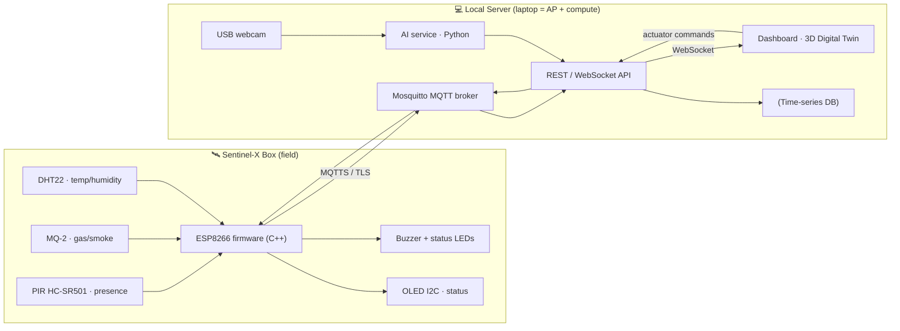

# Sentinel-X — The Industrial Outpost of the Future

> Autonomous cyber-physical surveillance node for AetherCorp's remote micro–power plants.
> One box, three threats neutralized: **network attacks**, **physical intrusion**, **environmental hazards** (gas leaks / thermal runaway).

<p align="center">
  
  
  
</p>

---

## 🎯 The pitch

It's 2050. AetherCorp deploys eco-friendly micro–power plants in remote, hostile zones. No permanent human staff can reach them — so each site gets a **Sentinel-X**: an autonomous edge node that watches, thinks, and defends on its own, talking over an ultra-secure wireless link to a hardened **Local Server** on the field.

Most teams will build four disconnected bricks. **We build one living system.**

### 💡 Our "wow": a real-time 3D Digital Twin

The dashboard is not a wall of separate charts. It's a **live 3D replica of the outpost** (Three.js) where the real world drives the scene:

- Real sensor values animate the twin — the box glows red as **gas** rises, heat shimmers on **thermal** spikes, the perimeter zone flashes on **PIR** motion.
- The AI's webcam **intrusion detection** spawns an animated intruder marker inside the 3D perimeter, in real time.
- The AI's **predictive maintenance** pulses the exact component it believes is drifting *before* the critical threshold is crossed.
- A **time-scrubber** replays the last incident second-by-second — our secret weapon for the live demo and the 60s teaser.

The twin makes the embedded intelligence *visible*. That's the story we tell the jury.

---

## 🧩 System architecture

> Hardware path: **Option B — Distributed "Edge-to-Server"**. No Raspberry Pi. A student laptop acts as the **Local Server + Wi-Fi access point**; the USB webcam plugs straight into it; the ESP8266 talks to it over Wi-Fi.



**End-to-end encryption is mandatory** (MQTTS/TLS between the ESP8266 and the stack). The whole server stack runs containerized via **Docker-Compose** on an **isolated `192.168.x.0/24` subnet** behind a dedicated Wi-Fi access point.

See [`docs/ARCHITECTURE.md`](docs/ARCHITECTURE.md) and [`docs/DIGITAL-TWIN.md`](docs/DIGITAL-TWIN.md) for the deep dives.

---

## 🛠️ The four technical pillars

| Pillar | What it delivers | Suggested stack |
|---|---|---|
| **Edge / IoT** | ESP8266 firmware: cadenced sensor reads, OLED status, buzzer/LED actuators, structured payloads to the server | C++ · PlatformIO |
| **Local AI & Data** | Standalone Python: webcam intrusion detection + **correlation-based** predictive maintenance (no static `if temp>40`) | Python · YOLOv8-tiny / OpenCV · scikit-learn (Isolation Forest) |
| **Infrastructure** | Containerized stack (DB + API + Mosquitto), isolated Wi-Fi topology & IP plan, MCO monitoring | Docker-Compose · Mosquitto |
| **Cybersecurity** | TLS/MQTTS everywhere, OS hardening (UFW, SSH keys only), cross-team pentest | OpenSSL · UFW/iptables · Nmap/Wireshark |
| **Dashboard & API** | Real-time UI: **3D Digital Twin**, live charts, box status, webcam feed, reactive actuator control | React · react-three-fiber (Three.js) · WebSocket |

> **Interconnection is pass/fail.** Physical sensor data must move the dashboard graphics in real time, and the AI must analyze the live webcam. That's the single most important integration to protect.

---

## 👥 Consortium & roles (3 dev + 2 infra)

| # | Role | Primary ownership |
|---|---|---|
| Dev 1 | **Edge / IoT** | `firmware/` — ESP8266, sensors, actuators, payload contract |
| Dev 2 | **AI / Data** | `ai/` — vision intrusion detection + predictive time-series model |
| Dev 3 | **Dashboard / Digital Twin + API** | `dashboard/` + `backend/` — 3D twin, real-time UI, API |
| Infra 1 | **Platform & Network** | `infra/` — Docker stack, MQTT, DB, Wi-Fi topology & IP plan |
| Infra 2 | **Cyber & MCO** | `cyber/` — TLS, hardening, pentest, monitoring |

Full breakdown in [`docs/TEAM.md`](docs/TEAM.md). User stories & tickets land in GitHub Issues once we finish brainstorming.

---

## 📁 Repository layout

```
sentinel-x/
├── firmware/      # ESP8266 C++ firmware (PlatformIO)
├── ai/            # Python: vision + predictive maintenance
├── backend/       # REST + WebSocket API (POST /api/v1/alerts)
├── dashboard/     # Web UI + 3D Digital Twin
├── infra/         # Docker-Compose, MQTT, DB, network topology
├── cyber/         # TLS, hardening, pentest reports
└── docs/          # Architecture, digital twin, team, deliverables
```

---

## 📦 Deliverables (due Thursday evening)

- **Engineering report** (PDF): network schema, wiring schema, security matrix (hardening, TLS), AI docs, post-pentest audit, A3 poster annex.
- **Presentation** (PPTX) for Friday's defense.
- **"Sentinel Drop" teaser**: vertical 9:16 MP4, exactly 60s, green-screen.
- **Code archive** (this repo, zipped): clean, structured, exhaustive README. **No secrets or auth keys in plaintext.**
- **Physical prototype**: the 3D-printed, laser-engraved Sentinel-X box, ready for live demo.

> ⚠️ **No secrets committed.** Keys, certs and credentials stay out of git — see [`.gitignore`](.gitignore) and `*/.env.example` files.

---

## 🚀 Getting started

```bash
git clone git@github.com:ArthurPoncin/sentinel-x.git
cd sentinel-x
# each pillar has its own README with setup steps:
#   firmware/  ai/  backend/  dashboard/  infra/  cyber/
```

---

## 🗓️ Sprint timeline

| Day | Focus |
|---|---|
| **Mon** | Kick-off, ideation, network & data-flow schemas, first CAD models |
| **Tue** | Core production: wiring, container stack, firmware, API, AI training |
| **Wed** | Global integration (Edge-to-Server) + "Sentinel Drop" green-screen shoot |
| **Thu** | Code freeze, Fablab finishing, **cross-team pentest**, audit report |
| **Fri** | Local defense: 5 min live demo + 5 min pitch & Q&A |

---

<p align="center"><em>Sentinel-X — security at the edge.</em></p>
