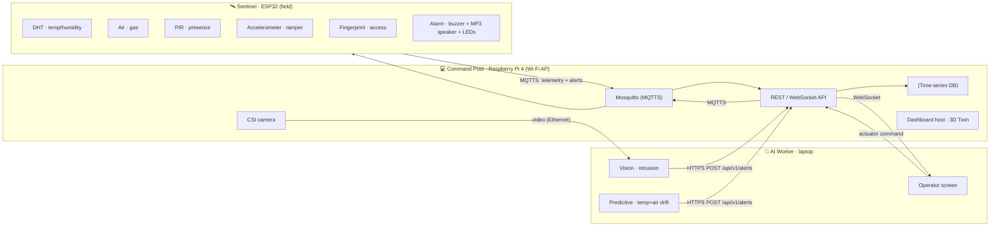

# Sentinel-X — The Industrial Outpost of the Future

> Autonomous cyber-physical surveillance node for AetherCorp's remote micro–power plants.
> One box, three threats neutralized: **network attacks**, **physical intrusion**, **environmental hazards** (gas leaks / thermal runaway).

<p align="center">
  
  
  
</p>

---

## 🎯 The pitch

It's 2050. AetherCorp deploys eco-friendly micro–power plants in remote, hostile zones. No permanent human staff can reach them — so each site gets a **Sentinel-X**: an autonomous edge node that watches, thinks, and defends on its own, talking over an ultra-secure wireless link to a hardened **Local Server** on the field.

Most teams will build four disconnected bricks. **We build one living system.**

### 💡 Our "wow": a real-time 3D Digital Twin

The dashboard is not a wall of separate charts. It's a **live 3D replica of the outpost** (Three.js) where the real world drives the scene:

- Real sensor values animate the twin — the box glows red as **gas** rises, heat shimmers on **thermal** spikes, the perimeter zone flashes on **PIR** motion.
- The AI's camera **intrusion detection** spawns an animated intruder marker inside the 3D perimeter, in real time.
- The AI's **predictive maintenance** pulses the exact component it believes is drifting *before* the critical threshold is crossed.
- A **time-scrubber** replays the last incident second-by-second — our secret weapon for the live demo and the 60s teaser.

The twin makes the embedded intelligence *visible*. That's the story we tell the jury.

---

## 🧩 System architecture

> **3-node "Edge-to-Server"** on an isolated table network. The **Raspberry Pi 4** is the Command Post (the single logical server): it runs the stack, is the Wi-Fi access point, and owns the CSI camera. The **ESP32** is the field Sentinel. A **laptop** acts as the AI Worker (heavy vision + predictive inference, delegated by the Pi) and the Operator's screen.



**End-to-end encryption is mandatory** (MQTTS/TLS between the Sentinel and the stack, HTTPS for the Worker). The server stack runs containerized via **Docker-Compose** on the Pi, on an **isolated `192.168.x.0/24` subnet** behind its dedicated Wi-Fi access point; the Worker links to the Pi over wired Ethernet.

See [`docs/ARCHITECTURE.md`](docs/ARCHITECTURE.md) and [`docs/DIGITAL-TWIN.md`](docs/DIGITAL-TWIN.md) for the deep dives.

---

## 🛠️ The four technical pillars

| Pillar | What it delivers | Suggested stack | Runs on |
|---|---|---|---|
| **Edge / IoT** | ESP32 firmware: cadenced probe reads, local display, Alarm (buzzer/MP3/LED), its own threshold/tamper Alerts, structured payloads | C++ · PlatformIO | Sentinel |
| **Local AI & Data** | Vision intrusion detection + **correlation-based** predictive maintenance on temp+air drift (no static `if temp>40`) | Python · YOLOv8-tiny / OpenCV · scikit-learn | AI Worker |
| **Infrastructure** | Containerized stack (DB + API + Mosquitto), isolated 3-node Wi-Fi/Ethernet topology & IP plan, MCO monitoring | Docker-Compose · Mosquitto | Command Post |
| **Cybersecurity** | TLS/MQTTS everywhere, OS hardening (UFW, SSH keys only), cross-team pentest | OpenSSL · UFW/iptables · Nmap/Wireshark | transversal |
| **Dashboard & API** | Real-time UI: **3D Digital Twin**, live charts, `Status`, camera feed, reactive actuator control | React · react-three-fiber (Three.js) · WebSocket | Command Post |

> **Interconnection is pass/fail.** Physical probe data must move the Twin in real time, and the AI must analyze the live camera. That's the single most important integration to protect. The contract that binds it all is in [`docs/ARCHITECTURE.md`](docs/ARCHITECTURE.md#json-schemas-the-contract--lock-monday-change-only-by-team-agreement).

---

## 👥 Consortium & workstreams (3 dev + 2 infra)

The **who-does-what split is open** — decided together after brainstorming. The stable part is the workstreams and which node each runs on:

| Workstream | Node | Scope |
|---|---|---|
| **Edge / IoT** | Sentinel (ESP32) | `firmware/` — probes, Alarm, local Alerts, telemetry |
| **AI / Data** | AI Worker (laptop) | `ai/` — vision intrusion + predictive drift |
| **Dashboard / Twin + API** | Command Post (Pi) | `dashboard/` + `backend/` — 3D twin, real-time UI, API |
| **Platform & Network** | Command Post (Pi) | `infra/` — Docker stack, MQTT, DB, 3-node topology |
| **Cyber & MCO** | transversal | `cyber/` — TLS, hardening, pentest, monitoring |

Full breakdown in [`docs/TEAM.md`](docs/TEAM.md). User stories & tickets land in GitHub Issues once we finish brainstorming.

---

## 📁 Repository layout

```
sentinel-x/
├── firmware/      # ESP32 C++ firmware (PlatformIO)
├── ai/            # Python: vision + predictive maintenance
├── backend/       # REST + WebSocket API (POST /api/v1/alerts)
├── dashboard/     # Web UI + 3D Digital Twin
├── infra/         # Docker-Compose, MQTT, DB, network topology
├── cyber/         # TLS, hardening, pentest reports
└── docs/          # Architecture, digital twin, team, deliverables
```

---

## 📦 Deliverables (due Thursday evening)

- **Engineering report** (PDF): network schema, wiring schema, security matrix (hardening, TLS), AI docs, post-pentest audit, A3 poster annex.
- **Presentation** (PPTX) for Friday's defense.
- **"Sentinel Drop" teaser**: vertical 9:16 MP4, exactly 60s, green-screen.
- **Code archive** (this repo, zipped): clean, structured, exhaustive README. **No secrets or auth keys in plaintext.**
- **Physical prototype**: the 3D-printed, laser-engraved Sentinel-X box, ready for live demo.

> ⚠️ **No secrets committed.** Keys, certs and credentials stay out of git — see [`.gitignore`](.gitignore) and `*/.env.example` files.

---

## 🚀 Getting started

```bash
git clone git@github.com:ArthurPoncin/sentinel-x.git
cd sentinel-x
# each pillar has its own README with setup steps:
#   firmware/  ai/  backend/  dashboard/  infra/  cyber/
```

---

## 🗓️ Sprint timeline

| Day | Focus |
|---|---|
| **Mon** | Kick-off, ideation, network & data-flow schemas, first CAD models |
| **Tue** | Core production: wiring, container stack, firmware, API, AI training |
| **Wed** | Global integration (Edge-to-Server) + "Sentinel Drop" green-screen shoot |
| **Thu** | Code freeze, Fablab finishing, **cross-team pentest**, audit report |
| **Fri** | Local defense: 5 min live demo + 5 min pitch & Q&A |

---

<p align="center"><em>Sentinel-X — security at the edge.</em></p>
