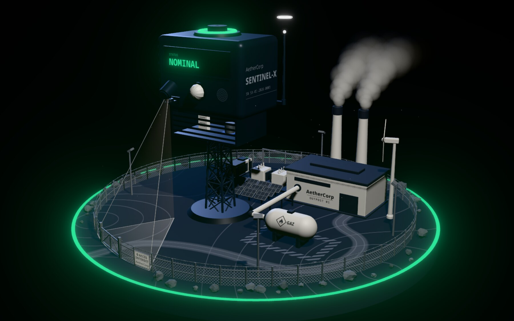
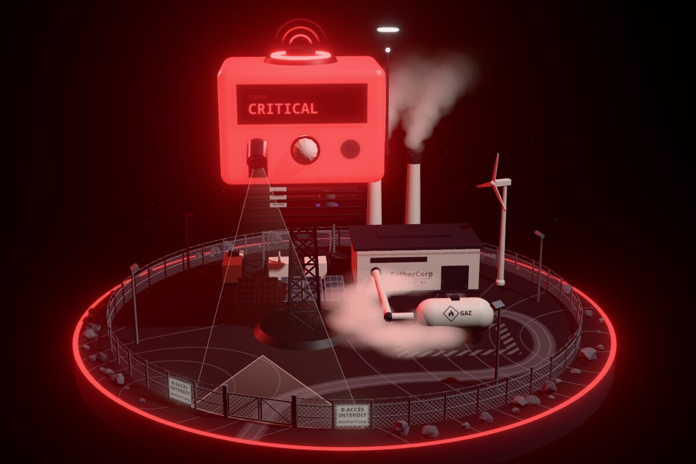
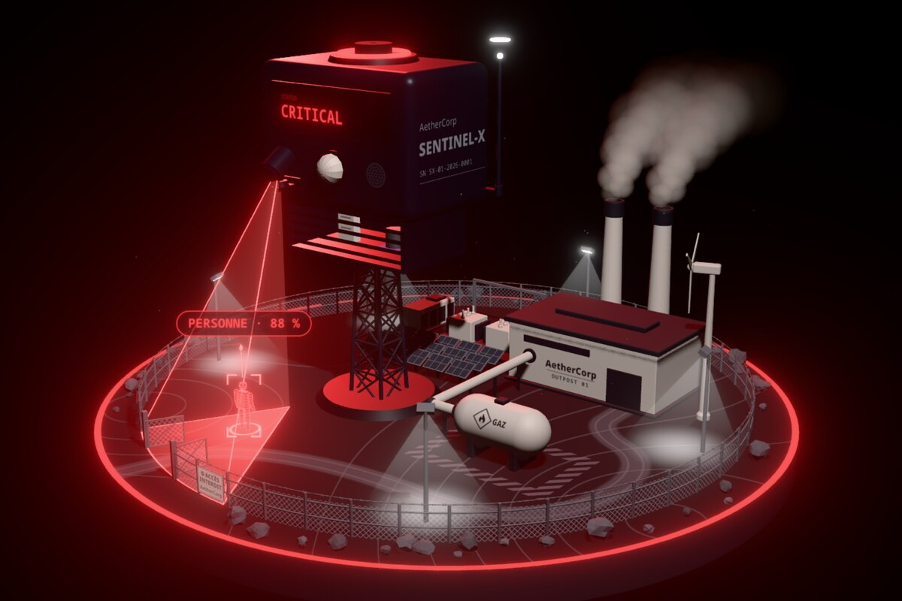
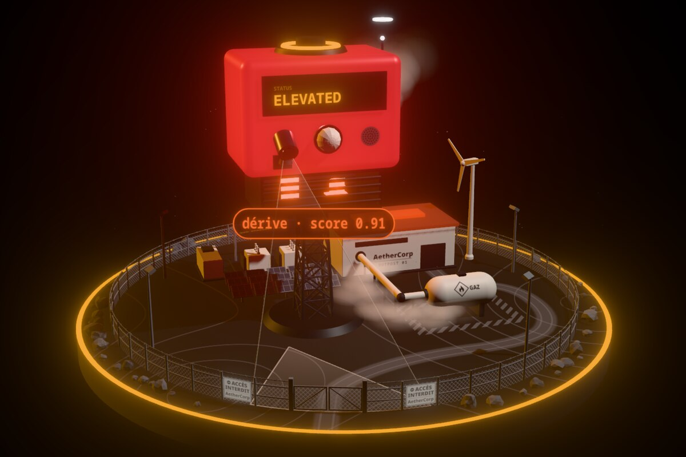
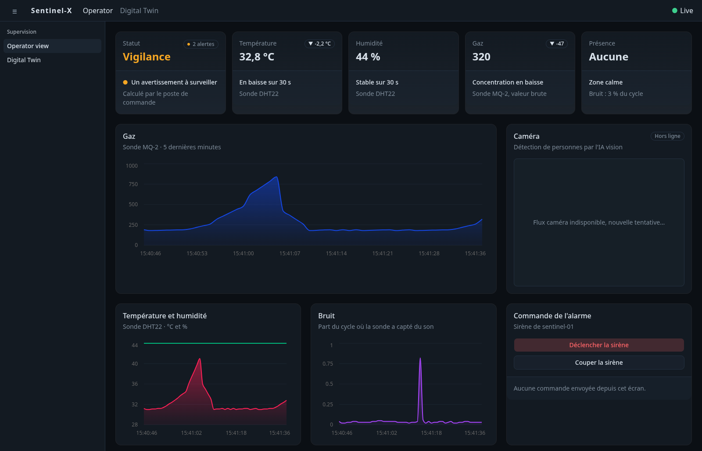
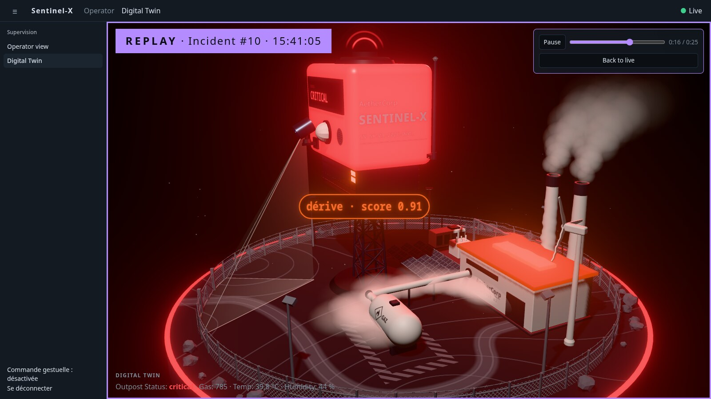
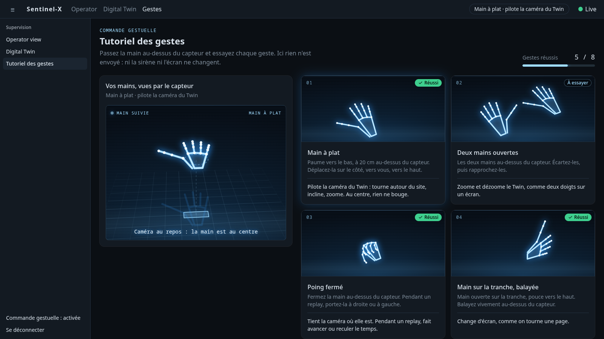
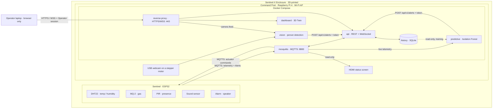

<div align="center">

# Sentinel-X

**An autonomous surveillance outpost for remote industrial sites.**

One enclosure senses gas leaks, overheating and intruders, raises its own alarm,
and shows the whole site on a real-time 3D Digital Twin.

<p>
  <a href="https://github.com/ArthurPoncin/sentinel-x/actions/workflows/ci.yml"></a>
  <a href="https://github.com/ArthurPoncin/sentinel-x/actions/workflows/images.yml"></a>
  <a href="LICENSE"></a>
</p>

<p>
  
  
  
  
  
  <br>
  
  
  
  
  
  
  <br>
  
  
  
  
</p>



[Screens](#screens) · [Features](#features) · [Architecture](#architecture) · [Security](#security) · [Quick start](#quick-start) · [Documentation](#documentation)

</div>

## Overview

Sentinel-X answers a brief from the EPSI Workshop 2026: protect a micro power plant in a remote, hostile area where no staff can stay on site. An ESP32 and a Raspberry Pi 4 share one 3D-printed enclosure. Together they watch the site, decide alone, and report to an Operator over an isolated, encrypted Wi-Fi link.

| It guards against | How | Decided on |
|---|---|---|
| Gas leak, overheating | MQ-2 and DHT22 probes, thresholds with hysteresis, siren fired locally | ESP32 |
| Presence, noise | PIR and sound sensor | ESP32 |
| Intrusion | Person detection on a USB webcam that turns to follow whoever it sees | Raspberry Pi 4 |
| A failure before it happens | Isolation Forest on the trend of temperature and gas, no fixed threshold | Raspberry Pi 4 |
| Network attack | TLS and authentication on every channel, two service ports exposed | Whole stack |

Five students built it in one week: more than 270 commits, 78 merged pull requests and 1,483 automated tests.

## Screens

The Twin is not an illustration. It is driven by the same event stream the real enclosure emits.

<table>
  <tr>
    <td width="33%"></td>
    <td width="33%"></td>
    <td width="33%"></td>
  </tr>
  <tr>
    <td align="center"><b>Gas leak</b><br><sub>Status critical, haze thickens at the pipe, the siren sounds</sub></td>
    <td align="center"><b>Intrusion</b><br><sub>A figurine stands where the camera sees the person, floodlights on</sub></td>
    <td align="center"><b>Predicted drift</b><br><sub>The drifting component pulses before any threshold is crossed</sub></td>
  </tr>
</table>

<p align="center">
  
  <br>
  <sub><b>Operator view.</b> Status, live Readings, charts, camera panel and siren control. Captured on the scripted mock feed, so the camera panel has no webcam to show.</sub>
</p>

<table>
  <tr>
    <td width="50%"></td>
    <td width="50%"></td>
  </tr>
  <tr>
    <td align="center"><b>Time-scrubber</b><br><sub>Any recorded Incident replays second by second on the Twin</sub></td>
    <td align="center"><b>Hand control</b><br><sub>The gesture tutorial, here with the bridge's simulated hand</sub></td>
  </tr>
</table>

A 60-second teaser is in the repository: [`docs/livrables/sentinel-x-teaser.mp4`](docs/livrables/sentinel-x-teaser.mp4).

## Features

**Digital Twin.** A live 3D model of the outpost (Three.js, react-three-fiber) fed by the Command Post's WebSocket stream.

| Signal | What the Twin does |
|---|---|
| Gas Reading | Haze thickens around the gas pipe, the enclosure glows red |
| Temperature | The generator hall's roof glows, the air above it ripples on a thermal Alert |
| Presence (PIR) | An amber sweep goes round the fence, the floodlights come on |
| Noise | A wave of light spreads from the enclosure, scaled to how loud it was |
| Intrusion | A hologram figurine stands where the person is, the camera's field turns with the real camera |
| Predictive drift | The drifting component pulses orange, with its anomaly score |
| Status | The scene is flooded in the Status color, then the ring and the LCD keep it |
| Feed lost | The picture drops out like a screen's, so a lost link never passes for a calm site |

**Autonomy at the edge.** The Sentinel decides its own Alerts and fires the siren even when the Command Post is down. One Alert is one transition: hysteresis on every threshold, no flapping.

**Vision.** EfficientDet-Lite0 on LiteRT keeps the `person` class only. A tracker follows the nearest person, tells of up to four others, and sends where they stand (`x_norm`, `h_norm`, `pan`) so the Twin places each one. A stepper motor turns the webcam toward the person followed.

**Predictive maintenance.** No `if temp > 40`. An Isolation Forest scores a 120-second window of seven features: the levels of temperature, humidity and gas, then the slopes and rolling means of temperature and gas. The model in service was trained on 32,101 readings from the real Sentinel (20,009 vectors), and its raise and clear levels are learned from held-out nominal data. On the synthetic drift shipped with the repo, the Alert comes about 43 minutes before the warning threshold.

**Time-scrubber.** Every Incident is recorded in SQLite and replays on the Twin, labelled REPLAY, with the camera turning to where each Alert happens.

**Hand control.** A Leap Motion Controller on the Operator's laptop steers the Twin's camera, winds a replay, changes screen, and sounds or silences the siren with a held thumb. A tutorial screen teaches the eight gestures.

**Plug and play.** One script takes a Raspberry Pi from a fresh OS to a running outpost: Wi-Fi access point, certificates and secrets, container stack, firmware built and flashed on the ESP32. The arm64 images are prebuilt by CI and pulled from GHCR.

## Architecture

The Raspberry Pi 4 is the single server (the brief's Option A, "embedded centralization"). It sits in the enclosure with the ESP32. The Operator's laptop is a browser, nothing more.



Two ingress paths feed one Alert pipeline: the Sentinel publishes over MQTTS, the AI services post to `POST /api/v1/alerts` on the internal Docker network. The API validates every message against a shared schema, derives the Outpost's `Status` (`nominal`, `elevated`, `critical`), stores the history and pushes it to the dashboard. The contract is in [`docs/ARCHITECTURE.md`](docs/ARCHITECTURE.md).

| Layer | Stack | Folder |
|---|---|---|
| Firmware | C++, Arduino core, PlatformIO, PubSubClient, ArduinoJson | [`firmware/`](firmware/) |
| API | Node 22, TypeScript, Fastify, WebSocket, MQTT.js, Zod, SQLite | [`backend/`](backend/) |
| Dashboard | React 19, react-three-fiber, Three.js, Vite, Tailwind CSS, Recharts | [`dashboard/`](dashboard/) |
| Vision | Python, OpenCV, LiteRT (EfficientDet-Lite0) | [`ai/vision/`](ai/vision/) |
| Predictive | Python, scikit-learn (Isolation Forest), paho-mqtt | [`ai/predictive/`](ai/predictive/) |
| Hand bridge | Node 22, TypeScript, Ultraleap LeapC through FFI | [`leap/`](leap/) |
| Platform | Docker Compose, Mosquitto, Caddy, NetworkManager, dnsmasq, chrony | [`infra/`](infra/) |
| Security | OpenSSL team CA, UFW, hardening and audit scripts | [`cyber/`](cyber/) |
| Enclosures | OpenSCAD, STL for the Creality K2 Plus, no supports | [`enclosure/`](enclosure/) |

## Security

| Channel | Protection |
|---|---|
| Sentinel to broker | MQTTS only, TLS 1.2 or later, broker verified against the team CA, one account and one ACL per client, no anonymous access |
| Operator to dashboard | HTTPS and WSS behind Caddy, login rate-limited to 5 a minute, session cookie `HttpOnly`, `Secure`, `SameSite=Strict` |
| AI services to API | Internal Docker network, one bearer token per service, each bound to its own kind of Alert |
| Network | Isolated WPA2 Wi-Fi access point with no route out, two service ports published (443 and 8883), no plaintext listener |
| Containers | `cap_drop: ALL`, `no-new-privileges`, read-only root filesystem, non-root users, log rotation |
| Payloads | Identity is never read from a message body: the Sentinel comes from the MQTT topic, the source from the channel |
| Repository | No secret in git, checked by CI on every pull request |

The engineering report lists 19 controls: six are proven by the API's automated tests, nine are read in the versioned configuration, and four depend on the host hardening script [`cyber/harden.sh`](cyber/harden.sh) (UFW, key-only SSH, Docker ports kept to the table Wi-Fi).

## Quick start

**On a laptop, without hardware** (Node 22 or later). The API plays a scripted scenario in a loop: a gas leak, a clap, an intruder.

```bash
git clone https://github.com/ArthurPoncin/sentinel-x.git && cd sentinel-x

# terminal 1: the API on its mock feed
cd backend && npm install && OPERATOR_AUTH=off MOCK_FEED=true HISTORY_FILE=:memory: npm run dev

# terminal 2: the dashboard, on http://localhost:5173 (Operator view at /, Twin at /twin)
cd dashboard && npm install && npm run dev
```

**On a Raspberry Pi 4**, with the ESP32 plugged into one of its USB ports and Ethernet for the first run:

```bash
git clone https://github.com/ArthurPoncin/sentinel-x.git && cd sentinel-x
infra/plug-and-play.sh X     # X = table number: the Pi becomes 192.168.X.1
```

The dashboard is then on `https://192.168.X.1/`. Step by step, from a blank SD card: [`docs/INSTALLATION-PI.md`](docs/INSTALLATION-PI.md) (in French).

## Quality

| Aspect | State |
|---|---|
| Tests | 1,483 on `main` on 9 October 2026: 776 dashboard, 437 AI, 255 API, 15 hand bridge |
| CI, on every pull request | Typecheck and tests, production build, smoke render of the dashboard in a headless browser, AI tests on Python 3.11 and 3.13, firmware build, shellcheck, Compose validation, secret check |
| Images | Five arm64 images built on GitHub's Arm runners and published on GHCR on every push to `main` |
| Workflow | One issue per user story, one branch per issue, pull request before `main` |

## Status and limits

- The predictive model trained on the real Sentinel has been in service on the Pi since 9 October 2026.
- `cyber/harden.sh` is ready and was verified in a Debian 12 container. It was not applied to the demo Pi.
- Vision runs on a Pi 4 where the brief assumes a Pi 5. Its latency on the Pi was not recorded; the benchmark tool is `python -m vision.bench`.
- Hand control needs Ultraleap's tracking software, so the bridge runs on a Windows or macOS laptop, not on the Pi.
- The Operator's interface is in French.

## Documentation

| Document | Content |
|---|---|
| [`docs/ARCHITECTURE.md`](docs/ARCHITECTURE.md) | Topology, Alert ownership, JSON contract, security model, network plan |
| [`docs/DIGITAL-TWIN.md`](docs/DIGITAL-TWIN.md) | What each signal does on the Twin, and why |
| [`docs/SCOPE.md`](docs/SCOPE.md) | Demo scenario and build tiers |
| [`GLOSSARY.md`](GLOSSARY.md) | The project's vocabulary: Outpost, Sentinel, Command Post, Alert, Incident |
| [`docs/INSTALLATION-PI.md`](docs/INSTALLATION-PI.md) | Installing the Command Post, step by step (French) |
| [`docs/DURCISSEMENT-PI.md`](docs/DURCISSEMENT-PI.md) | Hardening the Pi before a pentest (French) |
| [`cyber/PENTEST-PLAN.md`](cyber/PENTEST-PLAN.md) | Defensive checklist and offensive audit plan (French) |
| [`docs/dossier/`](docs/dossier/) and [`docs/soutenance/`](docs/soutenance/) | Sources of the engineering report and of the defence deck (French) |

Each folder has its own README: [`firmware`](firmware/README.md), [`backend`](backend/README.md), [`dashboard`](dashboard/README.md), [`ai`](ai/README.md), [`leap`](leap/README.md), [`infra`](infra/README.md), [`cyber`](cyber/README.md), [`enclosure`](enclosure/README.md) (French).

## Team

Built by five students (three developers, two infrastructure) for the EPSI Workshop 2026, from 5 to 9 October 2026. See the [contributors](https://github.com/ArthurPoncin/sentinel-x/graphs/contributors).

The brief is in the repository: [`Workshop-2026_BAC+4_Sujet_Sentinel-X.pdf`](Workshop-2026_BAC+4_Sujet_Sentinel-X.pdf) (French).

## License

[MIT](LICENSE)
