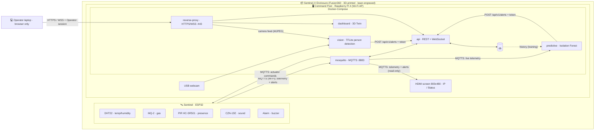

# Sentinel-X — The Industrial Outpost of the Future

> Autonomous cyber-physical surveillance node for AetherCorp's remote micro–power plants.
> One box, three threats neutralized: **network attacks**, **physical intrusion**, **environmental hazards** (gas leaks / thermal runaway).

<p align="center">
  
  
  
</p>

---

## 🎯 The pitch

It's 2050. AetherCorp deploys eco-friendly micro–power plants in remote, hostile zones. No permanent human staff can reach them — so each site gets a **Sentinel-X**: an autonomous edge node that watches, thinks, and defends on its own, talking over an ultra-secure wireless link to a hardened **Local Server** on the field.

Most teams will build four disconnected bricks. **We build one living system.**

### 💡 Our "wow": a real-time 3D Digital Twin

The dashboard is not a wall of separate charts. It's a **live 3D replica of the outpost** (Three.js) where the real world drives the scene:

- Real sensor values animate the twin — the box glows red as **gas** rises, heat shimmers on **thermal** spikes, the perimeter zone flashes on **PIR** motion, sound ripples spread on a loud **noise**.
- The AI's camera **intrusion detection** spawns an animated intruder marker inside the 3D perimeter, in real time.
- The AI's **predictive maintenance** pulses the exact component it believes is drifting *before* the critical threshold is crossed.
- A **time-scrubber** replays the last incident second-by-second — our secret weapon for the live demo and the 60s teaser.

The twin makes the embedded intelligence *visible*. That's the story we tell the jury.

---

## 🧩 System architecture

> **Option A "Embedded centralization"** from the brief. A **Raspberry Pi 4** fixed inside the Sentinel-X Enclosure is the Command Post — the single Local Server: Wi-Fi access point, containerized stack (web front-end + API), and the vision + predictive AI on its **USB webcam**. The **ESP32** is the Sentinel and joins the Pi's Wi-Fi. A laptop is only the Operator's browser.



**Every channel is encrypted and authenticated**: MQTTS (TLS) with per-device credentials and ACLs between the Sentinel and the broker, HTTPS/WSS with an Operator session for the dashboard. Only two service ports reach the table network (443, 8883). The stack runs via **Docker-Compose** on the Pi, on an **isolated `192.168.X.0/24` subnet** behind its own WPA2 Wi-Fi access point.

See [`docs/ARCHITECTURE.md`](docs/ARCHITECTURE.md) and [`docs/DIGITAL-TWIN.md`](docs/DIGITAL-TWIN.md) for the deep dives, and [`docs/SCOPE.md`](docs/SCOPE.md) for the demo scenario and build tiers (MVP → wow). To set up the Pi and the Sentinel, step by step: [`docs/INSTALLATION-PI.md`](docs/INSTALLATION-PI.md).

---

## 🛠️ The four technical pillars

| Pillar | What it delivers | Suggested stack | Runs on |
|---|---|---|---|
| **Edge / IoT** | ESP32 firmware: cadenced probe reads, Alarm (buzzer), its own threshold Alerts, structured payloads | C++ · PlatformIO | Sentinel |
| **Local AI & Data** | Vision person detection on the USB webcam + **correlation-based** predictive maintenance on temp+air drift (no static `if temp>40`) | Python · TFLite ([rpi-object-detection](https://github.com/automaticdai/rpi-object-detection)) / OpenCV · scikit-learn | Command Post |
| **Infrastructure** | Containerized stack (reverse proxy, broker, DB, API, dashboard, AI services), isolated Wi-Fi AP & IP plan | Docker-Compose · Mosquitto · hostapd | Command Post |
| **Cybersecurity** | MQTTS/HTTPS + authentication on every channel (MQTT ACL, API tokens, Operator session), Pi & Docker hardening (UFW, SSH keys only), cross-team pentest | OpenSSL · UFW/iptables · Nmap/Wireshark | transversal |
| **Dashboard & API** | Real-time UI: **3D Digital Twin**, live charts, `Status`, camera feed, reactive actuator control, Operator login | React · react-three-fiber (Three.js) · WebSocket | Command Post |

> **Interconnection is pass/fail.** Physical probe data must move the Twin in real time, and the AI must analyze the live camera. That's the single most important integration to protect. The contract that binds it all is in [`docs/ARCHITECTURE.md`](docs/ARCHITECTURE.md#json-schemas-the-contract--lock-monday-change-only-by-team-agreement).

---

## 👥 Consortium & workstreams (3 dev + 2 infra)

The **who-does-what split is open** — decided together after brainstorming. The stable part is the workstreams and which node each runs on:

| Workstream | Node | Scope |
|---|---|---|
| **Edge / IoT** | Sentinel (ESP32) | `firmware/` — probes, Alarm, local Alerts, telemetry |
| **AI / Data** | Command Post (Pi) | `ai/` — vision intrusion + predictive drift |
| **Dashboard / Twin + API** | Command Post (Pi) | `dashboard/` + `backend/` — 3D twin, real-time UI, API, auth |
| **Platform & Network** | Command Post (Pi) | `infra/` — Docker stack, MQTT, DB, Wi-Fi AP & IP plan |
| **Cyber** | transversal | `cyber/` — TLS, credentials & ACL, hardening, pentest |

Full breakdown in [`docs/TEAM.md`](docs/TEAM.md). User stories & tickets land in GitHub Issues once we finish brainstorming.

---

## 📁 Repository layout

```
sentinel-x/
├── firmware/      # ESP32 C++ firmware (PlatformIO)
├── ai/            # Python: vision + predictive maintenance
├── backend/       # REST + WebSocket API (POST /api/v1/alerts)
├── dashboard/     # Web UI + 3D Digital Twin
├── infra/         # Docker-Compose, MQTT, DB, network topology
├── cyber/         # TLS, hardening, pentest reports
└── docs/          # Architecture, digital twin, team, deliverables
```

---

## 📦 Deliverables (due Thursday evening)

- **Engineering report** (PDF): network schema, wiring schema, security matrix (hardening, TLS), AI docs, post-pentest audit, A3 poster annex.
- **Presentation** (PPTX) for Friday's defense.
- **"Sentinel Drop" teaser**: vertical 9:16 MP4, exactly 60s, green-screen.
- **Code archive** (this repo, zipped): clean, structured, exhaustive README. **No secrets or auth keys in plaintext.**
- **Physical prototype**: the 3D-printed, laser-engraved Sentinel-X box, ready for live demo.

> ⚠️ **No secrets committed.** Keys, certs and credentials stay out of git — see [`.gitignore`](.gitignore) and `*/.env.example` files.

---

## 🚀 Getting started

```bash
git clone https://github.com/ArthurPoncin/sentinel-x.git
cd sentinel-x
# each pillar has its own README with setup steps:
#   firmware/  ai/  backend/  dashboard/  infra/  cyber/
```

**On the Pi** — the whole Command Post, step by step in [`infra/README.md`](infra/README.md#run-the-command-post-on-the-pi):

```bash
infra/setup.sh X                 # once: CA, certificates, MQTT accounts, tokens, Operator password (X = table)
docker compose up -d --build     # https://192.168.X.1/ and mqtts://192.168.X.1:8883
```

**On a laptop**, without hardware: the API on its mock feed and the dashboard — see [`dashboard/README.md`](dashboard/README.md).

**CI** ([`.github/workflows/ci.yml`](.github/workflows/ci.yml)), on every pull request and on `main`: the backend's and the dashboard's tests, the dashboard's build and its smoke-render on the mock feed, the AI services' tests on Python 3.11 and 3.13 (the person detector's model fetched for them), the firmware's build, the Pi's scripts through shellcheck and the Compose stack's validity, and no secret tracked.

---

## 🗓️ Sprint timeline

| Day | Focus |
|---|---|
| **Mon** | Kick-off, ideation, network & data-flow schemas, first CAD models |
| **Tue** | Core production: wiring, container stack, firmware, API, AI training |
| **Wed** | Global integration (Edge-to-Server) + "Sentinel Drop" green-screen shoot |
| **Thu** | Code freeze, Fablab finishing, **cross-team pentest**, audit report |
| **Fri** | Local defense: 5 min live demo + 5 min pitch & Q&A |

---

<p align="center"><em>Sentinel-X — security at the edge.</em></p>
