# dashboard/ — Web UI & 3D Digital Twin

**Node:** served by the Command Post (Pi) through the reverse proxy (HTTPS/WSS), rendered in the Operator's browser · **Stack:** Vite + React + TypeScript, react-three-fiber (Three.js) for the Twin

The face of Sentinel-X and our **"wow" centerpiece**. See [`../docs/DIGITAL-TWIN.md`](../docs/DIGITAL-TWIN.md).

**One app, two screens on the same live feed:** `/` is the Operator's dashboard, `/twin` the Digital Twin (lazy-loaded, so three.js only loads there). For the demo, open each in its own window. One origin, one container, one Operator session, as in [`../docs/ARCHITECTURE.md`](../docs/ARCHITECTURE.md).

## Must have (from the brief)
- Real-time environmental curves.
- Logical box status.
- Live camera feed — the annotated MJPEG stream served by the `vision` service.
- Reactive control panel to trigger the actuator (buzzer) remotely — `POST /api/v1/commands`.

## Security
- **Operator login** screen; every view, the WebSocket (`wss://`) and the camera feed sit behind the session.
- No token or secret in the front-end bundle.

## Our extra — the Digital Twin
- Live 3D replica of the **Outpost** reacting to the real WebSocket event stream.
- **Intruder marker** placed along the perimeter from the `intrusion` Alert's `x_norm`.
- **Component pulse** on a `predictive` anomaly; sound ripples on `noise`.
- **`Status`** drives the twin's overall color (`nominal`/`elevated`/`critical`).
- **Time-scrubber** replays a past Incident second by second, labelled REPLAY — demo insurance (#15).
- **Scenario mode** plays the scripted reference scenario on demand, network or not (#15).

## Run it
Node ≥ 22. Start the mock feed first, then the app:

```bash
# terminal 1 — the Command Post API playing its scripted scenario (gas leak, clap, intruder)
cd backend && npm install && OPERATOR_AUTH=off MOCK_FEED=true HISTORY_FILE=:memory: npm run dev

# terminal 2 — the app on http://localhost:5173 (/ and /twin)
cd dashboard && npm install && npm run dev

npm test            # store, feed client, config, gas level, heat level, scene mapper, site plan, steam, haze, Alarm,
                    # fades, pulse, presence sweep, noise wave, automatic orbit, pixel ratio, framing,
                    # Incidents, replay, scenario, Incidents client, the Twin on a replay
npm run build       # typecheck + production bundle in dist/
```

**Filming the Twin for the teaser** — open `/twin?capture` in a vertical 9:16 window (1080 × 1920) and record the screen while the scenario plays: the Twin alone on black, no interface, on the same feed. See [capture mode](#digital-twin--featurestwin).

The app always talks to its **own origin** (`/ws`, `/api`): the Vite dev server proxies them to `BACKEND_URL`, the reverse proxy does it on the Pi. Mock or live is the backend's setting, the front never changes.

| Variable | Default | Purpose |
|---|---|---|
| `BACKEND_URL` | `http://127.0.0.1:8080` | Command Post API that `/ws` and `/api` are proxied to in `dev` and `preview` (e.g. the Pi's address). Set it in `.env` (see `.env.example`). |

## Structure — feature-driven

```
src/
├── main.tsx
├── app/                     # composition only: shell, router, routes
│   ├── app.tsx              # LiveFeedProvider + router
│   ├── router.tsx           # /  and  /twin (lazy)
│   ├── layout.tsx
│   └── routes/              # operator.tsx, twin.tsx — assemble features, no logic
├── features/
│   ├── live-feed/           # #10 — the socket, the store, the hook
│   │   ├── api/             # connectFeed(): WebSocket client, backoff, drops bad frames
│   │   ├── stores/          # apply(state, event): pure reducer + tiny external store · stateAfter(frames)
│   │   ├── hooks/           # useLiveFeed(selector)
│   │   ├── components/      # LiveFeedProvider, ConnectionIndicator, FeedInspector
│   │   └── index.ts         # the feature's public API
│   ├── replay/              # #15 — the time-scrubber and scenario mode
│   │   ├── api/             # fetchIncidents(), fetchIncidentReplay(id): the Command Post's recorded Incidents
│   │   ├── hooks/           # usePlayer(): second by second · useRecordedIncidents(key)
│   │   ├── components/      # TimeScrubber: the LIVE/REPLAY label and the scrubber, over the Twin
│   │   ├── utils/           # incidents(history) · replayOf(history, incident) · framesAt(replay, t)
│   │   │                    # withStatus(frames) · scenario(start), scenarioFrames(start) · labels
│   │   └── index.ts
│   └── twin/                # #20, #12, #30, #31, #32, #33, #40, #13, #36, #34, #35, #37, #23 — the Outpost as a maquette, on its studio stage
│       ├── components/      # OutpostTwin: the scene, drawn from SceneProps · Enclosure · OrbitCamera · Halo
│       │                    # Socle · PowerPlant · Perimeter · Steam: the site, drawn from SITE
│       │                    # Haze: the gas around the pipe · VapourMaterial: what steam and haze are made of
│       │                    # HeatShimmer: the hot air above the hall · NoiseWaves: a clap's wave over the socle
│       │                    # Intruder: the figure the camera sees, on the fence's arc
│       │                    # Box · Turned: the bevelled volumes it is built from · palette
│       ├── hooks/           # usePixelRatio(element) · useFade(target), useColorFade(color) · useSweep(present)
│       │                    # useWaves(frames)
│       ├── utils/           # toScene(state): the scene's props, pure · gasLevel(air), heatLevel(temp): 0–1
│       │                    # SITE: the ground plan · lensPoint() · watchedPoint(xNorm) · fencePosts()
│       │                    # alongPipe(share) · puffAt(age): a puff of steam's life · wispAt(age): a wisp
│       │                    # of haze's · blink(t), arcsAt(t): the Alarm · ENCLOSURE_PARTS, ENCLOSURE_SHAPE
│       │                    # autoOrbitSpeed(touch, now) · pixelRatio(density, width, height)
│       │                    # wholeStageDistance(aspect) · fadeTo(fade, to, now), fadeValue(fade, now)
│       │                    # DRIVER_PROBES: driver → Probe · pulse(t): a drifting Probe's beat
│       │                    # sweepsAt(sweeps, present, now), lapAt(sweeps, now): the fence's sweeps on a presence
│       │                    # sweepGlow(place, lap) · domeFlash(lap)
│       │                    # framesSince(seen, frames), clapsIn(frames), wavesAt(waves, claps, now): the waves a
│       │                    # clap sends · waveShape(elapsed, amplitude): a wave's radius, width and glow
│       └── index.ts
└── shared/
    ├── contract/            # re-exports backend/src/contract.ts — never redeclare a schema
    └── config/              # feedUrl() · captureMode() · STATUS_COLORS
```

**Rules**
- A feature owns everything it needs (`api/`, `stores/`, `hooks/`, `components/`, `utils/`… only the folders it uses).
- Import a feature through its `index.ts` only (`@/features/live-feed`), never its folders.
- Features don't import each other; `app/routes` composes them. `shared/` imports nothing from `features/` or `app/`.
- Logic goes in pure functions next to their tests (`*.test.ts`), so it is tested without a browser; components stay thin.
- Imports use the `@/` alias for `src/`.

**Features to come**

| Feature folder | Tickets | On |
|---|---|---|
| `features/telemetry` | #21 gas curve, #11 every curve | `/` |
| `features/status` · `features/alerts` | #11 Status badge, active Alerts | `/` |
| `features/camera` · `features/actuators` | #14 camera feed, actuator panel | `/` |
| `features/twin` (started) | #38 final intrusion | `/twin` |

## Live feed — `features/live-feed`

```tsx
import { useLiveFeed } from '@/features/live-feed'

const status = useLiveFeed((state) => state.status)                  // 'nominal' | 'elevated' | 'critical'
const telemetry = useLiveFeed((state) => state.latestTelemetry)      // last snapshot, or null
const alerts = useLiveFeed((state) => state.activeAlerts)            // raised, not cleared yet
const history = useLiveFeed((state) => state.history)                // every frame, oldest first (last 1000)
```

- Select a state field as is; derive anything else with `useMemo` (a selector returning a new array each call loops).
- The Status comes from the Command Post: the front never recomputes it on the live feed. A replay is the one exception: the history keeps no Status, so `features/replay` works it out from the replayed Alerts by the Command Post's rule.
- On every (re)connection the backend sends its snapshot (current Status + latest telemetry) and the active Alerts start over, since some may have cleared while the socket was down.
- `connection` is the socket as it is now (`connecting`, `open`, `closed`), `connectedOnce` whether it has ever been open. Together they tell a signal lost (not open any more) from a first connection still being tried.
- Types come from `@/shared/contract`: `Telemetry`, `Alert`, `Status`, `Frame`…
- The Status colors are defined once, in `shared/config/status-colors.ts` (`STATUS_COLORS`). `main.tsx` hands them to the stylesheet as `--nominal`, `--elevated` and `--critical`; the Twin lights its scene with the same.

## Digital Twin — `features/twin`

```tsx
import { OutpostTwin, toScene } from '@/features/twin'

const connection = useLiveFeed((state) => state.connection)
const connectedOnce = useLiveFeed((state) => state.connectedOnce)
const status = useLiveFeed((state) => state.status)
const latestTelemetry = useLiveFeed((state) => state.latestTelemetry)
const activeAlerts = useLiveFeed((state) => state.activeAlerts)
const scene = useMemo(
  () => toScene({ connection, connectedOnce, status, latestTelemetry, activeAlerts }),
  [connection, connectedOnce, status, latestTelemetry, activeAlerts],
)
const history = useLiveFeed((state) => state.history)
<OutpostTwin scene={scene} frames={history} />
```

- `toScene(state)` turns the live state into what the scene shows, and is all the scene reads: pure, tested without WebGL. It gives the Enclosure's color and glow (gas), what its LCD reads and the color its LED ring breathes in (the Status), its Alarm (active `gas` and `thermal` Alerts), the Probes to pulse and the drift's label (active `predictive` Alerts), how thick the haze around the gas pipe is (gas), the Status's color grade, the heat of the generator hall (how red its roof glows, whether the air ripples above it), whether the camera sector is lit (an active `intrusion`), where the intruder stands (last active `intrusion`'s `x_norm`, and the point of the fence it gives), whether someone is near the site (an active `presence`) and whether the signal is lost.
- The `Status` grades the whole scene. At `nominal` the studio keeps its neutral light, and only the ring around the socle, the LCD and the LED ring are green. At `elevated` and `critical` every light takes the Status's color: the whole model is lit in amber, in red. It follows the Command Post's Status, never the readings. The sky stays black on the stage (#30): the grade's `background` is no longer drawn.
- **Nothing cuts** (#33). A new Status fades in over `FADE_SECONDS` (0.8 s), lights, ring around the socle, LCD and LED ring together, and one that comes during a fade starts from the color on screen. `fadeTo(fade, to, now)` and `fadeValue(fade, now)` are that rule, pure and tested; `useFade` / `useColorFade` run it on every frame.
- **Signal lost** (#33). When the feed closes after having been open, `scene.signalLost` is true until it is open again, the retries in between included: the whole frame fades to grey (`<Halo saturation>`), "Signal lost" shows over the scene and the caption loses its colors, so that a stale state never passes for a live one. Before the first connection there is no signal to lose: the scene is neutral, with no notice. To see it, stop the backend.
- The Enclosure goes from dark anodized to red as `readings.air` rises, and lights the ground around it. It follows the telemetry, not the Alerts: it moves before any `gas` Alert is raised.
- `gasLevel(air)` gives the share of the way from calm to critical, 0–1. Its two bounds, `CALM_AIR` (200) and `CRITICAL_AIR` (620), are those of the mock feed: tune them to the MQ-2's calibration when the Sentinel sends its own Readings. The Enclosure's glow and the haze both run over that range: it is set there, once.
- What follows the Readings (the Enclosure's gas color and glow, the haze, the glow of the hall's roof) eases toward them (`EASE`, `HAZE_EASE`): a snapshot a second flows into the next, it does not jump.
- The feature takes its data as props: `app/routes/twin.tsx` reads the feed, maps it with `toScene` and hands it over, with the feed's frames (`frames`) for what is an event rather than a state: a clap. `TwinState` asks for the live-feed state's fields by shape, so a replayed state (time-scrubber) feeds it the same way.

**The threats** (#13) — what the vision and predictive services see, shown on the maquette:

| Intrusion | Predictive drift |
|---|---|
| 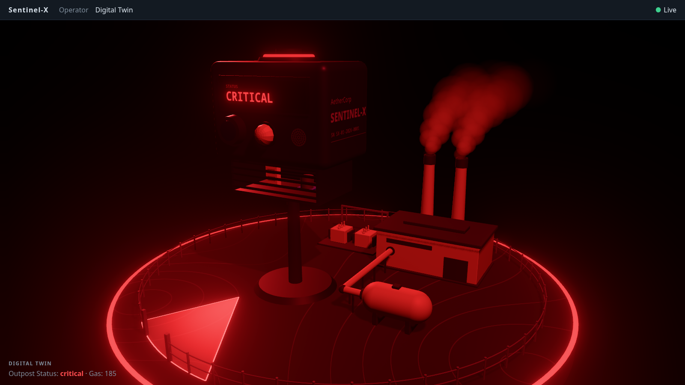 | 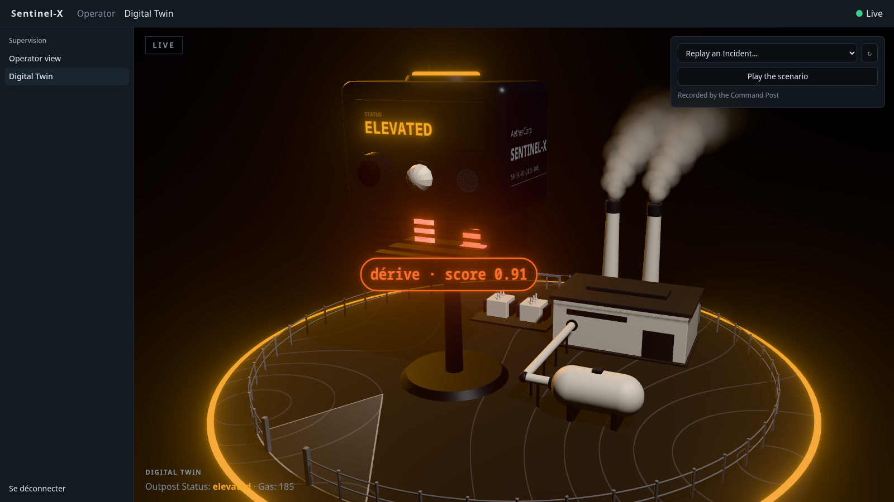 |

- **Intrusion** — while an `intrusion` Alert is active, `scene.sector.lit` is true and the camera sector on the ground lights up in `INTRUSION_COLOR` (the critical red): the zone of the perimeter the camera watches, whole, wherever the intruder stands in it. It goes out when the last `intrusion` is `cleared`. The intruder itself stands on the sector's arc (#23, below).
- **Predictive drift** — an active `predictive` Alert names what drifts in `detail.drivers`, and `DRIVER_PROBES` gives the Probe each one is read from: `temp_slope` → the DHT22, `air_slope` → the MQ-2. `scene.enclosure.pulses` lists them, each once; a driver that is not in `DRIVER_PROBES` pulses nothing. Those Probes emit `DRIFT_COLOR` in beats, an orange of its own that is not a Status color, so it shows at `nominal` as well as in the amber of `elevated`. `pulse(t)` is the beat, pure and tested: one every `PULSE_PERIOD` (1.2 s), never below `PULSE_FLOOR`.
- Both come and go in a fade (`useFade`), like everything in the Twin, and both glow: they are emissive, so the halo takes them for lights.
- **The drift's label** (#39) — under the pulsing Probes, a card reads « dérive · score 0.91 »: the `anomaly_score` of the last raised of the active `predictive` Alerts that pulse a Probe, to two decimals. `scene.enclosure.drift` gives it (`{ score, label }`, `driftLabel(score)` for the text), null while no Probe pulses: an Alert whose drivers are all unknown labels nothing. The text comes from the mapper, tested without a render. The card is a sprite drawn over the mast and the body: it faces the camera wherever the orbit takes it, so the drift reads from every side, even where the compartment's cheek hides the pulse. It fades in with the pulse and out on the `cleared`, keeping its last text as it goes; like the pulse, it is the drift's orange at `nominal` as at `elevated`.

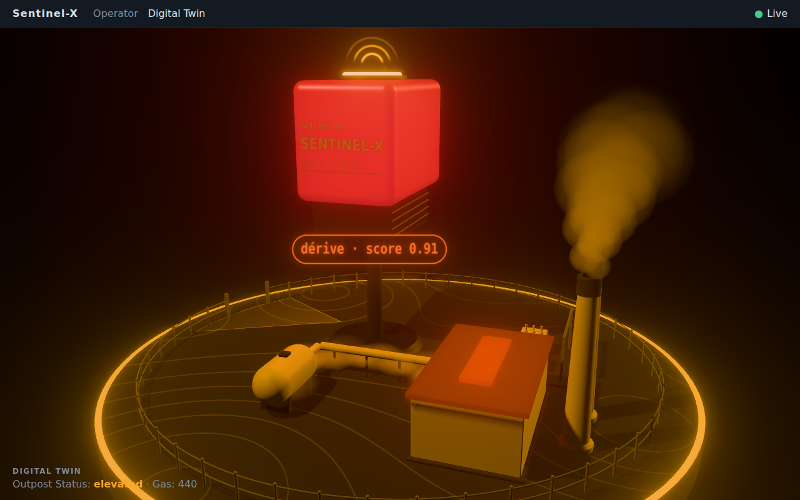

**The intruder** (#23) — where the vision service sees someone, on the maquette:

| `x_norm` 0.15 | `x_norm` 0.85 |
|---|---|
| 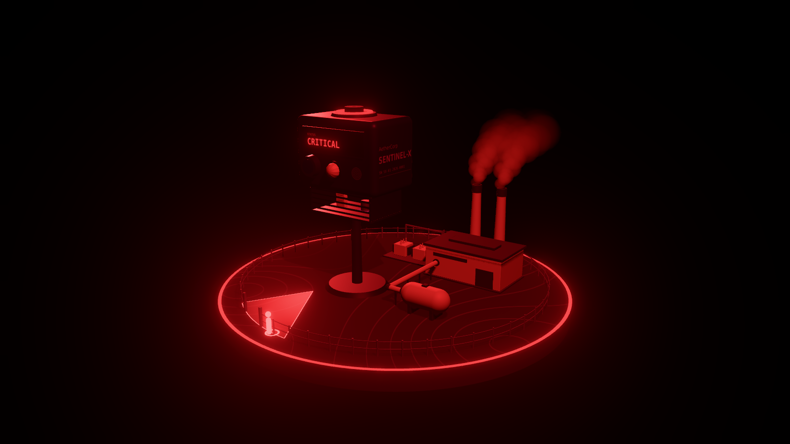 | 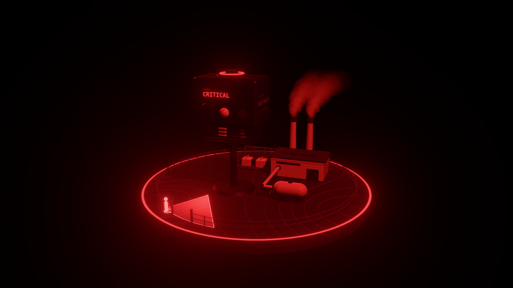 |

- **Where** — `scene.intruder` is the last raised of the active `intrusion` Alerts: its `x_norm` and `at`, the point of the fence the camera's sight meets for it, `watchedPoint(x_norm)` (see [the site](#digital-twin--featurestwin), camera sector). 0 is the lens's left, 1 its right: mirrored when you face the Enclosure. `toScene` does the mapping, so it is tested without a render: on the fence, at `watchedPoint`, and moving across the arc, in order, as the mock's 0.15 → 0.35 → 0.55 → 0.75 come in.
- **Drawn** — `<Intruder>`: a figure a little taller than the fence, standing just outside it (it comes from outside, and the rails do not run through it), with a ring on the arc at its feet. Unlit and brighter than white in `INTRUSION_COLOR`, so it reads over a scene lit all in red and the halo takes it for a light. It casts no shadow: the shadows are drawn once, and it moves.
- **Moves** — a new `x_norm` on the same Alert stands it at the new point; it is gone when the last `intrusion` is `cleared`, while the sector fades out.
- **Not yet** (#38) — it jumps from one point to the next and appears and goes without a fade. #38 makes it a column of light that glides along the arc, fades in and out, and is tied to the lens by a thin line.

**Presence** (#36) — the site knows it is approached before anyone is inside:

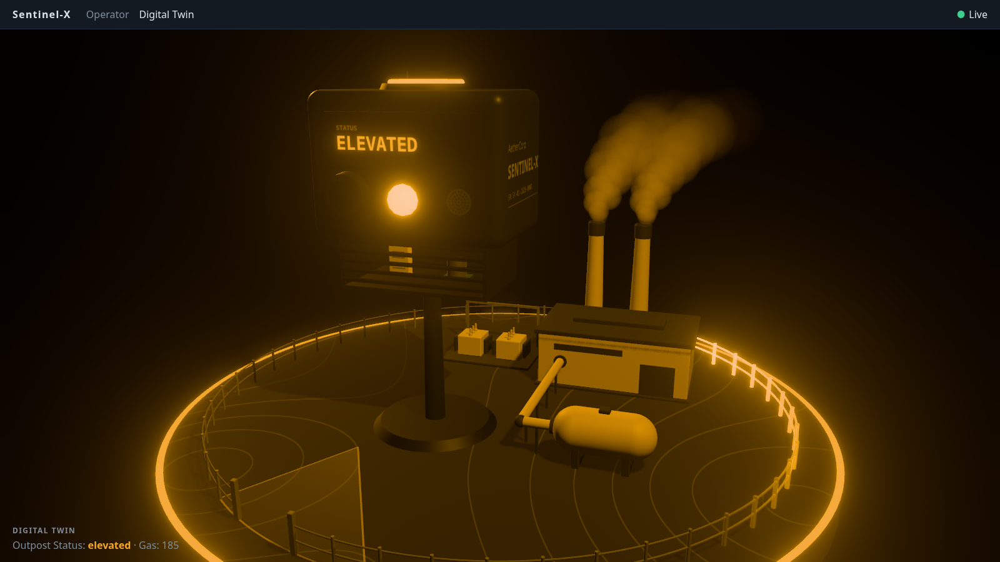

- While a `presence` Alert is active, `scene.presence.active` is true: the Enclosure's PIR dome blinks and a sweep goes round the fence, both in `PRESENCE_COLOR`, the amber of the `elevated` Status.
- **The sweep** leaves the gate's first post as the Alert is raised and reaches the last one `SWEEP_PERIOD` (2.4 s) later: a bright head and a tail behind it (`SWEEP_TAIL`, a share of the fence). Another follows, for as long as the Alert is active. `sweepGlow(place, lap)` is how bright the fence is at each place along it, `lap` of the way through a sweep.
- **The dome** flashes `FLASHES_PER_SWEEP` (4) times in a sweep, lit for as long as it is dark: `domeFlash(lap)`. A blink has steep edges, but each takes a few frames.
- **Once it is cleared** the sweep in progress goes to its end and no other starts; a presence that comes back before that end keeps it going. `sweepsAt(sweeps, present, now)` is that rule and `lapAt(sweeps, now)` how far through its sweep the fence is; `useSweep(present)` runs them on every frame, for the fence and for the dome. All of it is pure and tested.
- **No fade here**: the fence and the dome are both dark as a sweep starts and as it ends, so one sweep follows another, and the last one stops, without a cut. On the mock feed the Alert lasts 2 s: one sweep, which ends 0.4 s after the `cleared`.
- The sweep is light added over the posts and the rails, unlit: it glows, and it still reads at `elevated`, when the whole model is lit in amber. That is when it shows: a `presence` Alert is a warning, so it takes the Status there on its own.

**Noise** (#37) — a clap next to the Sentinel, seen on the maquette:

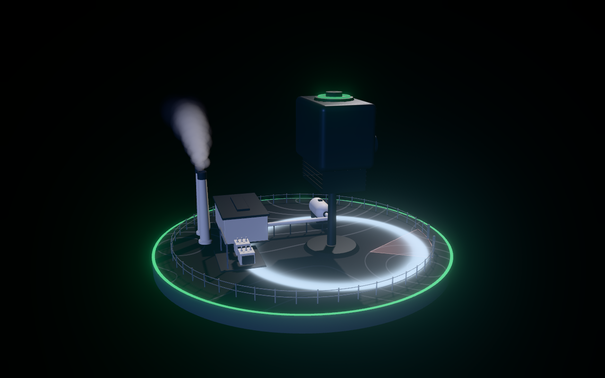

- **A wave a clap** — each `noise` Alert `raised` sends a wave of light from the foot of the Enclosure's mast over the socle: it spreads for `WAVE_LIFE` (1.5 s), fast as it leaves and slower as it goes, lights up within its first tenth and fades out to nothing as it ends. `waveShape(elapsed, amplitude)` is that envelope — the band's radius, its width, how bright it is — pure and tested.
- **As loud as the clap** — the amplitude is the Alert's `value` (the share of the cycle the sound sensor heard sound), held to 0–1, and 1 when the Alert does not carry one: `amplitudeOf(value)`. The loudest wave crosses the whole socle (`WAVE_REACH`, from the Enclosure to the farthest point of the rim) at full brightness; the faintest still goes `QUIET_REACH` of the way, at `QUIET_GLOW` of the brightness.
- **An event, not a state** — a `noise` Alert can be `cleared` on the next cycle, so the wave does not follow the active Alerts: it starts from the `raised` frame itself and plays to its end whatever comes after. `OutpostTwin` takes the feed's history as `frames`; `framesSince(seen, frames)` gives what came in since the last frame, `clapsIn(frames)` the claps among it, `wavesAt(waves, claps, now)` the waves still going plus one for each new clap. Two claps close together give two waves, the second never cuts the first (up to `MAX_WAVES` at once, the oldest going first past that). `useWaves(frames)` runs them on every frame.
- **Nothing replayed** — the frames already in the history when the Twin opens are past, and so is a history that does not follow on from the last one seen: no wave plays for them. A reconnection only brings the Command Post's snapshot (Status and latest telemetry): it sends no wave either.
- **Drawn** — one disc over the whole socle, whose shader draws every wave as a band around the Enclosure, sharper at its front than at its back, fading out at the socle's cut edge. In `NOISE_COLOR`, an ice white no Status shares (the Alert is only `info`: something was heard, nothing is wrong), unlit and added over the ground, so the halo takes it for a light and the buildings it passes behind hide it. It is not drawn at all while the site is quiet. Its cost, while a wave is on, is one disc's fragments, twice (the lit frame and the halo's): not measured on the Iris Xe yet, but far below the haze's.
- **On the real Sentinel** — the firmware raises `noise` once and holds it for `NOISE_HOLD_MS` (3 s) of quiet before clearing it: claps closer than that make one Alert, so one wave. On the mock feed, the clap is raised at 0.82 and cleared on the next tick.

**The site** (#32) is what the Enclosure watches over, and what every reaction is anchored on:

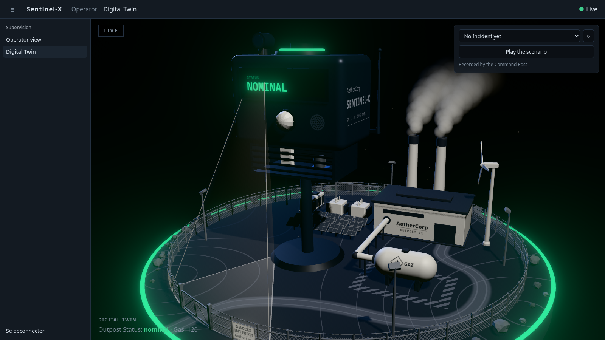

- **One ground plan** — `SITE` (`utils/site.ts`) places everything, once: the socle, the generator hall, its two chimneys, the transformer station, the gas tank and the pipe from it to the hall, the fence and its gate, the Enclosure and its camera. Coordinates are scene units from the socle's centre, `x` to the right and `z` to the front; a bearing is an angle around the vertical, 0 to the front. The components only draw what `SITE` says: move a part there, never in a component. Its tests hold the plan together without a render — everything stands on the socle and inside the fence, no two parts on the same ground, the pipe joins the hall to the tank, the Enclosure stands at the gate with nothing of the plant in its field of view.
- **Who stands where** — the Enclosure is tall enough to throw its shadow across half the socle, and the key light comes from the front right: so it stands on the left by the gate, and the plant on the right, in the light. Keep that in mind before moving either.
- **Camera sector** — `lensPoint()` is where the Enclosure's lens is over the ground, and `watchedPoint(xNorm)` where its sight meets the fence for what stands at `xNorm` across its image: 0 on the lens's left, 1 on its right (so mirrored when you face the Enclosure). The sector drawn on the ground runs from under the lens to that arc; it lights up on an `intrusion` Alert (#13), and the intruder belongs on its arc (#23, #38). The field of view is `SITE.camera.fov`, 60° until the real lens is measured.
- **Socle** — a disc of terrain cut clean, afloat in the black. Its contour lines are drawn by the terrain's material from a relief that exists only there: the ground stays flat. The Status's ring runs around its rim.
- **Volumes** — `Box` (bevelled edges) and `Turned` (a profile turned around the vertical, every corner crisp) are what the plant is built from; both cast and receive shadows. No model is loaded.
- **Materials** — `palette.ts`: graphite and off-white only. Color is kept for the Status and the signals.
- **Steam** — a slow plume above each chimney, whatever the Status: the plant is idling. `puffAt(age)` is a puff's whole life, pure: it leaves the mouth unseen and is gone when its life ends, so the plume loops without a cut. The puffs are lit, so they take the Status's light and never glow.

**Heat** (#35) shows on the generator hall, so that it is told from a gas leak, which shows on the Enclosure:

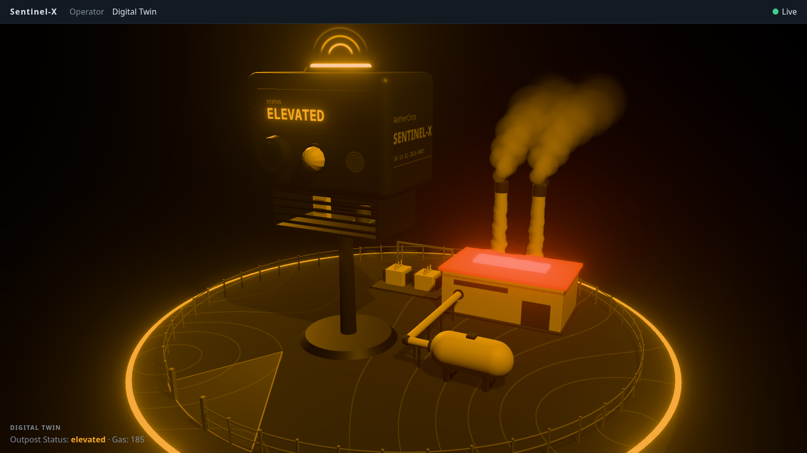

- **The roof glows** with `scene.thermal.intensity`, which is `heatLevel(readings.temp)`: dark when calm, a deep red all over at the peak, its skylight far brighter. Like the gas, it follows the telemetry, not the Alerts: it reddens before any `thermal` Alert is raised and cools down after it clears. The glow is emissive, so it has its halo, in `HEAT_COLOR`: more orange than the critical Status, to stay apart from it when the whole model is lit in red.
- **One range** — `CALM_TEMP` (31.5 °C) and `PEAK_TEMP` (41 °C), in `utils/heat-level.ts` and nowhere else. They are those of the mock feed: tune them to the site when the Sentinel sends its own Readings (its `thermal` Alert is raised at 40 °C, `firmware/include/config.h`).
- **The air ripples** above the hall while a `thermal` Alert is active (`scene.thermal.shimmer`), and fades in and out over `FADE_SECONDS` like every change. What stands behind the hot air wavers: the chimneys from the front, the fence and the ground from behind. What stands in front of it does not.
- **How** — `HeatShimmer` draws no color. It is a box over the hall whose shader works out how much hot air each pixel is seen through (a bell around the middle of the roof, thinning out upward, cut where the sight meets the roof) and writes what it leaves into the **frame's alpha**, which is 1 or more everywhere else. It is depth-tested, so what stands in front hides it. The frame's last pass (`Halo`) then reads that alpha and looks up the image a little to the side, along waves that rise. No extra pass, one more box while the air ripples, nothing while it is still: a frame costs the GPU the same either way (timed on the Iris Xe, at the 3 million pixel budget).
- The frame's alpha is taken: anything else that brings it under 1 (a material with custom blending) would ripple. A light added over the frame (`AdditiveBlending`) only raises it, and `HeatShimmer`, drawn last (`renderOrder`), keeps the lesser of the two: such a light ripples behind the hot air like everything else. Another source of heat is another `<HeatShimmer>` over another block; keep its box (`REACH` spreads out) clear of the other parts, since what is inside it is taken to be behind the hot air.

**The stage** (#30) is what every later Twin slice is set on:

- **Full screen** — `OutpostTwin` fills its parent. A route that renders a `.stage` gets the whole window under the top bar (`styles.css`); the other routes keep the padded page.
- **Light** — black background, a key light that casts the soft shadows, a cold rim light from behind, a trace of fill. The key and the fill take the grade's `light`, the rim its `rim`: neutral at `nominal`, the Status's color otherwise. The lights stay put while the camera orbits. Give a new mesh `castShadow` / `receiveShadow`. The shadow map is 2048 wide with a blur of 3 since #32: a wider blur shows its grain on the off-white walls. The shadows are drawn once (`StillShadows`), since nothing that casts one moves: after moving a caster, ask for them again with `gl.shadowMap.needsUpdate = true`.
- **Halo** — only what emits light glows. `Halo` draws the scene a second time with its lights off and blurs that image over the frame: set `emissive` + `emissiveIntensity` on a material and it glows in proportion, in its own color; a lit surface never does, however bright. An unlit material (`meshBasicMaterial`) counts as emitting — the ring around the socle glows in the Status's color that way — so use a standard one for anything that should not glow. Its pass is the last to touch the frame: that is also where the frame turns grey when the signal is lost (`saturation`), and where hot air ripples what is seen through it (#35).
- **Color** — the frame is rendered in HDR and tone-mapped with `NeutralToneMapping`, which leaves the Status colors as they are.
- **Camera** — it goes around the Outpost in 80 s. The Operator can turn it and zoom with the mouse, between bounds that keep the Outpost in frame (no panning, never under the ground); 3 s after they let go, the orbit picks up speed again. `autoOrbitSpeed` is that rule, as a pure function.
- **Resolution** — `pixelRatio` caps the rendering at a pixel ratio of 2 and at 3 million pixels (`MAX_PIXELS`), whatever the screen. That budget was measured on an Iris Xe, where the Twin holds 60 images per second up to about 3.4 million pixels: raise it on a stronger GPU.

**The Enclosure** (#31) — the Sentinel-X product itself, on a mast, at an exaggerated scale (`ENCLOSURE_SHAPE.scale`) to stay readable from the back of the room. Built in code from bevelled volumes (`RoundedBoxGeometry`) and canvas-drawn textures, no external model.

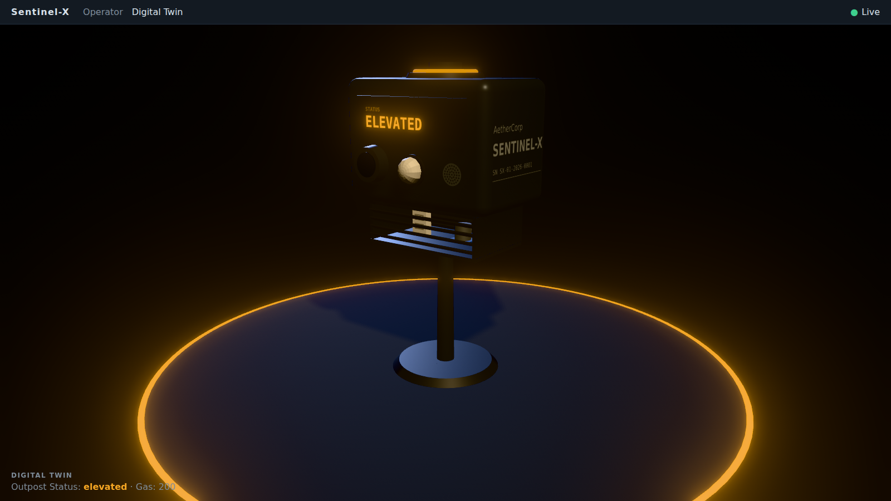

- **Front:** the LCD band, then the camera lens, the PIR dome, the mic grille. **Under the body:** the ventilated Probe compartment, louvres front and back, the DHT22 and the MQ-2 visible between them. **On top:** the buzzer and the LED ring around it. **Right side:** the engraving, *AetherCorp / SENTINEL-X / serial* (`ENGRAVING`).
- **Parts to drive:** every Probe and actuator is a named object — `scene.getObjectByName(ENCLOSURE_PARTS.mq2)` — for the later slices. The predictive pulse (#13) drives `dht22` and `mq2` from `scene.enclosure.pulses`, the presence (#36) blinks `pir`, the Alarm (#34) drives `ledRing` and `buzzer` from `scene.enclosure.alarm`.
- **LCD:** shows `scene.enclosure.lcd.text` (`LCD_TEXT`: `NOMINAL`, `ELEVATED`, `CRITICAL`) in the Status's color. The text switches like a real LCD's, the color fades. Unlit, so it glows.
- **LED ring:** breathes in the Status's color, one breath every `BREATH_PERIOD` (4 s), never below `BREATH_FLOOR` — `breath(t)` is pure and tested. The kit has no LED any more (`docs/ARCHITECTURE.md`): on the Twin, the ring is the Status light, until the Alarm makes it blink (#34, below).
- **Gas:** the body carries the glow of #20, and lights the ground from inside it.
- **Where it stands:** the site plan says (`SITE.enclosure`: the foot of its mast, the way it faces), and `OutpostTwin` puts it there. What the plan needs of its shape is in `ENCLOSURE_SHAPE` (`utils/enclosure-parts.ts`), which the model is drawn from: its scale, the radius of its foot, where its lens is. Move the lens there and the camera sector follows.
- **Camera:** the orbit now turns around the Enclosure's height (`TARGET` y = 1.2).

**Gas and the Alarm** (#34) — the physical threat, readable without a look at the curves:

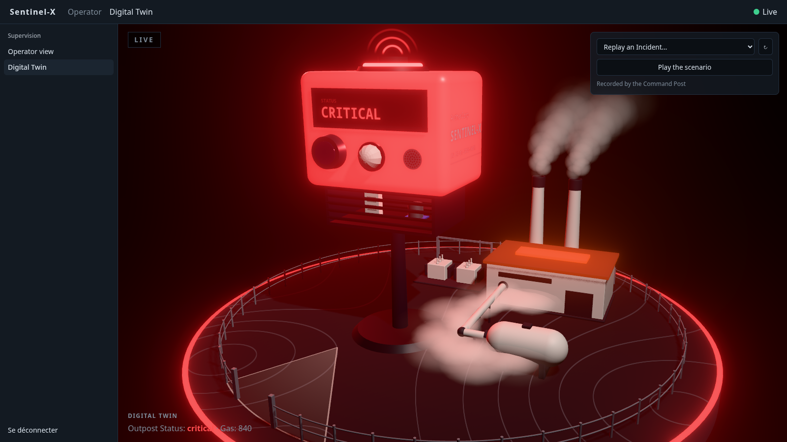

- **Haze** — a haze settles around the gas pipe and thickens with `readings.air`. `scene.haze` is the gas level (`gasLevel`): none when calm, the most from `CRITICAL_AIR` on. Like the Enclosure's glow it follows the telemetry, not the Alerts: it is there before any `gas` Alert. `<Haze density>` eases toward it slowly enough (`HAZE_EASE`) never to rest on a step between two Readings.
- **Wisps** — the haze is made of wisps that seep from points spread along the pipe (`alongPipe(share)`), sink to the ground and spread over it. `wispAt(age)` is a wisp's whole life, pure. They are made of what the steam is made of (`VapourMaterial`): lit, so the haze takes the Status's light, red at `critical`, and never glows.
- **Alarm** — `scene.enclosure.alarm` is on while a `gas` or `thermal` Alert is active, the Alerts the Sentinel fires its Alarm on. It carries the highest severity among them and its color: green for `info`, amber for `warning`, red for `critical`. The LED ring then blinks in that color instead of breathing, and the buzzer sends out arcs of sound, one on every beat (`ALARM_PERIOD`, 0.5 s): `blink(t)` and `arcsAt(t)` are pure and tested. When none is left, the ring goes back to breathing in the Status's color and the buzzer goes silent. One fades into the other over `FADE_SECONDS`.
- **Not the real Alarm's state** — the contract does not carry it. An Alarm the Operator silenced keeps sounding on the Twin for as long as its Alert is active.
- **Arcs** — drawn on a sheet that stands on the buzzer and turns to face the camera. They rise no higher than `ARC_REACH`: the camera frames the Enclosure with little room above it.
- **Cost** — at the gas peak a frame takes about 1 ms more than when calm: 9 ms against 8 at 1920 × 1080 on the Iris Xe, where 60 images per second leave 16.7. All of it is the haze: each wisp is drawn over what is behind it, so their number (`WISPS`) and their radius are what to keep an eye on.

**Capture mode** (#40) — `/twin?capture` is the Twin alone, to be filmed for the teaser:

- **No interface** — no top bar, no connection indicator, no caption: the canvas takes the whole window, on black. `captureMode(location)` reads the parameter (being there is enough, whatever its value); without it `/twin` is the normal view.
- **Same feed** — mock or live, it plays what the normal view plays.
- **Whole in frame** — `<OutpostTwin wholeStage />` stands the camera back until the whole stage holds in the frame, whatever its shape: `wholeStageDistance(aspect)` fits a sphere around the stage (`STAGE_RADIUS`, the ring around the socle plus room for its halo) in the narrower field of view, so it holds all the way around the orbit and at any tilt. The camera can still be turned by hand; it no longer zooms.
- Anything added to the stage further out than the ring around the socle needs a larger `STAGE_RADIUS`.

## Time-scrubber — `features/replay`

The demo's insurance (#15): a past Incident replayed second by second in the Twin, or the scripted scenario played on demand, network or not, and always labelled as a replay.

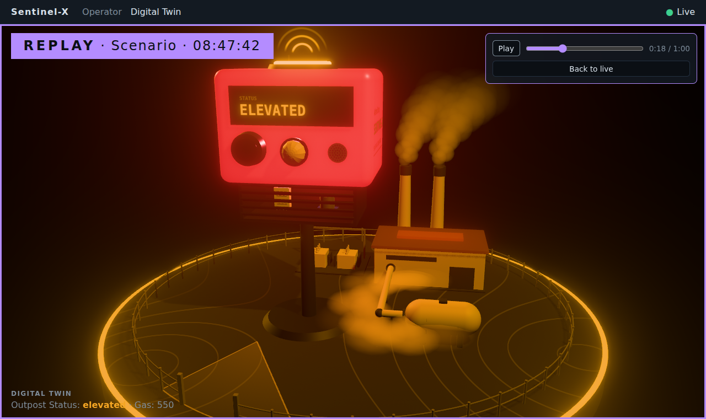

```tsx
import { stateAfter, useLiveFeed } from '@/features/live-feed'
import { TimeScrubber, usePlayer } from '@/features/replay'

const player = usePlayer()
const shown = player.frames ? stateAfter(player.frames) : liveState   // replayed or live, the same shape
<OutpostTwin scene={toScene(shown)} frames={player.frames ?? history} />
<TimeScrubber history={history} player={player} />
```

- **Incidents** — `incidents(history)` groups the Alerts of any list of frames into Incidents, pure: from the first `raised` until every Alert raised since is `cleared`, paired by `alert_id`, by date. The Command Post's rule and shape (`Incident` of the contract), so the reference scenario holds here too: gas nominal → warning → critical → warning → nominal plus two PIR detections = 8 Alerts, 1 Incident.
- **Where they come from** — the scrubber lists the Command Post's recorded Incidents (`GET /api/v1/incidents`, asked again whenever an Incident opens or closes in the feed, and on ↻) and replays one from `GET /api/v1/incidents/:id`. When the Command Post cannot be reached (network down, no Operator session), it falls back on `incidents(history)` over the frames this window received: the feed's last 1000. An Incident whose replay fails to load is taken from there too if the window saw it.
- **A replay** — `replayOf(history, incident)`: the Incident's span with `LEAD_MS` (3 s) of calm on each side, the last telemetry before it, and after each Alert the Status it leads to (`withStatus`: the history keeps no Status). Copies of the frames, never the live feed's own: the noise waves tell them apart by identity, so going back to live replays no clap.
- **Second by second** — `usePlayer()` moves one second every second from the replay's start, stops on its last second and holds there; the range input seeks to any second, Play/Pause, and Play from the end starts over. `framesAt(replay, t)` is what has been received by `t`, and `stateAfter(frames)` (live-feed) folds it with the live feed's own `apply`, on a connection open all along: the Twin reacts to the replayed frames exactly as to the live ones, and never shows a signal lost in a replay.
- **Live or replay** — always one label at the top left of the stage: `LIVE`, or `REPLAY · Incident #1 · 14:23:12` on a solid violet (`--replay`, a color no Status shares), the whole stage framed in it and the caption showing the replayed Status and gas. **Back to live** leaves the replay; the Twin never goes back on its own.
- **Scenario mode** — **Play the scenario** plays `scenario(now)`: the reference scenario, scripted (60 s: 5 s of calm, the 50 s Incident, 5 s of calm), one telemetry snapshot a second with the gas rising to 680 and the PIR on while someone is there. It plays the same every time without the network, and is labelled REPLAY like any other.
- **Not in capture mode** — `/twin?capture` shows neither the label nor the scrubber.
- **Not yet** — the last N minutes of history (`GET /api/v1/history`) as one free timeline, rather than Incident by Incident. With `OPERATOR_AUTH` on, the Command Post answers only to a session: until the login screen exists, the scrubber falls back on this window's Incidents.

## TODO
- [x] App shell + live feed (WebSocket client, store, hook) — #10
- [ ] Operator login screen: the API is ready (`POST /api/v1/auth/login`, `GET /api/v1/auth/check`, see [`../backend/README.md`](../backend/README.md#operator-session))
- [ ] Charts + Status + Alerts — #21, #11
- [ ] Camera panel + actuator control panel — #14
- [x] 3D Outpost whose Enclosure reacts to gas — #20
- [x] Scene mapper + Status color — #12
- [x] Twin full screen, in studio light, with an orbiting camera — #30
- [x] The Enclosure, with its LCD and LED ring alive — #31
- [x] Status fades and "signal lost" — #33
- [x] Capture mode for the teaser (`/twin?capture`) — #40
- [x] The Outpost as a maquette: socle, micro power plant, perimeter, camera sector — #32
- [x] Intrusion zone lit, predictive pulse on the drifting Probes — #13
- [x] The drift's label under the pulsing Probes: « dérive · score 0.91 » — #39
- [x] Presence: PIR dome blinking, amber sweep round the fence — #36
- [x] Gas haze around the pipe, the Alarm on the Enclosure's LED ring and buzzer — #34
- [x] Heat on the generator hall: its roof glows with the temperature, the air ripples on a `thermal` Alert — #35
- [x] Noise: a wave from the Enclosure over the socle on each clap — #37
- [x] Intruder placement (`x_norm` → perimeter arc) — #23
- [x] Time-scrubber + scenario mode — #15
- [ ] CI: build + smoke render — #16
