# dashboard/ — Web UI & 3D Digital Twin

**Node:** served by the Command Post (Pi) through the reverse proxy (HTTPS/WSS), rendered in the Operator's browser · **Stack:** Vite + React + TypeScript, Tailwind CSS v4 + [shadcn/ui](https://ui.shadcn.com/docs/components) (Recharts for the charts), react-three-fiber (Three.js) for the Twin

The face of Sentinel-X and our **"wow" centerpiece**. See [`../docs/DIGITAL-TWIN.md`](../docs/DIGITAL-TWIN.md).

**One app, two screens on the same live feed:** `/` is the Operator's dashboard, `/twin` the Digital Twin (lazy-loaded, so three.js only loads there). For the demo, open each in its own window. One origin, one container, one Operator session, as in [`../docs/ARCHITECTURE.md`](../docs/ARCHITECTURE.md).

## Must have (from the brief)
- Real-time environmental curves.
- Logical box status.
- Live camera feed — the annotated MJPEG stream served by the `vision` service.
- Reactive control panel to trigger the actuator (buzzer) remotely — `POST /api/v1/commands`.

## Security
- **Operator login** screen; every view, the WebSocket (`wss://`) and the camera feed sit behind the session. A session that ends brings the login screen back — see [Operator session](#operator-session--featuresauth). In the control room's look: a grid floor, the perimeter radar, the Enclosure's hexagon turning faster while the Command Post checks, red and a shake on a refusal, "Accès autorisé" before the dashboard; whether the channel is encrypted (HTTPS) is read from the page, never claimed. Still with reduced motion. Screenshots in [`../docs/dashboard/`](../docs/dashboard/).
- No token or secret in the front-end bundle.

## Our extra — the Digital Twin
- Live 3D replica of the **Outpost** reacting to the real WebSocket event stream.
- **Intruder**: a human figurine in hologram, stood inside the fence from the `intrusion` Alert's `x_norm` (where across the camera's image), `h_norm` (how tall in it: how near) and `pan` (how far the camera is turned), framed by detection brackets and labelled with the vision model's `confidence`: « PERSONNE · 88 % ». It walks to where the camera sees it next, turned the way it goes: in toward the Enclosure as the real person comes nearer. Each other person the camera sees (`others`) has a figurine of their own, five at most. A thin line ties the head of each to the lens, one a person. Once someone is no longer seen, the hollow outline of their figurine stays for about 5 s where it last stood: the last known position, one for each person the camera saw.
- **Camera field**: a translucent volume from the lens on the Enclosure's front down to the arc of the fence it watches, faint at rest, lit on an `intrusion`. It turns with the real camera, which a servo turns to whom it follows.
- **Perimeter**: a chain-link fence under a strand of barbed wire, its gate closed, which opens for as long as an intrusion goes on. The camera's field, the intruder and the presence's sweep read through it.
- **Component pulse** on a `predictive` anomaly; sound ripples on `noise`.
- **The link, seen**: an antenna on the Enclosure sends an impulse of white light for each frame of telemetry received, and a padlock reads « WSS » by it when the live feed really is encrypted, never otherwise.
- **`Status`** floods the twin in its color as it rises, then stays on its ring, its rim light and the Enclosure (`nominal`/`elevated`/`critical`).
- **Time-scrubber** replays a past Incident second by second, labelled REPLAY — demo insurance (#15).
- **Scenario mode** plays the scripted reference scenario on demand, network or not (#15).

## Run it
Node ≥ 22. Start the mock feed first, then the app:

```bash
# terminal 1 — the Command Post API playing its scripted scenario (gas leak, clap, intruder)
cd backend && npm install && OPERATOR_AUTH=off MOCK_FEED=true HISTORY_FILE=:memory: npm run dev

# terminal 2 — the app on http://localhost:5173 (/ and /twin)
cd dashboard && npm install && npm run dev

npm test            # store, feed client, config, gas level, heat level, scene mapper, site plan, steam, haze, Alarm,
                    # fades, escalation flash, pulse, presence sweep, noise wave, the link's impulses, automatic orbit, pixel ratio, framing,
                    # the camera's field, the intruder's track and last known position, walk cycle and figurine,
                    # its detection's label and frame, the camera's turn to an Alert,
                    # Incidents, replay, scenario, Incidents client, the Twin on a replay
npm run build       # typecheck + production bundle in dist/
npm run smoke       # smoke-render of that bundle, on the mock feed — see below
```

**Smoke-render** (#16) — `npm run build && npm run smoke` opens `/` and `/twin` of the production bundle in a headless Chromium and fails on any runtime error: an uncaught exception, an error on the console, the feed not live, the Status or the Readings missing, the Twin without a WebGL context. It starts what it needs itself, on ports of its own (`playwright.config.ts`): the API from `../backend` on its mock feed (`npm install` there first) and `vite preview`, pointed at it by `BACKEND_URL`. The Twin is rendered in software, as on a CI runner. The browser: `npx playwright install chromium` once, or `SMOKE_BROWSER=/path/to/chrome` for one already on the machine. The tests are in [`smoke/`](smoke/).

**CI** — [`.github/workflows/ci.yml`](../.github/workflows/ci.yml), on every pull request and on `main`: the backend's typecheck and tests (the contract the front imports), then here `npm test`, `npm run build` and the smoke-render; and a check that nothing `.gitignore` lists as a secret is tracked.

**Filming the Twin for the teaser** — open `/twin?capture` in a vertical 9:16 window (1080 × 1920) and record the screen while the scenario plays: the Twin alone on black, no interface, on the same feed. See [capture mode](#digital-twin--featurestwin).

The app always talks to its **own origin** (`/ws`, `/api`): the Vite dev server proxies them to `BACKEND_URL`, the reverse proxy does it on the Pi. Mock or live is the backend's setting, the front never changes.

| Variable | Default | Purpose |
|---|---|---|
| `BACKEND_URL` | `http://127.0.0.1:8080` | Command Post API that `/ws` and `/api` are proxied to in `dev` and `preview` (e.g. the Pi's address). Set it in `.env` (see `.env.example`). |
| `CAMERA_URL` | — | The `vision` service's MJPEG stream that `/camera` is proxied to in `dev` and `preview`. Unset: the camera panel shows "unavailable" and retries every 5 s. |

Run the backend with `OPERATOR_AUTH=on` (and an `OPERATOR_PASSWORD_HASH`) to get the login screen; with `OPERATOR_AUTH=off` the app goes straight in.

## Structure — feature-driven

```
src/
├── main.tsx
├── app/                     # composition only: shell, router, routes
│   ├── app.tsx              # AuthGate + LiveFeedProvider + router
│   ├── router.tsx           # /  and  /twin (lazy)
│   ├── layout.tsx
│   └── routes/              # operator.tsx, twin.tsx — assemble features, no logic
├── features/
│   ├── live-feed/           # #10 — the socket, the store, the hook
│   │   ├── api/             # connectFeed(): WebSocket client, backoff, drops bad frames
│   │   ├── stores/          # apply(state, event): pure reducer + tiny external store · stateAfter(frames)
│   │   ├── hooks/           # useLiveFeed(selector)
│   │   ├── components/      # LiveFeedProvider, ConnectionIndicator
│   │   └── index.ts         # the feature's public API
│   ├── auth/                # #48 — AuthGate (login screen until a session exists, and again once it is gone)
│   │                        # useSignOut(), useSessionCheck() · afterCheck(session, answer): pure
│   ├── status/              # StatusCard, StatusBadge — the Status the backend computes
│   ├── telemetry/           # #21 #11 — ReadingTiles, Gas / Climate / Sound charts, toSeries()
│   ├── alerts/              # #11 — ActiveAlerts, AlertLog (+ filters: filterLog()), AlertToasts
│   ├── incidents/           # ThreatOverview, IncidentTable, useIncidents() on GET /api/v1/incidents
│   ├── camera/              # #14 — CameraPanel on /camera, intruder marker from x_norm
│   ├── actuators/           # #14 — ActuatorPanel, POST /api/v1/commands
│   ├── replay/              # #15 — the time-scrubber and scenario mode
│   │   ├── api/             # fetchIncidents(), fetchIncidentReplay(id): the Command Post's recorded Incidents
│   │   ├── hooks/           # usePlayer(): second by second · useRecordedIncidents(key)
│   │   ├── components/      # TimeScrubber: the LIVE/REPLAY label and the scrubber, over the Twin
│   │   ├── utils/           # incidents(history) · replayOf(history, incident) · framesAt(replay, t)
│   │   │                    # withStatus(frames) · scenario(start), scenarioFrames(start) · labels
│   │   └── index.ts
│   └── twin/                # #20, #12, #30, #31, #32, #33, #40, #13, #36, #34, #35, #37, #23, #38, #91, #92, #93, #94, #96, #95, #97, #98, #99, #101, #102, #103 — the Outpost as a maquette, on its studio stage
│       ├── components/      # OutpostTwin: the scene, drawn from SceneProps · Enclosure · OrbitCamera · Halo
│       │                    # Socle · PowerPlant · Perimeter · Steam: the site, drawn from SITE
│       │                    # ChainLinkMaterial: the fence's mesh and the gate's, drawn by their material · inDiamonds
│       │                    # Signage: its no-entry signs, the tank's danger zone and pictogram, the site's name
│       │                    # Rocks: the rocks around the site, in instances · Dust: the motes adrift over it
│       │                    # Renewables: the solar field, in instances, the wind turbine and the batteries
│       │                    # Haze: the gas around the pipe · VapourMaterial: what steam and haze are made of
│       │                    # HeatShimmer: the hot air above the hall · NoiseWaves: a clap's wave over the socle
│       │                    # Antenna: the Enclosure's antenna, its impulses and the padlock by it
│       │                    # Intruder: a hologram figurine for each person the camera sees, inside the fence, in its
│       │                    # detection's brackets, the one it follows tied to its lens, and the outline that one leaves
│       │                    # LabelCard: a signal's label, a card that faces the camera
│       │                    # Box · Turned: the bevelled volumes it is built from · boxShape, turnedShape: their shapes · palette
│       ├── hooks/           # usePixelRatio(element) · useFade(target), useColorFade(color) · useSweep(present)
│       │                    # useWaves(frames) · useStatusLight(level, neutral) · useFraming(anchor, frames)
│       │                    # useImpulses(frames, live)
│       ├── utils/           # toScene(state): the scene's props, pure · gasLevel(air), heatLevel(temp): 0–1
│       │                    # SITE: the ground plan · lensPoint(), lensHeight() · fencePosts() · bearingTo(from, to)
│       │                    # sightBearing(xNorm, pan), watchedPoint(xNorm, pan): where the camera looks, turned or not
│       │                    # standingSpan(bearing), standingPoint(xNorm, pan, hNorm): where someone it sees stands
│       │                    # panToward(shown, pan, elapsed): the camera's pan as it is drawn
│       │                    # bearingAlongFence(point, way): the way to face to walk along it · gatePoint()
│       │                    # fenceLength() · meshCell(): a diamond of the mesh · barbedHeight(), fenceBarbs(): the barbed
│       │                    # wire · gateLine(): the closed gate's line and the opening its leaves fit in
│       │                    # gateSigns(), dangerZone(), hallSign(): where the signage is
│       │                    # hallDoor() · track(): the track's two stretches · fromPath(point, path) · rocks():
│       │                    # the rocks, drawn from a seed · DUST, moteAt(index, seconds): a mote of dust's drift
│       │                    # solarPanels(): where each solar panel stands · panelGround(): the ground one takes
│       │                    # cameraField(steps), fieldBase(field), fieldWalls(field): the camera's field, a volume
│       │                    # alongPipe(share) · puffAt(age): a puff of steam's life · wispAt(age): a wisp
│       │                    # of haze's · blink(t), arcsAt(t): the Alarm · ENCLOSURE_PARTS, ENCLOSURE_SHAPE
│       │                    # autoOrbitSpeed(touch, now), resumeRamp(elapsed) · pixelRatio(density, width, height)
│       │                    # newlyRaised(seen, frames), shortestTurn(from, to), cameraTurn(framing, azimuth, touch, now):
│       │                    # the camera's turn to an Alert
│       │                    # wholeStageDistance(aspect) · fadeTo(fade, to, now), fadeValue(fade, now)
│       │                    # statusShare(from, to, elapsed): the Status's share of the light as it rises
│       │                    # lightTo(light, level, now), lightShares(light, now), lit(shares, neutral, colors)
│       │                    # DRIVER_PROBES: driver → Probe · pulse(t): a drifting Probe's beat
│       │                    # sweepsAt(sweeps, present, now), lapAt(sweeps, now): the fence's sweeps on a presence
│       │                    # sweepGlow(place, lap) · domeFlash(lap)
│       │                    # framesSince(seen, frames), clapsIn(frames), wavesAt(waves, claps, now): the waves a
│       │                    # clap sends · waveShape(elapsed, amplitude): a wave's radius, width and glow
│       │                    # telemetryIn(frames), impulsesAt(impulses, received, live, now): the impulses the
│       │                    # telemetry sends from the antenna · impulseShape(elapsed): its height, radius and glow
│       │                    # trackAt(track, seen, elapsed): a figurine's track, walking to where its person was seen
│       │                    # lastKnown(track): the last known position · figurineLevel(track), marksLevel(track)
│       │                    # tracksAt(tracks, intrusion, elapsed): a track for each person, and those going out
│       │                    # walkPhase(walked), walkCycle(phase, share): its walk cycle · turnedTo(from, to, share)
│       │                    # FIGURE: the figurine's plan · figureHeight(), headHeight() · sweptTo(age): its sweep
│       │                    # detectionLabel(confidence) · detectionFrame(), brackets(): the detection's frame
│       └── index.ts
└── shared/
    ├── contract/            # re-exports backend/src/contract.ts — never redeclare a schema
    ├── config/              # feedUrl(), feedEncrypted() · captureMode() · STATUS_COLORS
    ├── api/                 # getJson / postJson on the app's own origin · onUnauthorized(listener): a 401
    ├── lib/                 # cn(), French labels, Status/severity colors, fr-FR formats · paginate(), inOrder()
    ├── components/          # LevelBadge: the outline badge with a colored dot · Pager, SortByTime
    ├── hooks/               # use-mobile (shadcn sidebar)
    └── ui/                  # shadcn/ui components (components.json points the CLI here)
```

**Rules**
- A feature owns everything it needs (`api/`, `stores/`, `hooks/`, `components/`, `utils/`… only the folders it uses).
- Import a feature through its `index.ts` only (`@/features/live-feed`), never its folders.
- Features don't import each other; `app/routes` composes them. `shared/` imports nothing from `features/` or `app/`.
- Logic goes in pure functions next to their tests (`*.test.ts`), so it is tested without a browser; components stay thin.
- Imports use the `@/` alias for `src/`.

- UI building blocks come from shadcn/ui: `npx shadcn@latest add <component>` writes them to `src/shared/ui/` (check that its imports say `@/shared/lib/utils`). No icon library: a state is said with a colored `●` and words, a trend with `▲` / `▼` — the top bar's `● En direct` sets the tone. A shadcn component added later comes with lucide icons (still installed: `ui/` uses it internally): swap them for that. The theme is shadcn's neutral one, dark only, in `app/styles.css`; `nominal` / `elevated` / `critical` are Tailwind colors too (`text-critical`, `bg-nominal`…), kept to dots and figures.
- The UI text is in French (the Operator and the jury are); code, comments and docs stay in English. Labels shared by several features live in `shared/lib/labels.ts`.
- `app/` holds the shell (`layout.tsx`): the original top bar across the window — `☰`, `Sentinel-X`, `Operator`, `Digital Twin`, `● Live`, its words in English — and under it the shadcn sidebar (`app-sidebar.tsx`), with the two surfaces and the sign-out.
- The shell is exactly the window's height and only the page scrolls inside it (`[data-scroll=page]`): the top bar and the sidebar never move, and "Se déconnecter" stays in sight on both screens.
- The sidebar folds away: the top bar's ☰ (or Ctrl+B) hides it and gives the page its room, and the choice survives a reload (`sidebarOpenFrom(document.cookie)` reads shadcn's `sidebar_state` cookie back). Under 768 px it is a drawer that a choice closes, and the top bar keeps only ☰, the brand and the feed.
- Responsive down to a 390 px phone: the Alert log's filters stack in two columns; on a phone the Alert log puts the state under the Alert's name and the Incidents put the outcome under the start, rather than scroll sideways; the pager drops its words.

**Features to come**

| Feature folder | Tickets | On |
|---|---|---|
| `features/telemetry` | #21 gas curve, #11 every curve | `/` |
| `features/status` · `features/alerts` | #11 Status badge, active Alerts | `/` |
| `features/camera` · `features/actuators` | #14 camera feed, actuator panel | `/` |

## Live feed — `features/live-feed`

```tsx
import { useLiveFeed } from '@/features/live-feed'

const status = useLiveFeed((state) => state.status)                  // 'nominal' | 'elevated' | 'critical'
const telemetry = useLiveFeed((state) => state.latestTelemetry)      // last snapshot, or null
const alerts = useLiveFeed((state) => state.activeAlerts)            // raised, not cleared yet
const history = useLiveFeed((state) => state.history)                // every frame, oldest first (last 1000)
```

- Select a state field as is; derive anything else with `useMemo` (a selector returning a new array each call loops).
- The Status comes from the Command Post: the front never recomputes it on the live feed. A replay is the one exception: the history keeps no Status, so `features/replay` works it out from the replayed Alerts by the Command Post's rule.
- On every (re)connection the backend sends its snapshot (current Status + latest telemetry) and the active Alerts start over, since some may have cleared while the socket was down.
- `connection` is the socket as it is now (`connecting`, `open`, `closed`), `connectedOnce` whether it has ever been open. Together they tell a signal lost (not open any more) from a first connection still being tried.
- Types come from `@/shared/contract`: `Telemetry`, `Alert`, `Status`, `Frame`…
- The Status colors are defined once, in `shared/config/status-colors.ts` (`STATUS_COLORS`). `main.tsx` hands them to the stylesheet as `--nominal`, `--elevated` and `--critical`; the Twin lights its scene with the same.

## Operator session — `features/auth`

```tsx
import { AuthGate, useSessionCheck, useSignOut } from '@/features/auth'

<AuthGate>{/* the login screen until there is a session: nothing below mounts without one */}</AuthGate>
const signOut = useSignOut()             // POST /api/v1/auth/logout, then the login screen
const checkSession = useSessionCheck()   // asks GET /api/v1/auth/check again
```

- **At load**, `GET /api/v1/auth/check`: `204` → the app, anything else → the login screen, on `/` as on `/twin`. `POST /api/v1/auth/login`: `204` lets in and the feed opens; `401` « Mot de passe incorrect. », `429` « Trop de tentatives. Patientez une minute. » (5 tries a minute), no answer « Le poste de commande est injoignable. ». **Se déconnecter**, at the foot of the sidebar, signs out.
- **A session that ends** (#48) — after 12 h, or when the API restarts (it keeps its sessions in memory) — brings the login screen back, and everything under the gate stops with it: the feed no longer retries. Two things say the session is gone:
  - **the feed going down.** A socket that closes does not say why, so `app.tsx` asks for the session again each time (`LiveFeedProvider`'s `onDown` → `useSessionCheck()`). `401` → the login screen. `204`, or no answer at all (the Command Post is out of reach, or restarting behind its proxy) → still in: the Twin says "Signal lost" and the feed keeps retrying. `afterCheck(session, answer)` is that rule, pure and tested.
  - **any call the API answers `401`** (`onUnauthorized` in `shared/api/http.ts`): the Incidents asked for every 15 s on `/`, a command.
- **Not covered** — a socket already open outlives its session: the API checks the session when the socket opens, not after. On `/twin`, where nothing else is asked through `shared/api`, the login screen comes back when that socket drops.
- With `OPERATOR_AUTH=off` the check always answers `204`: nothing changes in development.

## Digital Twin — `features/twin`

```tsx
import { OutpostTwin, toScene } from '@/features/twin'

const connection = useLiveFeed((state) => state.connection)
const connectedOnce = useLiveFeed((state) => state.connectedOnce)
const status = useLiveFeed((state) => state.status)
const latestTelemetry = useLiveFeed((state) => state.latestTelemetry)
const activeAlerts = useLiveFeed((state) => state.activeAlerts)
const scene = useMemo(
  () => toScene({ connection, connectedOnce, status, latestTelemetry, activeAlerts }),
  [connection, connectedOnce, status, latestTelemetry, activeAlerts],
)
const history = useLiveFeed((state) => state.history)
<OutpostTwin scene={scene} frames={history} />
```

- `toScene(state)` turns the live state into what the scene shows, and is all the scene reads: pure, tested without WebGL. It gives the Enclosure's color and glow (gas), what its LCD reads and the color its LED ring breathes in (the Status), its Alarm (active `gas` and `thermal` Alerts), the Probes to pulse and the drift's label (active `predictive` Alerts), how thick the haze around the gas pipe is (gas), the Status's color grade, the heat of the generator hall (how red its roof glows, whether the air ripples above it), whether the camera's field is lit, its sector on the ground with it (an active `intrusion`), where the intruder stands and how sure the vision model is of it (last active `intrusion`'s `alert_id`, `x_norm` and the point of the fence it gives, `confidence` and the label that reads it), whether someone is near the site (an active `presence`), whether the floodlights are lit (an active `presence` or `intrusion`), where the last raised of the active Alerts happens (`anchor`, for [the camera to turn to](#digital-twin--featurestwin)), whether the padlock shows by the antenna (`link.encrypted`, from its second argument: what the route says of the feed) and whether the signal is lost.
- The `Status` grades the scene, and no longer lights the whole of it for good (#91, a change from #12). The key light and the fill are neutral at every Status (`scene.status.light`): the signals are in the Status's hues, and a red intruder is lost on a maquette lit in red. What says the Status at all times is the rim light (`scene.status.rim`, the studio's cold one at `nominal`), the ring around the socle, the LCD and the LED ring: green, amber, red. It follows the Command Post's Status, never the readings. The sky stays black on the stage (#30): the grade's `background` is no longer drawn.
- **The escalation flash** (#91). When the Status rises (`nominal` → `elevated`, `elevated` → `critical`, `nominal` → `critical`), the whole model is lit in the new Status's color for `FLASH_HOLD` (2 s, the fade that brings the color in included), then the light fades back to neutral over `FADE_SECONDS`, keeping a slight tint of the Status (`REST_SHARE`, 12 % of the light). A Status that goes down does not flash: the light only fades to the tint of the new one, none at `nominal`. `statusShare(from, to, elapsed)` (`utils/escalation.ts`) is that envelope, the share of the Status's color in the light, pure and tested.
- **From one Status to the next** — `lightTo(light, level, now)` and `lightShares(light, now)` carry the light across the changes: it leaves what is on screen for what the new Status asks over `FADE_SECONDS`, so the flash fades in like every change, and a Status that rises during a flash floods the model in its own color from the one on screen, without a jump. The Status the Twin opens on is shown at rest: nothing flashes for what was already there. `lit(shares, neutral, colors)` is the color that makes; `useStatusLight(level, neutral)` runs it all on every frame, for the key light and the fill. A replay and the scenario flash the same way, a Status reached by a seek included: the light follows the Status on screen, whatever feeds it.

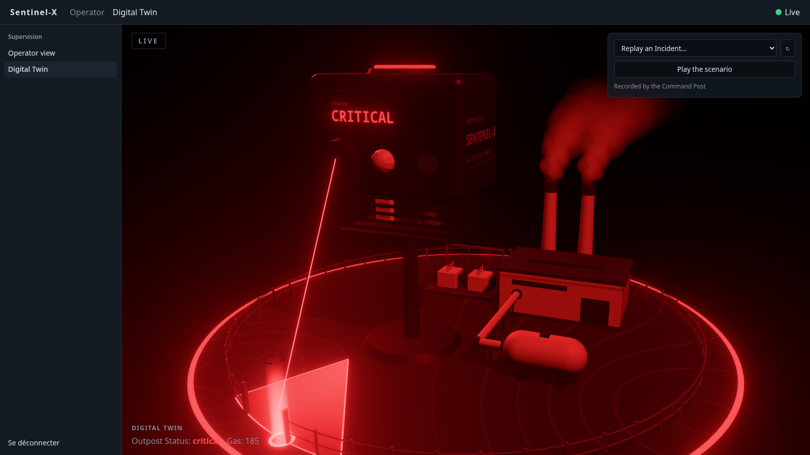

- **Nothing cuts** (#33). A new Status fades in over `FADE_SECONDS` (0.8 s), rim light, ring around the socle, LCD and LED ring together, the flash with them, and one that comes during a fade starts from the color on screen. `fadeTo(fade, to, now)` and `fadeValue(fade, now)` are that rule, pure and tested; `useFade` / `useColorFade` run it on every frame.
- **Signal lost** (#33). When the feed closes after having been open, `scene.signalLost` is true until it is open again, the retries in between included: the whole frame fades to grey (`<Halo signal>`), "Signal lost" shows over the scene and the caption loses its colors, so that a stale state never passes for a live one. Before the first connection there is no signal to lose: the scene is neutral, with no notice. To see it, stop the backend.
- **The picture drops out** (#104). A grey scene can pass for a calm one, so the image itself drops out like a screen's: snow over the whole frame, strips of rows torn sideways now and then, and a bar that rolls down the frame in 7 s, dragging its rows along. It is the same `signal` as the grey, 1 live and 0 lost, so it comes and goes in the same fade and the image is sharp again once the feed is back; none of it before the first connection. All of it is drawn in the halo's last pass, on the frame already rendered (`SUM_FRAGMENT` in `halo.tsx`, where `TEAR`, `BAR_HEIGHT`, `SNOW` and `BAR_LIGHT` set its strength): the scene is not drawn once more, and nothing is computed while the signal is whole. "Signal lost" is HTML over the canvas, on its own dark ground: the snow does not reach it. Checked by stopping a mock backend under the production bundle, then starting it again: 60 images a second while lost, at 1600 × 900 on the Iris Xe.

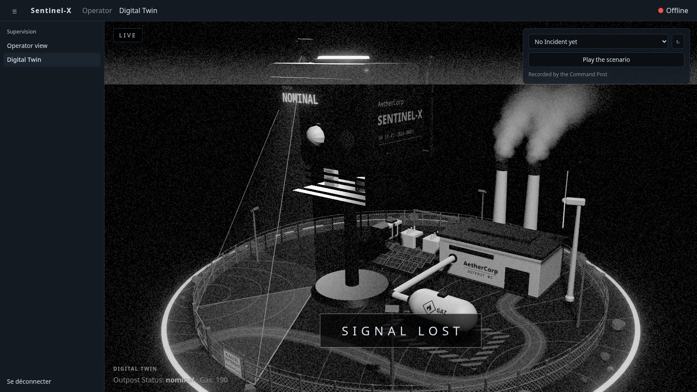
- The Enclosure goes from dark anodized to red as `readings.air` rises, and lights the ground around it. It follows the telemetry, not the Alerts: it moves before any `gas` Alert is raised.
- `gasLevel(air)` gives the share of the way from calm to critical, 0–1. Its two bounds, `CALM_AIR` (200) and `CRITICAL_AIR` (620), are those of the mock feed: tune them to the MQ-2's calibration when the Sentinel sends its own Readings. The Enclosure's glow and the haze both run over that range: it is set there, once.
- What follows the Readings (the Enclosure's gas color and glow, the haze, the glow of the hall's roof) eases toward them (`EASE`, `HAZE_EASE`): a snapshot a second flows into the next, it does not jump.
- The feature takes its data as props: `app/routes/twin.tsx` reads the feed, maps it with `toScene` and hands it over, with the feed's frames (`frames`) for what is an event rather than a state: a clap, an Alert raised for the first time. `TwinState` asks for the live-feed state's fields by shape, so a replayed state (time-scrubber) feeds it the same way.

**The threats** (#13) — what the vision and predictive services see, shown on the maquette:

| Intrusion | Predictive drift |
|---|---|
|  |  |

- **Intrusion** — while an `intrusion` Alert is active, `scene.sector.lit` is true and the camera's field lights up in `INTRUSION_COLOR` (the critical red), the volume that leaves from the lens and the sector on the ground under it together (#96, see [the site](#digital-twin--featurestwin), camera field): the zone of the perimeter the camera watches, whole, wherever the intruder stands in it. It goes out when the last `intrusion` is `cleared`. The intruder itself stands inside the fence, in the sector (#23, below). `scene.camera.pan` is how far the Alert says the camera is turned, in radians, 0 without an intrusion: the field and the lens on the Enclosure's front turn with it (see [the site](#digital-twin--featurestwin), camera on its servo).
- **Predictive drift** — an active `predictive` Alert names what drifts in `detail.drivers`, and `DRIVER_PROBES` gives the Probe each one is read from, for the model's 7 features (the closed vocabulary of [`docs/ARCHITECTURE.md`](../docs/ARCHITECTURE.md)): `temp`, `temp_slope`, `temp_mean`, `humidity` → the DHT22, `air`, `air_slope`, `air_mean` → the MQ-2 (#76). `scene.enclosure.pulses` lists them, each once; a driver that is not in `DRIVER_PROBES` pulses nothing. Those Probes emit `DRIFT_COLOR` in beats, an orange of its own that is not a Status color, so it shows at `nominal` as well as in the amber of `elevated`. `pulse(t)` is the beat, pure and tested: one every `PULSE_PERIOD` (1.2 s), never below `PULSE_FLOOR`.
- Both come and go in a fade (`useFade`), like everything in the Twin, and both glow: they are emissive, so the halo takes them for lights.
- **The drift's label** (#39) — under the pulsing Probes, a card reads « dérive · score 0.91 »: the `anomaly_score` of the last raised of the active `predictive` Alerts that pulse a Probe, to two decimals. `scene.enclosure.drift` gives it (`{ score, label }`, `driftLabel(score)` for the text), null while no Probe pulses: an Alert whose drivers are all unknown labels nothing. The text comes from the mapper, tested without a render. The card is a `<LabelCard>`, the one the intruder's detection is labelled with: a sprite drawn over the mast and the body. It faces the camera wherever the orbit takes it, so the drift reads from every side, even where the compartment's cheek hides the pulse. It fades in with the pulse and out on the `cleared`, keeping its last text as it goes; like the pulse, it is the drift's orange at `nominal` as at `elevated`.


**The intruder** (#23, #38, #92, #93, #94, #95) — where the vision service sees someone, on the maquette: a human figurine in hologram inside the fence, tied to the lens that sees it, framed and labelled as the vision model detects it, walking as the intruder moves — in toward the Enclosure as they come nearer the camera — and leaving its outline where it was last seen. And a figurine for each other person the camera sees.

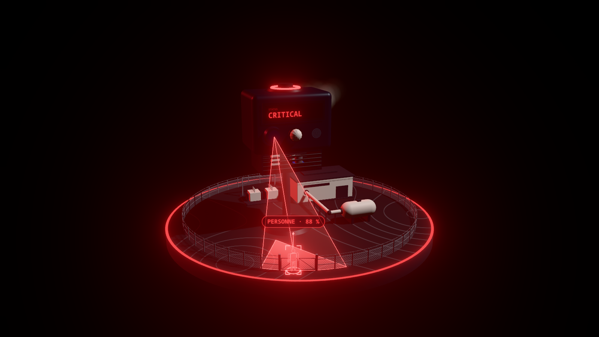

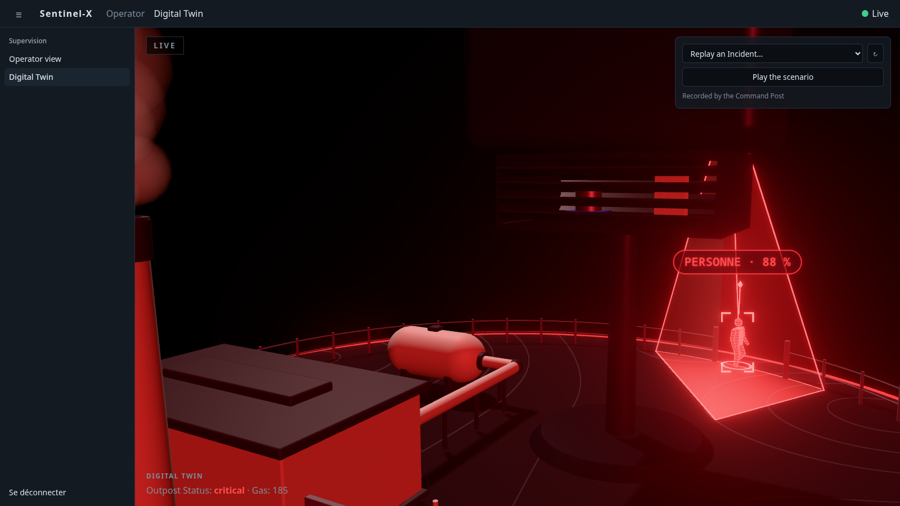

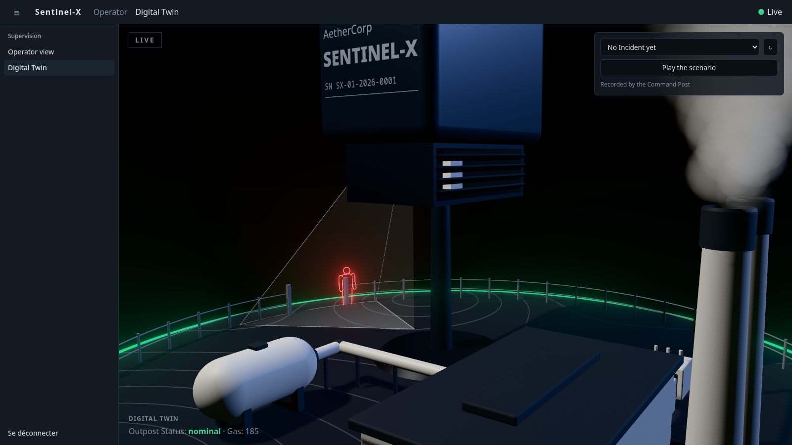

- **Where** — `scene.intruder` is the last raised of the active `intrusion` Alerts: its `alertId`, the `key` of the person its camera follows (the Alert's `id`), their `x_norm`, their `confidence` and `at`, where they stand on the ground: `standingPoint(x_norm, pan, h_norm)` (`utils/site.ts`). That is a point of the camera's sight line for `x_norm` (0 is the lens's left, 1 its right: mirrored when you face the Enclosure), the camera turned by the Alert's `pan`, and as far along that line as they are short in the image: a lens makes what is twice as far half as tall, so `h_norm` reads as a distance, between someone who fills the image (`STANDING.tall.near`, 1), stood at the near end of where one can stand, and someone as short as at the fence (`STANDING.tall.far`, 0.3), at its far end. `standingSpan(bearing)` gives the two ends: from where the line is clear of the Enclosure's own ground to a step (`STANDING.clear`, 0.2 unit) inside the fence's line — never on it, all round the site — or short of what stands on the site before that, the plant's parts and the gas pipe: turned a quarter turn to its left the camera looks at the tank, and the intruder stops before the pipe. An Alert that does not say how tall, as the vision service sent them before, stands its intruder at the far end, just inside the fence. `toScene` does the mapping, so it is tested without a render: inside the fence, on the sight line, nearer as `h_norm` grows, on the side the camera is turned to.
- **Several people** — `scene.intruder.others` are the other people the Alert sees (`others`, at most 4): `{ key, at }` each, placed the same way. `<Intruder>` stands a figurine for each, with the ring at its feet and its four brackets. What tells the one the camera follows from them is the pin over its head, the line to the lens and the label: the camera looks at that one. Each figurine has its own track, by its person's `key` within the Alert, so each walks to where its own person is seen, whatever the order the Alert tells them in. Someone the Alert no longer tells of fades out where they stood, and leaves nothing; when the camera goes on to follow someone else, that figurine takes the pin, the line and the label where it stands, and the one it followed leaves its outline. `tracksAt(tracks, intrusion, elapsed)` (`utils/track.ts`) follows them all: those that are seen, in the Alert's order, then those going out. `MOST_FIGURINES` (12) is all the Twin draws at once: 5 seen, and those still fading.
- **Drawn** — `<Intruder>`: a human figurine standing where the scene places it and facing the Enclosure's lens (`bearingTo(at, lens)`), so toward the inside of the site, like the pedestrians of a self-driving car's display: a head, a torso, arms and legs in two segments each. It is built from the maquette's volumes (`boxShape`, `turnedShape`: no model is loaded, no dependency added) to the plan in `FIGURE` (`utils/figure.ts`), and is `figureHeight()` tall, about 0.45 unit, nearly twice the fence: exaggerated like the Enclosure, to read from the back of the room. Its matter is a hologram, unlit, in `INTRUSION_COLOR`: a lit edge all around it and scan lines that rise slowly, which fade out evenly where they would be closer than two pixels apart instead of shimmering. It is drawn in two goes: its shade first, which dims what stands behind it (red on the red of the lit sector, its light alone would not tell it apart) and leaves its depth, then its light, added only where a volume is the nearest of them, so that an arm in front of the torso is not twice as bright. A pin of light over its head, a thin stem up to a gem 0.8 above the ground, where the column of #38 ended, tells it from afar; a ring marks its feet; a thin line runs from the Enclosure's lens (`lensPoint()`, `lensHeight()`) to the middle of its head (`headHeight()`). All of it is brighter than white, so it reads even while the Status's flash lights the scene all in red, and the halo takes it for lights. Once the flash has passed, it is the red that stands out of a neutral maquette. Nothing casts a shadow: the shadows are drawn once, and it moves.
- **Walks** (#94) — a new sighting of the same person does not move the figurine there at once, nor slide it there: it walks over the ground, straight to where they are now seen, the line, the brackets and the label following it. Along the fence when they cross the camera's image, in toward the Enclosure when they come nearer it, round the Enclosure when the camera turns to follow them. `trackAt(track, seen, elapsed)` (`utils/track.ts`) is the figurine from one frame to the next, on the ground (`at`). The camera says where someone is, not how fast they go: the figurine takes as long to walk to a sighting as the camera took to see the move, and a little longer (`UNHURRIED`, 1.15). So it goes at their own pace, one sighting behind, and is still walking when the next one comes instead of marking time between two: on the mock's intruder, one sighting a second, it walks in from the fence toward the plant in one go, about 0.4 unit a second, a step a second and a little more. The time between two sightings is taken within `SIGHTING` (0.25 to 1.5 s): two in a row do not make it dash, one that comes after it stood for long does not make it crawl. Its pace is steady, it never goes past where it was seen and stops right there, and it lands at the same place whatever the frame rate. This replaces the glide of #23, which got there in a few tenths of a second: legs under it, that was a sprint. The track also gives `course`, the bearing it walks along, taken as it sets off and turned to another as it walks (`SET_OFF`, 8 a second); `walked`, the ground it has covered since it appeared, in scene units; and `walking`, how much of its stride it takes, 0 at rest and 1 in full stride, eased at the same rate. Someone newly seen stands their figurine where they are, at rest: no move and no step from where another stood, even one seen again under the same key. The track also counts the seconds it has been shown (`age`, from 0 for each new one, held once it is no longer seen), which the sweep goes by. Pure, and tested without a render.
- **Its walk cycle** (#94) — `walkCycle(phase, share)` (`utils/walk.ts`) is the pose at a phase of the cycle: how far each arm and each leg swings and folds, and how far the hips come down. The legs go in opposition, half a cycle from each other, and each arm comes forward as the leg of its side goes back. For half the cycle a foot is planted, and goes back under the hips as fast as the figurine goes forward; for the other half it is lifted and swung forward again, the knee folded. The hips ride over the leg it stands on, highest above its foot. The phase is `walkPhase(walked)`, one cycle per `STRIDE` (0.36 unit, four fifths of its height) of ground covered, not per second: the foot on the ground stays where it was put down at any pace and any frame rate, and a figurine that stands takes no step. `share` is how much of its stride it takes, `|walking|`: at 0 it is the pose of rest, whatever the phase, and it gets into its stride and out of it without a jump. Its feet only slide for the few tenths of a second that takes. Pure and tested without a render: periodic, legs and arms in opposition, the planted foot still, the pose of rest.
- **Turns** (#94) — in full stride it faces the way it goes, its `course`; at rest it faces the lens. `turnedTo(from, to, share)` takes it from one to the other by the shortest way as `walking` goes: it turns as it sets off, and turns back to the lens once it has stopped. When its person walks back it turns round as it walks, without stopping: its course comes round to the new way in a few tenths of a second.
- **Comes and goes** — a newly raised intruder appears where it stands in a sweep from its feet to its head, `SWEEP_SECONDS` (0.7 s) long, a band of light at its front: `sweptTo(age)` is the share of the way up it has got to, pure and tested. Its pin, its ring, the line, the brackets and the label fade in meanwhile (`marksLevel(track)`). When the last `intrusion` is `cleared`, the figurines, the pin, the rings, the line, the brackets, the label and the camera's field fade out together (`figurineLevel(track)`, `useFade` for the field), each figurine where it last stood, where the one the camera followed leaves its outline (below). The field turns back to where the camera rests.
- **Last known position** (#95) — where the intruder disappeared. As the figurine fades out, its outline fades in at the same place: a thin red line around its silhouette and nothing inside it. It stays for `LAST_KNOWN_SECONDS` (5 s) from the `cleared`, then goes out in a fade. It is told from an intruder that is still seen: it is hollow, it stands still and at rest, facing the lens, and it carries no pin, no ring, no line to the lens, no bracket and no label; the camera's field around it is back to neutral. The track gives it (`utils/track.ts`, pure and tested without a render): once it is no longer seen, `trackAt` keeps the figurine where it last stood (`at`, `walked` and `age` held), brings it out of its stride (`walking` eased to 0, so a figurine cleared in mid-step is at rest before it has faded out), counts the seconds since (`lost`), and returns nothing once `LAST_KNOWN_SECONDS` and a fade have passed. `lastKnown(track)` is the last known position that track gives: null while its person is seen, then `{ at, level }`, whether the camera followed them or not, how much of the outline shows; `figurineLevel(track)` is how much of the figurine itself does, and the two add up to 1 while one replaces the other. The place is where the figurine stood, not the last sighting sent: it walks one sighting behind, so on the mock it is a step short of where the Alert last saw it when that is cleared. An intruder raised while an outline still shows appears at its own place, in its sweep, and the outline of the one before it goes out where it is, in one fade from what showed of it: `tracksAt(tracks, intrusion, elapsed)` follows both, the figurines that are seen and those going out. Another Alert raised while the first is still active leaves no outline: that intruder is still seen. Everyone leaves one: the others the Alert sees as the one its camera follows, when the Alert is cleared or as soon as it no longer tells of them.
- **How the outline is drawn** (#95) — with the figurine's own volumes, no new shape: each is drawn once more a line's width larger (`OUTLINE.width`, 0.007 unit), its far side only, after the volumes themselves have left their depth. They hide all of it but what goes past their edge, which is the line; where an arm stands in front of the torso, its line shows over it. The figurine's shade, which by then shades nothing, is what leaves that depth: each figurine has its own, so the outline of a former intruder is drawn like any other. A volume is moved out along `outward`, the mean of the normals of the faces that meet at each of its points (`withOutward(shape)`): along its normals it would come apart at every crisp edge of a turned shape. Of a figurine cleared before its sweep had brought it in whole, the outline is that of what was seen. Unlit, in `INTRUSION_COLOR` and dimmer than the marks of an intruder that is seen (`OUTLINE.glow`, 3); the halo takes it for a light.
- **Detected** (#93) — what tells that the vision AI sees it, not a sensor. Four brackets frame the figurine, like a detection in an image: the corners of a rectangle that holds it with room to spare, `detectionFrame()` and `brackets()` (`utils/detection.ts`), drawn to the plan in `DETECTION` and tested without a render. They always face the Twin's camera, whatever the angle of the orbit, a tilt from above included. Over the marker, a label reads what the model sees and how sure it is of it, « PERSONNE · 88 % »: `detectionLabel(confidence)`, the Alert's `confidence` rounded to the percent and kept within 0 and 100 %. `scene.intruder` carries both (`confidence`, `label`), so a new `confidence` on the same `alert_id` rewrites the label without bringing the figurine in again. The label is a `<LabelCard>` in `INTRUSION_COLOR`, the card the drift's label is drawn on; seen from above, where the marker looks short, it stands over the frame instead. Brackets and label are drawn over whatever stands in front of the figurine, the Enclosure included: they are what the model draws over its image, not things on the site, and they say where the intruder is even when the maquette hides it. The Alert's `bbox` is still not read: `x_norm`, `h_norm` and `pan` place the intruder. `h_norm` gives a distance without a camera calibration, between two heights the Twin takes for the far and the near end of the site (`STANDING.tall`): how near, not how many metres.
- **At rest** — it stands facing the lens, its arms by its sides and its forearms a little forward (`REST_BEND`), which is how its front is told from its back. A newly raised intruder appears like that, and a figurine that has stopped comes back to it.
- **Cost** — ten small volumes drawn twice, in the lit frame and in the halo's. On the Iris Xe at 1920 × 1080, production bundle, frame rate uncapped: a median of 9 to 11 ms a frame with the figurine shown, against 8 to 10 without it and 8 to 10 for the column it replaces, so 90 to 100 images a second where the GPU was free, well over the 60 the screen shows. Other sessions shared the GPU during the runs, which scatter by more than the gap between the two: to measure again on a quiet machine. The brackets and the label (#93) add one flat mesh and one sprite, drawn in both frames. Measured against the build before them, the two at the same time under the same load, three runs of 15 s with the orbit turning: 54 to 58 images a second for both, within 1.5 % of each other, and a median of 10.6 to 11.8 ms a frame against 10.6 to 11.3. They cost nothing that shows; the GPU was shared again, so that the 60 hold on a quiet machine is still to confirm there. The walk (#94) draws nothing more: a pose a frame, a few sines and square roots, and eight joints turned. Measured the same way against the build before it, the intruder walking back and forth across the field on both, six runs of 15 s at 1920 × 1080, frame rate uncapped, the two builds sharing the GPU with each other and with other sessions: within 2.5 % of each other every time, the walk ahead in three runs and behind in three (37 to 61 images a second, a median of 9.9 to 15.5 ms a frame against 9.6 to 15.2). Each on its own with the frame rate capped by the screen, two runs each: 60.0 images a second for both, a median of 16.7 ms a frame, 95 % of them within 16.8 ms. The outline (#95) draws the ten volumes once more for the six seconds it shows, and none before or after. Measured against the build before it on the mock's crossing, 1920 × 1080, two cycles a run, in three states: calm, the intruder seen, and the four seconds after the figurine has faded out. Uncapped, the two builds at the same time, sharing the GPU with each other and with five other Chromiums, two runs: 65.4 and 63.3 images a second with the outline shown against 67.3 and 64.9 at the same instants on the build without it, 3 % apart, which is what the two builds differ by in the calm state where they draw the same thing (67.5 and 62.9 against 68.2 and 60.7). Each on its own with the frame rate capped by the screen, two runs each: 60.0 images a second for both in the three states, a median of 16.7 ms a frame, 95 % of them within 16.8 ms.

**Presence** (#36) — the site knows it is approached before anyone is inside:


- While a `presence` Alert is active, `scene.presence.active` is true: the Enclosure's PIR dome blinks and a sweep goes round the fence, both in `PRESENCE_COLOR`, the amber of the `elevated` Status.
- **The sweep** leaves the gate's first post as the Alert is raised and reaches the last one `SWEEP_PERIOD` (2.4 s) later: a bright head and a tail behind it (`SWEEP_TAIL`, a share of the fence). Another follows, for as long as the Alert is active. `sweepGlow(place, lap)` is how bright the fence is at each place along it, `lap` of the way through a sweep.
- **The dome** flashes `FLASHES_PER_SWEEP` (4) times in a sweep, lit for as long as it is dark: `domeFlash(lap)`. A blink has steep edges, but each takes a few frames.
- **Once it is cleared** the sweep in progress goes to its end and no other starts; a presence that comes back before that end keeps it going. `sweepsAt(sweeps, present, now)` is that rule and `lapAt(sweeps, now)` how far through its sweep the fence is; `useSweep(present)` runs them on every frame, for the fence and for the dome. All of it is pure and tested.
- **No fade here**: the fence and the dome are both dark as a sweep starts and as it ends, so one sweep follows another, and the last one stops, without a cut. On the mock feed the Alert lasts 2 s: one sweep, which ends 0.4 s after the `cleared`.
- The sweep is light added over the posts and the rails, unlit and drawn after the fence's mesh, which does not veil it: it glows, and it still reads while the flash of `elevated` lights the whole model in amber. That is when it starts: a `presence` Alert is a warning, so it takes the Status there on its own. Once the flash has passed, the sweep is the amber that stands out of a neutral fence.

**Noise** (#37) — a clap next to the Sentinel, seen on the maquette:


- **A wave a clap** — each `noise` Alert `raised` sends a wave of light from the foot of the Enclosure's mast over the socle: it spreads for `WAVE_LIFE` (1.5 s), fast as it leaves and slower as it goes, lights up within its first tenth and fades out to nothing as it ends. `waveShape(elapsed, amplitude)` is that envelope — the band's radius, its width, how bright it is — pure and tested.
- **As loud as the clap** — the amplitude is the Alert's `value` (the share of the cycle the sound sensor heard sound), held to 0–1, and 1 when the Alert does not carry one: `amplitudeOf(value)`. The loudest wave crosses the whole socle (`WAVE_REACH`, from the Enclosure to the farthest point of the rim) at full brightness; the faintest still goes `QUIET_REACH` of the way, at `QUIET_GLOW` of the brightness.
- **An event, not a state** — a `noise` Alert can be `cleared` on the next cycle, so the wave does not follow the active Alerts: it starts from the `raised` frame itself and plays to its end whatever comes after. `OutpostTwin` takes the feed's history as `frames`; `framesSince(seen, frames)` gives what came in since the last frame, `clapsIn(frames)` the claps among it, `wavesAt(waves, claps, now)` the waves still going plus one for each new clap. Two claps close together give two waves, the second never cuts the first (up to `MAX_WAVES` at once, the oldest going first past that). `useWaves(frames)` runs them on every frame.
- **Nothing replayed** — the frames already in the history when the Twin opens are past, and so is a history that does not follow on from the last one seen: no wave plays for them. A reconnection only brings the Command Post's snapshot (Status and latest telemetry): it sends no wave either.
- **Drawn** — one disc over the whole socle, whose shader draws every wave as a band around the Enclosure, sharper at its front than at its back, fading out at the socle's cut edge. In `NOISE_COLOR`, an ice white no Status shares (the Alert is only `info`: something was heard, nothing is wrong), unlit and added over the ground, so the halo takes it for a light and the buildings it passes behind hide it. It is not drawn at all while the site is quiet. Its cost, while a wave is on, is one disc's fragments, twice (the lit frame and the halo's): not measured on the Iris Xe yet, but far below the haze's.
- **On the real Sentinel** — the firmware raises `noise` once and holds it for `NOISE_HOLD_MS` (3 s) of quiet before clearing it: claps closer than that make one Alert, so one wave. On the mock feed, the clap is raised at 0.82 and cleared on the next tick.

**The link** (#103) — the brief asks for a link « sans fil et ultra-sécurisée », and nothing on the maquette showed it. The Enclosure now carries an antenna, which beats with the feed and says whether it is encrypted:

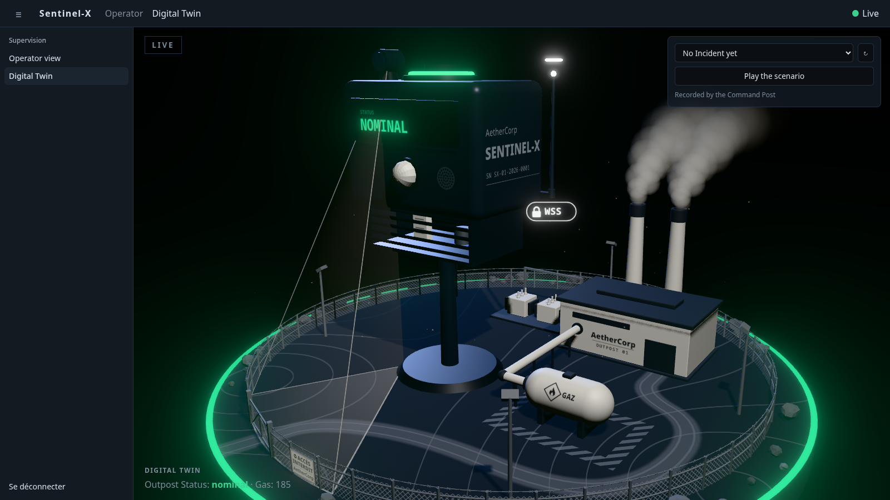

- **An antenna** — `<Antenna>` (`components/antenna.tsx`), a part of the Enclosure under its own name (`ENCLOSURE_PARTS.antenna`): an arm out of the body's right side, behind the engraving, a joint and a whip whose tip stands just over the roof. On the side, not on the roof: the camera frames the Enclosure with little room above it, and an impulse has to rise within the frame.
- **An impulse a frame of telemetry** — each one received lights the tip and sends a ring of white light from it (`LINK_COLOR`), which rises `IMPULSE_RISE`, widens and fades out in `IMPULSE_LIFE` (0.9 s): shorter than the second between two snapshots, so the link is seen to beat. `impulseShape(elapsed)` (`utils/link.ts`) is that envelope, its height over the tip, its radius and how bright it is: pure and tested, in the line of the noise wave's.
- **Telemetry only** — `telemetryIn(frames)`: an Alert sends none, nor does a Status. Frames that come in at the same instant, as when a replay is sought forward, leave one impulse: several at the same place would only be a brighter one.
- **An event, not a state** — like a clap: `framesSince(seen, frames)` gives what came in since the last frame, `impulsesAt(impulses, received, live, now)` the impulses still rising plus the new one (`MAX_IMPULSES` at most). The frames already in the history as the Twin opens are past: none is replayed. `useImpulses(frames, live)` runs it on every frame.
- **None while the signal is lost** — `live` is `!scene.signalLost`: no impulse leaves, the one on its way goes out, and what was received meanwhile leaves none later. The link beats again with the first telemetry of the feed that is back.
- **REPLAY** — the Twin is given the replayed frames: the impulses follow them second after second, and stop with the replay paused.
- **The padlock** — a card under the antenna's foot, a closed padlock and « WSS », shown only when it is true. `feedEncrypted(location)` (`shared/config/feed-url.ts`) reads it from the page, as `feedUrl` does: `wss://` on a page served over HTTPS, behind the reverse proxy, and plain `ws://` on a developer's machine. The route says so to `toScene(state, { encrypted })`, never for a replay, which is no link; `scene.link.encrypted` is true only while that feed is open, so there is no padlock before the first connection nor on a signal lost. Without that second argument `toScene` takes the feed for a plain one. All of it is tested without a render. The card is a sprite, like a label's: it faces the camera, is drawn over what stands in front of it, and comes and goes in a fade. On `npm run dev` there is none: that is the Twin saying nothing false.
- **Shadows** — the antenna stands still: it casts its shadow with the others, drawn once (`StillShadows`). The impulses and the card are unlit light added over the frame and cast none; the halo takes them for lights.
- **Cost** — four small shapes at rest, and one ring more for the 0.9 s an impulse lasts, in the lit frame and in the halo's; a sprite while the feed is encrypted. Measured on the Iris Xe at 1920 × 1080, production bundle, the orbit turning, frame rate capped by the screen, runs of 15 s with telemetry coming in every second: 60.1 images a second, a median of 16.7 ms a frame and 95 % of them within 16.7 ms on the run the GPU was free for. Three later runs, taken while other sessions used the GPU, gave 42.6 with the impulses against 51.7 and 43.8 without any telemetry, a median of 16.7 ms each: the load, not the link. Not compared uncapped against the build before it.

**The camera turns to the Alert** (#97) — the orbit took no account of what happened: depending on the instant, an Alert was raised at the edge of the frame or behind the Enclosure. Now the camera goes to it:

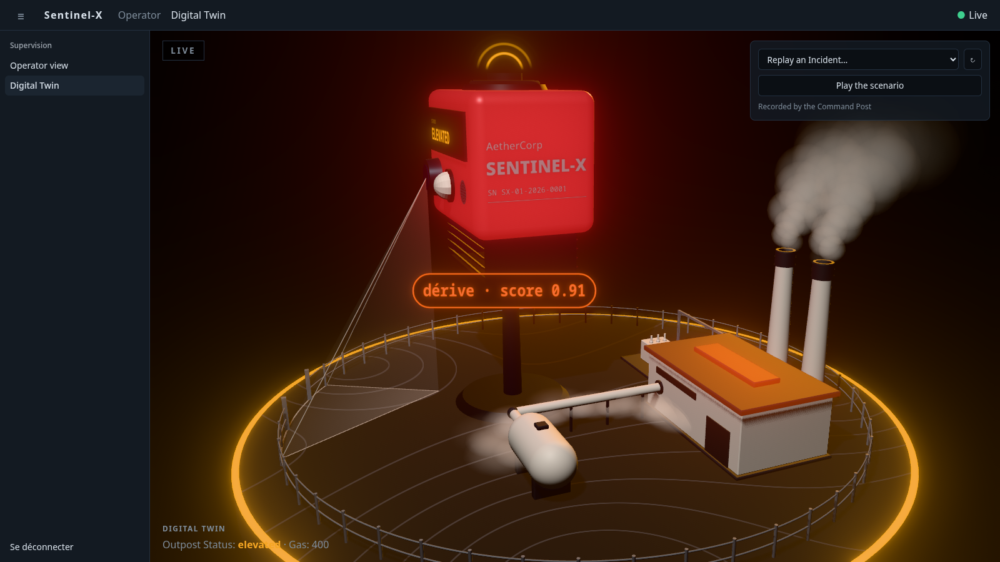

- **An anchor a kind** — `scene.anchor` is where the last raised of the active Alerts happens on the site plan, with its `alertId`: the intruder for an `intrusion` (`watchedPoint(x_norm)`, where the figurine stands), the middle of the gas pipe for a `gas` (`alongPipe(0.5)`), the generator hall for a `thermal`, the gate for a `presence` (`gatePoint()`), the Enclosure for a `predictive`. A clap is heard, not seen anywhere: a `noise` Alert has no anchor and leaves it to the Alert raised before it. `toScene` does the mapping, tested without a render.
- **Newly raised** — like a clap, it is an event: `newlyRaised(seen, frames)` gives the Alerts raised for the first time among the frames that came in, paired by `alert_id` as the feed does. An `intrusion` sent again where its intruder now stands, a `gas` Alert raised again as it gets worse are not new, even on the tick another Alert is cleared; the Alerts already active when the Twin opens are past, and so is a history that does not follow on. The pairing reads the frames the Twin is given: an Alert active for longer than the feed's history holds (its last 1000 frames, about a quarter of an hour) counts as new when it is sent again. `useFraming(anchor, frames)` frames the scene's anchor when its Alert is among them, where it was as it was raised: the intruder that walks on does not move the camera a second time.
- **The turn** — `cameraTurn(framing, azimuth, touch, now)` (`utils/alert-framing.ts`) says how the camera turns on its own at an instant, pure and tested: toward the anchor's bearing the shortest way round (`shortestTurn`), in `FRAMING_TURN` (2 s) however far that is, slow out of the orbit and slow onto the anchor; it stays there for `FRAMING_HOLD` (6 s), the orbit stopped; then the automatic orbit picks up speed over `RESUME_RAMP`, as it does after the Operator. Facing an anchor is standing on its side of the site: the camera still looks at the centre, the anchor in front of it. The turn is worked out from where the camera is, not from where it started, so there is nothing to remember and a more recent Alert takes the camera from wherever the first one left it.
- **Neither the distance nor the height change** — `OrbitCamera` turns the camera round the vertical of its target, then lets the controls read where it stands, as after a drag.
- **The Operator's hand comes first** — the camera stops the instant they take it, mid-turn included, and is not taken back when they let go: the orbit resumes after its usual `RESUME_DELAY`. An Alert raised while they hold the camera moves nothing. The next Alert turns the camera again.
- **Replay and scenario** — the camera follows the Alerts a replay raises, second after second, and again when it is played again; going back to live moves nothing.
- **Capture mode** — the same turn, at the distance that holds the whole stage: nothing leaves the frame.
- **On the mock feed** — the camera goes to the Enclosure on the drift, to the pipe on the gas, to the gate on the presence, to the hall on the heat, then to the intruder; the gas raised again at `critical` and back at `warning` moves nothing. The loop raises an Alert every 3 to 4 s at its busiest, so the camera leaves for the next one before the hold is over.
- **At the default distance** the front of the socle is under the bottom edge of the frame, as it is whenever the orbit passes there: facing an anchor on the fence, the gate or the intruder, puts it at the bottom of the image. When it first appears the figurine shows its head and shoulders, its brackets and its label in frame, and more of itself as it walks on. Three wheel notches back hold it whole, the ring at its feet included, and so does capture mode.
- **Cost** — nothing is drawn: a few sines a frame, and the history read through once when a frame comes in. Measured on the Iris Xe at 1920 × 1080 against the build before it, production bundle, on the mock feed over a whole loop (42 s), each build on its own with the frame rate capped by the screen: 59.7 images a second against 59.6, a median of 16.7 ms a frame and 99 % of them within 16.8 ms for both. A second run, with other sessions on the GPU, gave 57.4 against 56.9, both builds stalling alike. Uncapped, the two at the same time under the same load: a median of 10.2 ms a frame for both, then 9.1 against 9.4.

**The site** (#32) is what the Enclosure watches over, and what every reaction is anchored on:


- **One ground plan** — `SITE` (`utils/site.ts`) places everything, once: the socle, the generator hall, its two chimneys, the transformer station, the gas tank and the pipe from it to the hall, the fence and its gate, the Enclosure and its camera, the signage (#99, below), the floodlights (#100, below), the track and the rocks (#101, below), the solar field, the wind turbine and the batteries (#102, below). Coordinates are scene units from the socle's centre, `x` to the right and `z` to the front; a bearing is an angle around the vertical, 0 to the front. The components only draw what `SITE` says: move a part there, never in a component. Its tests hold the plan together without a render — everything stands on the socle and inside the fence, no two parts on the same ground, the pipe joins the hall to the tank, the gate fits in the fence's opening, the Enclosure stands at the gate with nothing of the plant in its field of view.
- **Who stands where** — the Enclosure is tall enough to throw its shadow across half the socle, and the key light comes from the front right: so it stands on the left by the gate, and the plant on the right, in the light. Keep that in mind before moving either.
- **Camera sector** — `lensPoint()` is where the Enclosure's lens is over the ground, and `watchedPoint(xNorm, pan)` where its sight meets the fence for what stands at `xNorm` across its image: 0 on the lens's left, 1 on its right (so mirrored when you face the Enclosure). The sector drawn on the ground runs from under the lens to that arc; it lights up on an `intrusion` Alert (#13), and the intruder stands in it, inside the fence (`standingPoint`, above). The field of view is `SITE.camera.fov`, 60° until the real lens is measured: the vision service's `CAMERA_FOV_DEG` is to be the same.
- **Camera on its servo** — the real webcam stands on a servo that turns it to whom it follows, and every `intrusion` Alert says how far it is turned (`pan`, degrees from where it rests, positive toward the right of its image). `sightBearing(xNorm, pan)` is the bearing it then looks along: a positive `pan` turns it toward smaller bearings, its right. It turns about its lens, so `lensPoint()` is the same whichever way it looks; where it rests it looks out through the gate. `watchedPoint`, `cameraField` and `standingPoint` all take that `pan`: the field, its sector and the people in it turn together. `scene.camera.aim` is how far the lens itself is drawn turned: along the sight line of the intruder the camera follows (`sightBearing(x_norm, pan)`), so the lens looks at them wherever they stand across its image, and by `pan`, with its field, without one. `scene.camera.pan` carries the field's turn, in radians, and the Twin draws the camera on its way there (`panToward(shown, pan, elapsed)`, `utils/pan.ts`, through `usePan`): most of the way in a few tenths of a second, as an Alert tells it twice a second at most and the servo turns in between. Without an intrusion the camera rests, and is drawn turning back.
- **Camera field** (#96) — alone, the sector read as a pane of glass standing on the socle: nothing said that it lay on the ground, nor that it was the camera's. It is now the base of a volume that leaves from the lens. `cameraField(steps, pan)` (`utils/camera-field.ts`) gives its parts from the site plan, for a camera turned by `pan`: the `lens` (`lensPoint()` at `lensHeight()`), the point of the ground `under` it, and the watched `arc` (`watchedPoint`, step by step). `fieldBase(field)` is the sector, and `fieldWalls(field)` the walls over it: a front that slopes from the lens down to the arc, and two sides upright on the sector's straight edges. Together they close the volume, without a gap, and the walls look out of it: all of it is tested without a render. Move the lens (`ENCLOSURE_SHAPE.lens`), the fence or `SITE.camera.fov`, and the volume and its sector follow together: neither is placed in a component.
- **How it is drawn** — the walls are a veil, most opaque at the lens (`WALL`), and the two edges from the lens to the ends of the arc are a thin line each, like the sector's outline on the ground. At rest all of it is neutral, off-white under the studio's light, and faint: it does not glow. On an `intrusion` it emits `INTRUSION_COLOR` with the sector, on the one fade (`useFade`), and the halo takes it for a light; it goes out the same way on the `cleared`. Only the walls that face the eye are drawn: there is one veil over what stands behind the volume, whatever the side it is seen from, and the Enclosure, the plant and the fence read through it. The intruder is drawn after the field (`DRAWN`), which never veils it. The volume casts no shadow and takes none. While the camera turns the volume is drawn anew on each frame (`fieldShapes(pan)`): the arc it lands on is another one, as the lens is not at the centre of the fence, so turning the shapes would not do. It is not cut where the camera looks at the plant: it goes through the tank to the fence.
- **What it costs** — one mesh for the walls (34 triangles) and one for the two edges, drawn in the lit frame and in the halo's. Measured on the Iris Xe at 1920 × 1080 against the build before it, the two at the same time under the same load, production bundle, frame rate uncapped, the orbit turning, three runs of 12 s: at rest a median of 8.0 to 9.5 ms a frame against 8.6 to 9.2, during an intrusion 10.1 to 10.8 against 9.6 to 11.0. The same build on both sides differs by as much (up to 0.6 ms): the field costs nothing that shows. Drawn from both sides, the walls did cost about 1 ms a frame, two layers of veil over a wide part of the image: keep them single-sided. Other sessions shared the GPU during the runs (52 to 64 images a second for both builds, with stalls): that the 60 hold on a quiet machine is still to confirm there.
- **Fence and gate** (#98) — the brief speaks of critical infrastructure and its illustration shows chain-link under barbed wire: posts and two rails alone read as a paddock, and the gate was a gap. The fence now carries a chain-link mesh between its posts, from one pillar of the gate round to the other, and a strand of barbed wire on top of the posts, which stand that much higher; the gate is closed by two leaves, hung from its pillars and meeting in the middle, each a frame of bars braced across around a pane of the same mesh. While an `intrusion` Alert is active the gate is open: each leaf swings into the site about its hinge (`SWING`, in a fade), and closes again once the Alert is cleared.

  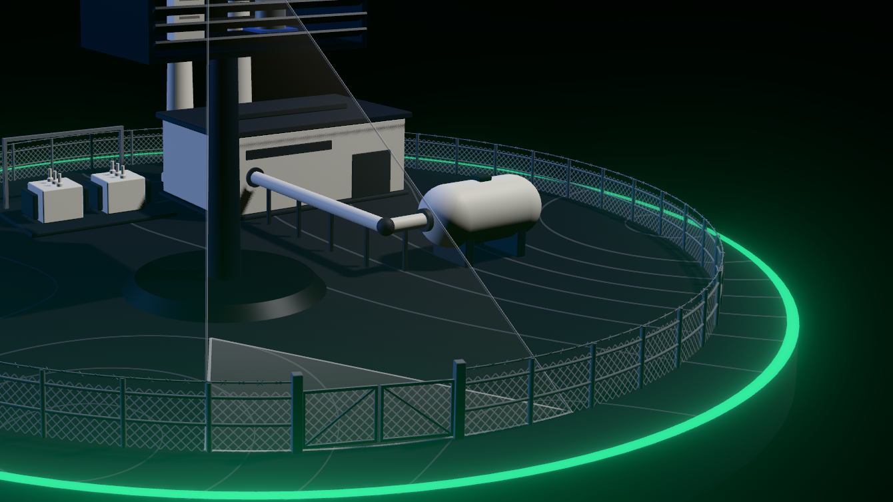

  - **From the plan** — `SITE.fence` gives it all: `mesh.rows` (the diamonds from the ground to the fence's top, `meshCell()` wide and high), `barbed` (how far over the mesh the strand runs, `barbedHeight()`, and a barb every so far, `fenceBarbs()`), and under `gate` its `pillar` and its `leaf`. `gateLine()` is the straight line the closed gate stands on, from one of its posts to the other, and the `opening` its pillars leave. The plan's tests check that the two leaves fit in that opening with a slit between them at most, that they close the fence to its height under the top of the pillars, and that the strand runs over the mesh and under the pillars' top.
  - **No shape for a diamond** — the mesh is one plain surface all along the fence (480 triangles), and one pane a leaf: `ChainLinkMaterial` draws the wires on it, from a `uv` that counts the diamonds (`inDiamonds`). A wire is never drawn thinner than a pixel, it is drawn fainter instead, and where the wires would crowd together, from afar or at a grazing angle, they fade to the veil they add up to: no shimmer as the camera orbits. The barbs are instances of one shape.
  - **Neutral** — steel like the posts (`palette.ts`), lit like the rest of the maquette: it takes the Status's flash and never glows. A wire being round, the mesh takes most of its light as if from above, so it reads from either side all round the site.
  - **Seen through** — the mesh leaves no depth and is drawn before everything else that is seen through (`MESH_DRAWN`): the amber sweep, the camera's field and the intruder are drawn over it, never veiled, so the figurine and its line to the lens stay whole from outside the fence, wherever the orbit is; the plant and the Enclosure are seen between its wires. The posts, the rails, the strand and the bars of the gate are solid and hide what a thin bar hides.
  - **Shadows** — the posts, the rails, the strand and the gate's bars cast theirs, drawn once with all the others; the mesh casts none and takes none, and the barbs cast none.
  - **What it costs** — ten draw calls and 10 400 triangles a frame, the lit frame and the halo's together (279 calls and 96 500 triangles against 269 and 86 000, at rest). Measured on the Iris Xe at 1920 × 1080 against the build before it, production bundle, on the mock feed. Each build on its own with the frame rate capped by the screen, over a whole loop (42 s): 59.8 images a second against 59.9, a median of 16.7 ms a frame and 99 % of them within 16.8 ms for both. Uncapped, the two at the same time under the same load, four runs of 30 s while other sessions kept the GPU busy: a median of 10.4 to 11.8 ms a frame against 9.6 to 10.9, 0.8 ms more each time, where two runs of the same build differ by 0.1 to 0.5 ms. Showing and hiding the mesh, the strand and the barbs in turn within one page showed no difference (7.33 ms against 7.31): where those 0.8 ms go was not found.
- **Socle** — a disc of terrain cut clean, afloat in the black. Its contour lines are drawn by the terrain's material from a relief that exists only there: the ground stays flat. The track is drawn by the same material (#101, below). The Status's ring runs around its rim, `SITE.socle.ring` wide.
- **Volumes** — `Box` (bevelled edges) and `Turned` (a profile turned around the vertical, every corner crisp) are what the plant is built from; both cast and receive shadows. No model is loaded. `boxShape` and `turnedShape` give their shapes alone, for what is drawn in a matter of its own: the intruder's figurine.
- **Materials** — `palette.ts`: graphite, steel and off-white, a grey between graphite and steel for the rocks, and a grey lighter than the ground for the solar panels' glass. Color is kept for the Status and the signals.
- **Steam** — a slow plume above each chimney, whatever the Status: the plant is idling. `puffAt(age)` is a puff's whole life, pure: it leaves the mouth unseen and is gone when its life ends, so the plume loops without a cut. The puffs are lit, so they take the scene's light, the Status's flash included, and never glow.

**Signage** (#99) — what a sensitive site says of itself: who it belongs to, that no one comes in, and where the risk is. None of it reacts to the feed.


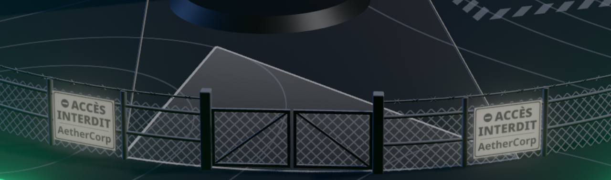

- **From the site plan** — `SITE.signs` (`utils/site.ts`) places and sizes all of it, and three functions give where: `gateSigns()`, the two no-entry signs, each a point of the fence and the bearing it faces; `dangerZone()`, the ground marked around the gas tank; `hallSign()`, the point of the hall's wall the site's name is on. Its tests hold them without a render: the signs hang on the fence's line, one on each side of the gate and as far from it as each other, each in a bay, halfway between two posts, facing out of the site and no taller than the fence; the zone goes all round the tank, inside the fence with room to walk, takes no ground from anything but the tank and the pipe that comes to it, and stays out of the camera sector; the pictogram holds on the tank's barrel; the name is on a wall of the hall, off the ground and under its roof.
- **No entry** — a plate on the fence on each side of the gate (`signs.gate`, 0.30 × 0.22 unit), hanging from the top of the mesh, outside it and under the barbed wire, read from outside the site: the no-entry mark, a disc and its bar, « ACCÈS INTERDIT », and « AetherCorp » under a rule. Its back and its edges are in the ink of its border.
- **A bay away from the gate** — the signs hang in the second bay from the gate (`signs.gate.bay`), not the first, clear of the way in. Whoever the camera sees stands inside the fence, `STANDING.clear` (0.2 unit) from its line, which is more than half a plate is wide: a figurine never stands in a sign, whichever way the camera is turned, and the site's test says so. A plate can still stand in front of one: now that the camera turns, and that its lens is out of the Enclosure's front, off its mast, what it watches of the fence is no longer the first bay alone. Seen from outside in line with a sign, someone stood by the fence behind it has their legs behind the plate; their head and shoulders, their brackets and the label show over it.
- **Legible up close** — the orbit cannot be panned and comes no closer than `MIN_DISTANCE`, where the near side of the fence is under the frame: the signs are read from about the default distance, the camera facing the gate and brought down as low as it goes. So their three lines are as wide as the plate, in bold: at 1600 × 900 a sign is about 70 pixels wide there and reads, as above.
- **Reflective faces** — the one exception to « only what emits light glows » ([the stage](#digital-twin--featurestwin), halo). The key light comes from the front right and the sign on the gate's left turns its back to it: lit alone, it was a black plate. Like a road sign's, a face gives back a share of its own tones whatever the light (`SIGN.shine`, 0.3, emissive through its own texture): enough to read in the shade, too little for a halo that shows. In neutral tones, so nothing is taken from the signals.
- **Danger zone** — a hatched band on the ground around the gas tank: clear ground `signs.dangerZone.margin` wide around the tank's footprint, then a band `band` wide, its stripes at 45°, one every `HATCH.pace`, meeting at its corners. The pipe comes in over it.
- **Under the haze** — the marking is lit paint in the fence's steel, worn thin (`HATCH.cover`, 55 % of the ground under a stripe): it does not glow and is dimmer than a wisp. It is drawn on the ground before the haze (`renderOrder`), which lies over it at the gas peak, as [the capture there](#digital-twin--featurestwin) shows: the stripes are regular, crisp and grey, the haze soft and bright, and neither is taken for the other.
- **Gas pictogram** — a flame in a hazard diamond and « GAZ », painted round the tank's barrel on the side `signs.tank.bearing` says, its middle `TILT` above the level so that it faces whoever looks down at the maquette. The sheet is bent round the barrel: a flat one would stand off it at its top and bottom.
- **The site's name** — « AetherCorp », as on the Enclosure's engraving (`ENGRAVING.maker`), over « OUTPOST 01 », on the hall's front wall (`signs.hall`): between the pipe and the door, under the band of windows, which is the wall the default framing and the gate both look at.
- **Neutral** — ink is `GRAPHITE`, plate `OFF_WHITE`, the ground marking `STEEL`: `palette.ts` and nothing else. No `Status` color, no signal's.
- **Drawn in code** — two canvas textures (`useCanvasTexture`), no image file: the sign's face, and one sheet for everything painted on the site, the name, the pictogram and a patch of the marking's paint (`PATCHES`). The flame is a path.
- **Cost** — two meshes in all: the two plates are one shape, and the name, the pictogram and the stripes another, each reading its patch of the sheet (`onPatch`). That is 4 draws more a frame, the lit frame and the halo's, on 278. Measured on the Iris Xe at 1920 × 1080 against the build before it, production bundle, the orbit turning. Each on its own with the frame rate capped by the screen, two runs of 15 s each: 60.0 and 60.1 images a second against 60.1 and 60.0, a median of 16.7 ms a frame and 99 % of them within 16.8 ms for both; the same 60.0 over a whole loop of the mock feed (42 s). Uncapped, the two at the same time, six runs of 12 s, other sessions on the GPU: 61 to 66 images a second for both, within 1.5 % of each other, the signage ahead in three runs and behind in two. Images a second are what is compared there: uncapped, frames come in bursts between stalls, and the median frame time moves with how long a burst lasts. Before the fence of #98, the signage read up to 1 ms more of it than the build without it, for shorter stalls and the same images a second, as seven meshes of its own and as two alike.

**Floodlights** (#100) — the site reacts when someone comes near it or gets in: the lights of its perimeter come on.

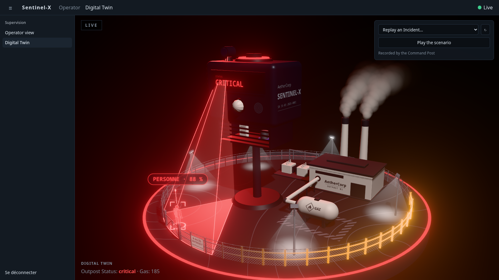

- **From the site plan** — `SITE.floodlights` (`utils/site.ts`) stands a mast on each of its `bearings`, `radius` from the socle's centre: five of them, 0.3 unit inside the fence, none on the side of the gate. `floodlights()` gives each one's foot, the bearing its head looks along, into the site, and the middle of its `pool`, `pool.throw` in from the foot. A mast is `height` (0.9 unit) tall, over the fence and the gate's pillars, and keeps the ground `foot` around its axis.
- **Its tests** hold the plan without a render: the masts stand inside the fence, on the walkway kept along it; none stands on the hall, a chimney, the transformer station, the tank, the pipe, the danger zone or another mast; they leave the Enclosure's foot free, and the camera sector, the arc where the intruder stands included; none stands in front of a no-entry sign; whoever the camera sees, however far it turns, stands clear of a mast as of the plant (`standingPoint`); each pool takes in the foot of its mast and stays on the socle.
- **Lit or dark** — `scene.floodlights.lit` is true while a `presence` or an `intrusion` Alert is active, and until the last of them is cleared; a `gas`, `thermal`, `noise` or `predictive` Alert lights nothing. `toScene` says so, tested without a render. At rest they are dark: a steel mast, a head whose pane is graphite.
- **In white** — `FLOODLIGHT_COLOR`, which no Status shares: they show the site reacting, not how bad it is. The white reads over the amber of the presence's sweep and the red of the intrusion alike, and while the Status's flash lights the whole model.
- **In a fade** — they come on and go out over `FADE_SECONDS` (`useFade`), like everything in the Twin. On the mock feed the presence lasts 2 s and the intrusion 4 s: they light twice a loop.
- **Simulated light** — no light is added to the scene and no shadow is cast more: the key light stays the only one that casts any, and the shadows are still drawn once. A lit lamp is a pane that emits (`LIT.lamp`); the pool is a disc on the ground whose points carry how bright they are, brightest at its heart and gone at its edge, and a faint beam comes down to it from the lamp. Pool and beam are unlit and added over the frame (`AdditiveBlending`), so the halo takes them for lights, as it does the lamp. What stands in the pool, the foot of the mast, the fence, is not lit by it: it is light drawn on the ground.
- **Drawn** — `<Floodlights>`: three shapes for the five of them, the masts and their heads, the lamps, the light. The masts cast their shadow and take the others', drawn once with the rest. The light is not drawn at all while they are dark.
- **Replay and scenario** — the scene is mapped from the replayed frames like the live ones: they light on a replayed presence, and in the scenario on its two PIR detections.
- **Cost** — two draws at rest and three while lit, in the lit frame and in the halo's. Measured on the Iris Xe at 1920 × 1080, production bundle, the orbit turning, frame rate capped by the screen, two runs of 10 s each with seven other Chromiums running: 59.9 and 60.1 images a second at rest, 60.0 and 60.1 with the five lit on a presence and an intrusion together, a median of 16.7 ms a frame in both. Not compared uncapped against the build before it.

**A remote place, left to itself** (#101) — the brief places the plants in « zones géographiques isolées et particulièrement hostiles », where staff cannot be kept. The socle was a bare disc: it now says where the site stands. None of it reacts to the feed.

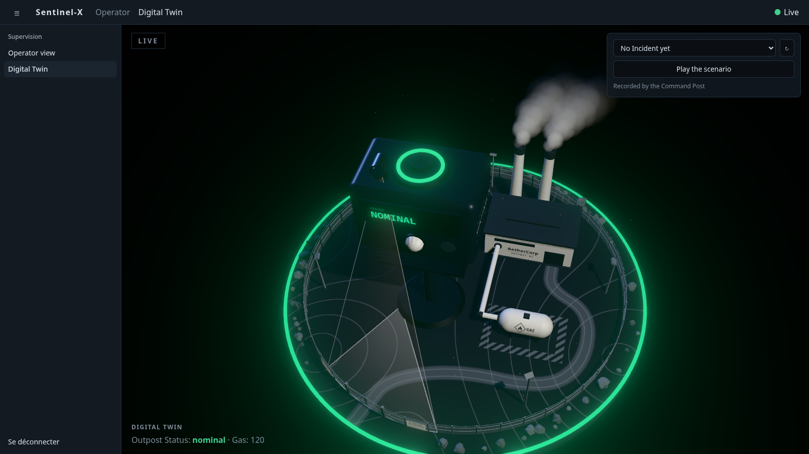

- **From the site plan** — `SITE.track` and `SITE.rocks` (`utils/site.ts`), like everything else. `track()` gives the track's two stretches, each the line its middle follows from `gatePoint()`: `toHall`, in to `hallDoor()` by the points of `track.via`, its turns rounded; `toEdge`, straight out to the socle's rim. `rocks()` gives the rocks, each a point, the `radius` of its footprint, its `height` and the way it is turned. `fromPath(point, path)` is how far a point is from a path.
- **The track** — `track.width` wide (0.24 unit). The pipe bars the short way from the gate to the door, which is on the hall's front wall between the pipe and the hall's corner (`SITE.hall.door`, which the hall is now drawn from): so the track passes in front of the gas tank, round its far end, and comes back to the door, clear of the danger zone all the way. Outside the gate it runs on to the rim and stops there: it leads nowhere.
- **Drawn in the ground** — no shape, no relief: the terrain's own material draws it (`socle.tsx`), packed earth paler than the terrain and two ruts paler still, in the fence's steel (`TRACK`). It reads a small map of the ground worked out once from `track()` (`trackMap()`, 256 × 256, how far each point is from the middle of the track), so the track costs one texture read a pixel of ground, however it winds. The contour lines are drawn after it and run on across it; the danger zone's stripes, the camera's sector and the haze are drawn over the ground as before, so the sector reads over the track at rest and lit. The map is drawn on past the rim, so the socle's edge cuts the track clean.
- **The rocks** — `rocks.count` of them (60), `rocks.radius` wide (0.04 to 0.145 unit, more small ones than large), between the fence and the Status's ring, which none covers. They are drawn from `rocks.seed` by a generator of its own (`drawnFrom`, mulberry32): the same rocks on every load and on every machine. None lies within `rocks.clear` of the gate's bearing, from one no-entry sign round to the other: the way in and the signs stay in sight. Two may lean on each other, in a heap.
- **One shape, in instances** — `<Rocks>`: a ball of 80 facets, dented (`rockShape()`), drawn once for all of them (`InstancedMesh`), each tipped, turned and squashed its own way and a shade of its own (`ROCK`, `palette.ts`). Flat-shaded, so each facet takes the light on its own.
- **Their shadows** — the rocks cast one and take the others', and never move: they are in the shadows drawn once (`StillShadows`).
- **Dust** — `<Dust>`: `DUST.motes` motes (44) over the site, all carried toward `DUST.wind` at about `DUST.speed` (0.11 unit a second), each on its own line across the socle, between the top of the fence and the top of the chimneys. `moteAt(index, seconds)` (`utils/dust.ts`) is a mote's whole drift, pure: it grows from nothing as it comes over the rim upwind and back to nothing as it leaves downwind, then starts over, so none pops in or out. One shape in instances, 7 to 15 thousandths of a unit across: a few pixels. Lit and 40 % opaque, so a mote takes the scene's light, the Status's flash included, never glows, and casts no shadow: it is not taken for a signal and hides none.
- **No one** — no vehicle, no figure: the only human the Twin shows is the intruder.
- **What the tests hold** (`site.test.ts`, `dust.test.ts`) — the track links the gate to the hall's door and the gate to the rim, goes through the fence at the gate only, between its pillars, and stays clear of the danger zone, of the pipe and of everything that stands; the rocks lie whole outside the fence and on the socle inside the ring, none in front of the gate or of a sign, none on the track, and are the same at every call; the motes stay over the socle, all go down the wind and none the other way.
- **Cost** — two draws more, the rocks and the dust (4 800 and 880 triangles), each in the lit frame and in the halo's, and one texture read a pixel of ground. Measured on the Iris Xe at 1920 × 1080 against the build before it, production bundle, at rest, the orbit turning. Frame rate uncapped, one build at a time, two runs of 12 s each: 110 and 117 images a second against 105 and 117, a median of 8.7 and 8.8 ms a frame against 9.6 and 8.1. Capped by the screen, runs of 15 to 20 s taken in turn while other sessions used the GPU: 60.0 images a second with a median of 16.7 ms and 99 % of the frames within 16.8 ms on the runs the GPU was free for, for both builds, and drops to 34–56 on either build when it was not, whichever ran at that moment.

**An eco-responsible plant** (#102) — the brief speaks of « micro-centrales énergétiques éco-responsables » and does not name the energy. The Twin showed a hall, two chimneys and a gas tank: it now shows a solar field, a wind turbine and batteries too. That is our reading of the brief. The hall, the tank and the pipe stay: gas and overheating are the threats it names. None of it reacts to the feed.

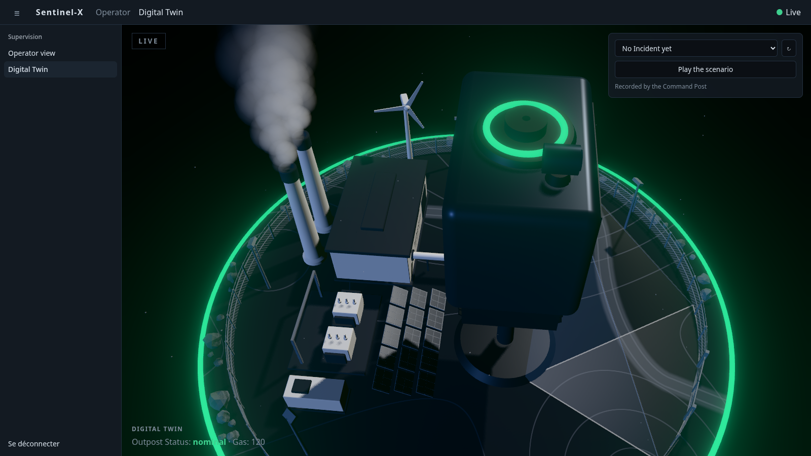

- **From the site plan** — `SITE.solar`, `SITE.turbine` and `SITE.batteries` (`utils/site.ts`), like everything else. `solarPanels()` gives the middle of each panel, in `solar.rows` rows of `solar.columns` (3 × 5) spread evenly over the field's ground; `panelGround()` is the ground one panel takes, its slope taken off its length.
- **The solar field** — between the Enclosure and the transformer station, which is the one free ground the key light reaches: the left and the back left of the site are in the Enclosure's shadow. Its two columns nearest the Enclosure still are, under the box's louvres. A panel is `solar.panel.width` by `solar.panel.length` (0.25 × 0.2 unit), leaned by `solar.panel.tilt` to face the entrance, its top edge `solar.height` above the ground: a steel frame on a post, its bars parting the glass in six cells.
- **In instances** — `<Renewables>` draws the fifteen panels as one shape (`panelShapes()`) in two `InstancedMesh`, the frames and the glass: two draws however many panels the plan asks for.
- **The wind turbine** — beside the hall, on the side the key light comes from: a mast that tapers (`turbine.height`, 1.4 unit to its hub, under the chimneys' 1.6), a nacelle, and a rotor of `turbine.rotor.blades` blades `rotor.radius` long, one shape. It faces `turbine.bearing`, into the wind that carries the dust (`DUST.wind`), so from the front of the site its rotor is seen edge on, and face on from either side. It turns once every `rotor.period` (6 s), at the one pace: no signal speeds it up, slows it or stops it.
- **No shadow from the blades** — the mast and the nacelle cast theirs, drawn once with all the others (`StillShadows`); the rotor casts none and takes none, so turning it never asks for the shadows again.
- **The batteries** — a container lying alongside the transformer station, on its side away from the hall: off-white on a graphite plinth, its doors facing the station, a cooling unit on its roof. Two draws, its walls and all that is graphite (`batteryTrim()`).
- **Neutral** — `OFF_WHITE`, `GRAPHITE`, `STEEL`, and `GLASS` for the panels, a grey lighter than the ground so that a panel is not taken for an empty frame. No `Status` color, no signal's; the glass is smooth enough to catch the key light as the camera orbits.
- **Where someone stands** — `standingPoint` stops short of the field, the turbine's mast and the batteries as of the rest of the plant, however far the camera turns.
- **What the tests hold** (`site.test.ts`) — the three stand on the socle and inside the fence with room to walk along it, on ground of their own: none on the hall, a chimney, the transformer station, the tank, the pipe, the danger zone, the Enclosure's foot, a floodlight's mast or the track, both its sides. None is in the camera sector. The panels lie whole inside the field, no two on the same ground, each row clear of the next; the turbine faces the wind, and its blades sweep above the fence, the floodlights and the hall, clear of the chimneys and over the socle; the batteries are nearer the transformer station than anything else, less than their own length away.
- **Cost** — seven draws more, each in the lit frame and in the halo's: two for the panels, three for the turbine, two for the batteries. Measured on the Iris Xe at 1920 × 1080 against the build before it, production bundle, at rest, the orbit turning, five other Chromiums running. Each on its own with the frame rate capped by the screen, runs of 15 s: 60.0 images a second for both, a median of 16.7 ms a frame and 99 % of them within 16.8 ms. Uncapped, one build at a time in turn, two runs of 12 s each: 125.7 and 127.2 images a second against 127.9 and 129.1, a median of 7.0 and 7.1 ms a frame against 7.0 and 6.8.

**Heat** (#35) shows on the generator hall, so that it is told from a gas leak, which shows on the Enclosure:


- **The roof glows** with `scene.thermal.intensity`, which is `heatLevel(readings.temp)`: dark when calm, a deep red all over at the peak, its skylight far brighter. Like the gas, it follows the telemetry, not the Alerts: it reddens before any `thermal` Alert is raised and cools down after it clears. The glow is emissive, so it has its halo, in `HEAT_COLOR`: more orange than the critical Status, to stay apart from it while the whole model is flooded in red.
- **One range** — `CALM_TEMP` (31.5 °C) and `PEAK_TEMP` (41 °C), in `utils/heat-level.ts` and nowhere else. They are those of the mock feed: tune them to the site when the Sentinel sends its own Readings (its `thermal` Alert is raised at 40 °C, `firmware/include/config.h`).
- **The air ripples** above the hall while a `thermal` Alert is active (`scene.thermal.shimmer`), and fades in and out over `FADE_SECONDS` like every change. What stands behind the hot air wavers: the chimneys from the front, the fence and the ground from behind. What stands in front of it does not.
- **How** — `HeatShimmer` draws no color. It is a box over the hall whose shader works out how much hot air each pixel is seen through (a bell around the middle of the roof, thinning out upward, cut where the sight meets the roof) and writes what it leaves into the **frame's alpha**, which is 1 or more everywhere else. It is depth-tested, so what stands in front hides it. The frame's last pass (`Halo`) then reads that alpha and looks up the image a little to the side, along waves that rise. No extra pass, one more box while the air ripples, nothing while it is still: a frame costs the GPU the same either way (timed on the Iris Xe, at the 3 million pixel budget).
- The frame's alpha is taken: anything else that brings it under 1 (a material with custom blending) would ripple. A light added over the frame (`AdditiveBlending`) only raises it, and `HeatShimmer`, drawn last (`renderOrder`), keeps the lesser of the two: such a light ripples behind the hot air like everything else. Another source of heat is another `<HeatShimmer>` over another block; keep its box (`REACH` spreads out) clear of the other parts, since what is inside it is taken to be behind the hot air.

**The stage** (#30) is what every later Twin slice is set on:

- **Full screen** — `OutpostTwin` fills its parent. A route whose `handle` says `stage: true` (the router's `/twin`) gets the whole space under the header; the other routes keep the padded page. `layoutMode(matches, location)` in `app/layout-mode.ts` decides it.
- **Light** — black background, a key light that casts the soft shadows, a cold rim light from behind, a trace of fill. The key and the fill take the grade's `light`, neutral at every Status, and the Status's color for a moment as it rises (#91, [the escalation flash](#digital-twin--featurestwin)). The rim takes the grade's `rim`: cold at `nominal`, the Status's color otherwise. Seen from behind, the faces the key light does not reach are lit by the rim alone, so they read in the Status's color for as long as it lasts. The lights stay put while the camera orbits. Give a new mesh `castShadow` / `receiveShadow`. The shadow map is 2048 wide with a blur of 3 since #32: a wider blur shows its grain on the off-white walls. The shadows are drawn once (`StillShadows`), since nothing that casts one moves: after moving a caster, ask for them again with `gl.shadowMap.needsUpdate = true`.
- **Halo** — only what emits light glows. `Halo` draws the scene a second time with its lights off and blurs that image over the frame: set `emissive` + `emissiveIntensity` on a material and it glows in proportion, in its own color; a lit surface never does, however bright. An unlit material (`meshBasicMaterial`) counts as emitting — the ring around the socle glows in the Status's color that way — so use a standard one for anything that should not glow. Its pass is the last to touch the frame: that is also where the frame turns grey and drops out when the signal is lost (`signal`, #104), and where hot air ripples what is seen through it (#35).
- **Color** — the frame is rendered in HDR and tone-mapped with `NeutralToneMapping`, which leaves the Status colors as they are.
- **Camera** — it goes around the Outpost in 80 s. The Operator can turn it and zoom with the mouse, between bounds that keep the Outpost in frame (no panning, never under the ground); 3 s after they let go, the orbit picks up speed again. `autoOrbitSpeed` is that rule, as a pure function. It turns to an Alert as it is raised (#97, [the camera turns to the Alert](#digital-twin--featurestwin)).
- **Resolution** — `pixelRatio` caps the rendering at a pixel ratio of 2 and at 3 million pixels (`MAX_PIXELS`), whatever the screen. That budget was measured on an Iris Xe, where the Twin holds 60 images per second up to about 3.4 million pixels: raise it on a stronger GPU.

**The Enclosure** (#31) — the Sentinel-X product itself, on a lattice mast, at an exaggerated scale (`ENCLOSURE_SHAPE.scale`) to stay readable from the back of the room. Built in code from bevelled volumes (`RoundedBoxGeometry`) and canvas-drawn textures, no external model.


- **Front:** the LCD band, then the PIR dome and the mic grille, and beside them the camera, on its servo: a plate, an arm out of the front and a housing with its lens, leaned down over the ground it watches, which turns to whom it follows (`scene.camera.aim`, eased like the field's `pan`): the lens looks at the intruder as they walk across the field; its head casts no shadow, as the shadows are drawn once. Its axis is clear of the front, so that the field that goes down from the lens does not go through the body. **Under the body:** the ventilated Probe compartment, louvres front and back, the DHT22 and the MQ-2 visible between them. **On top:** the buzzer and the LED ring around it. **Right side, behind the engraving:** the antenna, its tip just over the roof (#103, [the link](#digital-twin--featurestwin)). **Right side:** the engraving, *AetherCorp / SENTINEL-X / serial* (`ENGRAVING`).
- **The mast** (#105) — a lattice pylon on the foot, as the brief's illustration shows the box: four uprights that lean in toward the top, and on each face a ring of rails and a cross of braces every bay (`LATTICE`, `latticeMast()` in `components/enclosure.tsx`). It is one shape, in the neutral steel the solid mast had, and stands still: its shadow is drawn once with the others. It is as tall as the mast it replaces, so the body, the lens and all the site plan anchors on it are where they were.
- **Parts to drive:** every Probe and actuator is a named object — `scene.getObjectByName(ENCLOSURE_PARTS.mq2)` — for the later slices. The predictive pulse (#13) drives `dht22` and `mq2` from `scene.enclosure.pulses`, the presence (#36) blinks `pir`, the Alarm (#34) drives `ledRing` and `buzzer` from `scene.enclosure.alarm`, the link (#103) lights the `antenna`.
- **LCD:** shows `scene.enclosure.lcd.text` (`LCD_TEXT`: `NOMINAL`, `ELEVATED`, `CRITICAL`) in the Status's color. The text switches like a real LCD's, the color fades. Unlit, so it glows.
- **LED ring:** breathes in the Status's color, one breath every `BREATH_PERIOD` (4 s), never below `BREATH_FLOOR` — `breath(t)` is pure and tested. The kit has no LED any more (`docs/ARCHITECTURE.md`): on the Twin, the ring is the Status light, until the Alarm makes it blink (#34, below).
- **Gas:** the body carries the glow of #20, and lights the ground from inside it.
- **Where it stands:** the site plan says (`SITE.enclosure`: the foot of its mast, the way it faces), and `OutpostTwin` puts it there. What the plan needs of its shape is in `ENCLOSURE_SHAPE` (`utils/enclosure-parts.ts`), which the model is drawn from: its scale, the radius of its foot, where its lens is, height included. Move the lens there and the camera's field, its sector on the ground with it, and the line to the intruder, follow.
- **Camera:** the orbit now turns around the Enclosure's height (`TARGET` y = 1.2).

**Gas and the Alarm** (#34) — the physical threat, readable without a look at the curves:


- **Haze** — a haze settles around the gas pipe and thickens with `readings.air`. `scene.haze` is the gas level (`gasLevel`): none when calm, the most from `CRITICAL_AIR` on. Like the Enclosure's glow it follows the telemetry, not the Alerts: it is there before any `gas` Alert. `<Haze density>` eases toward it slowly enough (`HAZE_EASE`) never to rest on a step between two Readings.
- **Wisps** — the haze is made of wisps that seep from points spread along the pipe (`alongPipe(share)`), sink to the ground and spread over it. `wispAt(age)` is a wisp's whole life, pure. They are made of what the steam is made of (`VapourMaterial`): lit, so the haze takes the scene's light, the Status's flash included, and never glows.
- **Alarm** — `scene.enclosure.alarm` is on while a `gas` or `thermal` Alert is active, the Alerts the Sentinel fires its Alarm on. It carries the highest severity among them and its color: green for `info`, amber for `warning`, red for `critical`. The LED ring then blinks in that color instead of breathing, and the buzzer sends out arcs of sound, one on every beat (`ALARM_PERIOD`, 0.5 s): `blink(t)` and `arcsAt(t)` are pure and tested. When none is left, the ring goes back to breathing in the Status's color and the buzzer goes silent. One fades into the other over `FADE_SECONDS`.
- **Not the real Alarm's state** — the contract does not carry it. An Alarm the Operator silenced keeps sounding on the Twin for as long as its Alert is active.
- **Arcs** — drawn on a sheet that stands on the buzzer and turns to face the camera. They rise no higher than `ARC_REACH`: the camera frames the Enclosure with little room above it.
- **Cost** — at the gas peak a frame takes about 1 ms more than when calm: 9 ms against 8 at 1920 × 1080 on the Iris Xe, where 60 images per second leave 16.7. All of it is the haze: each wisp is drawn over what is behind it, so their number (`WISPS`) and their radius are what to keep an eye on.

**Capture mode** (#40) — `/twin?capture` is the Twin alone, to be filmed for the teaser:

- **No interface** — no top bar, no sidebar (so no connection indicator), no caption: the canvas takes the whole window, on black. `captureMode(location)` reads the parameter (being there is enough, whatever its value); without it `/twin` is the normal view.
- **Same feed** — mock or live, it plays what the normal view plays.
- **Whole in frame** — `<OutpostTwin wholeStage />` stands the camera back until the whole stage holds in the frame, whatever its shape: `wholeStageDistance(aspect)` fits a sphere around the stage (`STAGE_RADIUS`, the ring around the socle plus room for its halo) in the narrower field of view, so it holds all the way around the orbit and at any tilt. The camera can still be turned by hand; it no longer zooms. It turns to an Alert as in the normal view (#97), at that distance.
- Anything added to the stage further out than the ring around the socle needs a larger `STAGE_RADIUS`.

## Operator view — `/`

| Panel | Feature | Data |
|---|---|---|
| Outpost Status card, header badge | `status` | `status` frames; "Connexion…" / "Signal perdu" while the feed is down |
| Reading tiles (with the change over 30 s) | `telemetry` | latest `telemetry` frame |
| Gas, temperature & humidity, noise curves (last 5 min) | `telemetry` | `telemetry` frames of the live history |
| Camera, intruder marker at `x_norm` | `camera` | `GET /camera` (MJPEG), active `intrusion` Alert |
| Active Alerts, toast on each new or escalated Alert | `alerts` | active Alerts |
| Alarm control: sound the siren, silence it (the kit has no LED any more) | `actuators` | `POST /api/v1/commands`; the request is checked against the contract before it leaves |
| Threats: Incidents, neutralized, under way, mean time to nominal, Incidents per kind | `incidents` | `GET /api/v1/incidents`, fetched again after each Alert and every 15 s |
| Alert log / Incidents tabs | `alerts` · `incidents` | `alert` frames of the live history · `GET /api/v1/incidents` |
| Alert log filters: hours (from / to, over midnight too), severity, kind, source, state | `alerts` | `filterLog(entries, filter)`, pure |
| Alert log and Incidents: ten rows a page, newest first; the arrow on Heure / Début flips to oldest first | `alerts` · `incidents` | `paginate()`, `inOrder()` in `shared/lib/paging.ts`; `Pager`, `SortByTime` in `shared/components/table-paging.tsx`. A new filter or order goes back to page 1 |

## Time-scrubber — `features/replay`

The demo's insurance (#15): a past Incident replayed second by second in the Twin, or the scripted scenario played on demand, network or not, and always labelled as a replay.


```tsx
import { stateAfter, useLiveFeed } from '@/features/live-feed'
import { TimeScrubber, usePlayer } from '@/features/replay'

const player = usePlayer()
const shown = player.frames ? stateAfter(player.frames) : liveState   // replayed or live, the same shape
<OutpostTwin scene={toScene(shown)} frames={player.frames ?? history} />
<TimeScrubber history={history} player={player} />
```

- **Incidents** — `incidents(history)` groups the Alerts of any list of frames into Incidents, pure: from the first `raised` until every Alert raised since is `cleared`, paired by `alert_id`, by date. The Command Post's rule and shape (`Incident` of the contract), so the reference scenario holds here too: gas nominal → warning → critical → warning → nominal plus two PIR detections = 8 Alerts, 1 Incident.
- **Where they come from** — the scrubber lists the Command Post's recorded Incidents (`GET /api/v1/incidents`, asked again whenever an Incident opens or closes in the feed, and on ↻) and replays one from `GET /api/v1/incidents/:id`. When the Command Post cannot be reached (network down, no Operator session), it falls back on `incidents(history)` over the frames this window received: the feed's last 1000. An Incident whose replay fails to load is taken from there too if the window saw it.
- **A replay** — `replayOf(history, incident)`: the Incident's span with `LEAD_MS` (3 s) of calm on each side, the last telemetry before it, and after each Alert the Status it leads to (`withStatus`: the history keeps no Status). Copies of the frames, never the live feed's own: the noise waves tell them apart by identity, so going back to live replays no clap.
- **Second by second** — `usePlayer()` moves one second every second from the replay's start, stops on its last second and holds there; the range input seeks to any second, Play/Pause, and Play from the end starts over. `framesAt(replay, t)` is what has been received by `t`, and `stateAfter(frames)` (live-feed) folds it with the live feed's own `apply`, on a connection open all along: the Twin reacts to the replayed frames exactly as to the live ones, and never shows a signal lost in a replay.
- **Live or replay** — always one label at the top left of the stage: `LIVE`, or `REPLAY · Incident #1 · 14:23:12` on a solid violet (`--replay`, a color no Status shares), the whole stage framed in it and the caption showing the replayed Status and gas. **Back to live** leaves the replay; the Twin never goes back on its own.
- **Scenario mode** — **Play the scenario** plays `scenario(now)`: the reference scenario, scripted (60 s: 5 s of calm, the 50 s Incident, 5 s of calm), one telemetry snapshot a second with the gas rising to 680 and the PIR on while someone is there. It plays the same every time without the network, and is labelled REPLAY like any other.
- **Not in capture mode** — `/twin?capture` shows neither the label nor the scrubber.
- **Not yet** — the last N minutes of history (`GET /api/v1/history`) as one free timeline, rather than Incident by Incident.

## Hand control — `features/gestures`

An extra for the demo: a Leap Motion Controller on the Operator's desk steers the dashboard. The sensor is read by the hand bridge ([`leap/`](../leap/README.md)), which runs on the Operator's machine and serves the hands on `ws://127.0.0.1:6438`; the gestures, how to set it up and what to look at when it does not work are described there.

- **Off by default** — the side menu's **Commande gestuelle** switches it on, and the choice stays with the browser (`localStorage`). Off, no socket is opened and nothing is drawn: the dashboard is what it was.
- **One socket, one store** — `HandControlProvider` connects to the bridge and keeps trying while it is on; `createHandStore()` folds each frame of hands through `interpret()` and wakes the interface only when what it shows changes (the bridge, the hand, its pose, a thumb held). What changes with every frame is read on demand: `useLiveHands()` gives the hands and what they steer at the instant asked.
- **Pure gestures** — `poseOf(hand)` reads a pose (flat, on its edge, fist, thumb up, thumb down, index pointed), `steerOf(palm)` turns a flat hand into a joystick with a dead zone, `interpret()` settles a pose (0.2 s), holds a thumb (1.2 s, one action per thumb raised) and catches a swipe. Two open hands are one gesture whatever each would be alone: `interpret()` keeps how far apart they were as they took hold, and `read()` gives how far they are for that (`stretch`). A hand that points has a sight (`aimOf(tip)`, eased) and a hammer (`hammerOf(hand)`, the angle between thumb and index): drawn back it cocks, brought down it fires once. Frames that stop coming for half a second let go of everything: a hand never steers from a frozen frame.
- **What a gesture does** is the app's (`app/hand-control.tsx`): a thumb sends the actuator panel's preset through `firePreset()` (same `POST /api/v1/commands`, same session, same answers in a toast), a swipe goes to the other screen.
- **In the Twin** — the route hands `OutpostTwin` an `operator`: `OrbitCamera` lets a flat hand turn, tilt and zoom within the bounds a drag has, and the automatic orbit waits for the hand as it does for the mouse; `HandHologram` draws the hands in bones of light in the lower left of the view, riding with the camera, green as a thumb is raised and red as one is turned down. Two open hands zoom from where the camera stood (`stretched()`). A fist held to one side winds a replay (`useHandWind`). An extra: `Gunsight` draws the sight of a hand that points, the trace of its shot and the motes it leaves; it and `Intruder` share a `Range` (`utils/shooting.ts`), through which a figurine that is hit is left out for three seconds, then swept in again. Nothing of the feed is touched. What the sight is on has a card by it (`utils/pointing.ts`): an intruder first, then the gas tank, the generator hall or the Enclosure, each a ball the sight looks through. A card reads what the feed carries and no more: `scene.readings`, the Status, the link, and for someone the Alert's `confidence` and `x_norm` — never who they are.
- **The tutorial** — `/gestes`, in the menu only while the hand control is on (`screens()`): `GestureTutorial` draws the hands on two canvases on every frame (`handLines()`, `flat()`), says what they do (`doing()`), and shows each lesson of `LESSONS` with a made-up hand in its pose (`modelHand()`), marked once made (`completed()`). The app does nothing about a gesture made there, and a swipe never leads to it.
- **The top bar** says what the sensor sees and what the hand does (`HandHud`), with a ring that fills while a thumb is held.
- **Not in capture mode** — `/twin?capture` shows no hologram and takes no hand.
- **Not yet** — the two-hand zoom and the pointed finger were checked in a browser on made-up hands, not on a real sensor: expect to tune `STRETCH_POWER`, `AIM`, `HAMMER_BACK` and `HAMMER_DOWN`.

## TODO
- [x] App shell + live feed (WebSocket client, store, hook) — #10
- [x] Operator login screen (`POST /api/v1/auth/login`, `GET /api/v1/auth/check`), back when the session ends — #48
- [x] Charts + Status + Alerts — #21, #11
- [x] Camera panel + actuator control panel — #14 (the `/camera` route in the reverse proxy and the firmware's siren pattern name are still to agree on)
- [x] 3D Outpost whose Enclosure reacts to gas — #20
- [x] Scene mapper + Status color — #12
- [x] Twin full screen, in studio light, with an orbiting camera — #30
- [x] The Enclosure, with its LCD and LED ring alive — #31
- [x] Status fades and "signal lost" — #33
- [x] Signal lost, the picture drops out: snow, tears and a rolling bar — #104
- [x] Capture mode for the teaser (`/twin?capture`) — #40
- [x] The Outpost as a maquette: socle, micro power plant, perimeter, camera sector — #32
- [x] Intrusion zone lit, predictive pulse on the drifting Probes — #13
- [x] The drift's label under the pulsing Probes: « dérive · score 0.91 » — #39
- [x] Presence: PIR dome blinking, amber sweep round the fence — #36
- [x] Gas haze around the pipe, the Alarm on the Enclosure's LED ring and buzzer — #34
- [x] Heat on the generator hall: its roof glows with the temperature, the air ripples on a `thermal` Alert — #35
- [x] Noise: a wave from the Enclosure over the socle on each clap — #37
- [x] Intruder placement (`x_norm` → perimeter arc) — #23
- [x] The intruder as a human figurine in hologram — #92
- [x] Detection brackets and the model's confidence on the intruder: « PERSONNE · 88 % » — #93
- [x] The figurine walks to where it is seen, and turns the way it goes — #94
- [x] The last known position: the figurine's outline stays about 5 s where it was last seen — #95
- [x] The camera's field as a volume, from the Enclosure's lens down to its sector on the ground — #96
- [x] The camera turns to the Alert as it is raised, then orbits again — #97
- [x] The fence in chain-link under barbed wire, its gate closed — #98
- [x] Signage: no-entry signs at the gate, the tank's danger zone and gas pictogram, the site's name on the hall — #99
- [x] Rocks around the site, a track from the gate to the hall that stops at the socle's rim, dust adrift — #101
- [x] A solar field, a wind turbine that turns and batteries by the transformer station — #102
- [x] Time-scrubber + scenario mode — #15
- [x] Neutral light, the Status floods the scene as it rises — #91
- [x] CI: build + smoke render — #16
