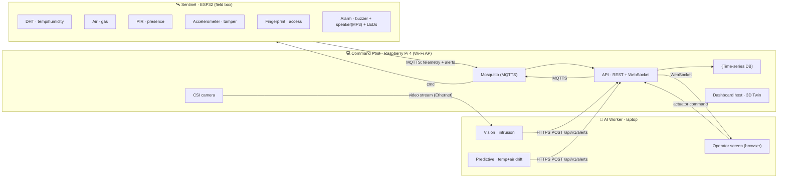

# Architecture

## Topology — 3-node "Edge-to-Server"

The system is three nodes on an isolated table network. See [`../GLOSSARY.md`](../GLOSSARY.md) for the canonical terms (Sentinel, Command Post, AI Worker…).

| Node | Hardware | Role |
|---|---|---|
| **Sentinel** | ESP32 + probes + actuators | Field box: senses, decides its own local Alerts, fires the Alarm autonomously |
| **Command Post** | Raspberry Pi 4 | The single logical server: MQTT broker, DB, API, dashboard host, Wi-Fi AP, owns the CSI camera |
| **AI Worker** | Laptop (i7) | Heavy inference (vision + predictive) delegated by the Command Post; also the Operator's screen |

> **Why 3 nodes.** The Pi 4 owns the CSI camera (so "camera on the Local Server" stays literally true) but is too weak for real-time vision, so heavy inference is delegated to the laptop over a wired link. This also keeps personal credentials off the main pentest target (the Pi).
>
> **Flag for the coach (Monday):** we use an **ESP32** (not ESP8266 — strictly more capable, same family; an ESP-01S is on hand if the ESP8266 label is required) and a **CSI camera** owned by the Pi (not a USB webcam), with inference offloaded to a worker.



## Alert ownership — who decides what

Each node owns the Alerts it can decide **alone**, so the Sentinel stays autonomous even if the Command Post is down.

| Alert `kind` | Decided by | Notes |
|---|---|---|
| `gas`, `thermal` | **Sentinel (ESP32)** | Threshold with hysteresis; fires the **Alarm locally and immediately** |
| `presence` | **Sentinel** | PIR digital |
| `tamper` | **Sentinel** | Accelerometer shock/tilt |
| `intrusion` | **AI Worker** | Vision on the Pi's camera stream |
| `predictive` | **AI Worker** | Isolation Forest on temp+air drift |
| *(Status)* | **Command Post** | Not an Alert — aggregates all active Alerts into the Outpost `Status` |

The Sentinel owns **hysteresis / debounce**: one Alert = one transition (a high/low threshold band, no flapping). It publishes telemetry continuously **and** Alerts on transition.

## Ingress & transport contract

Two normalized ingress paths, both funnel into one Alert pipeline on the Command Post:

- **Sentinel → MQTTS** (Mosquitto on the Pi): telemetry + its own Alerts. Lightweight for the micro, and satisfies the mandatory IoT↔stack encryption.
- **AI Worker → HTTPS `POST /api/v1/alerts`**: vision + predictive Alerts. This is the brief's mandatory JSON entry point.
- **API (Pi)**: subscribes to MQTT, exposes `/api/v1/alerts`, normalizes both into DB + WebSocket → Twin. Recomputes `Status` after every Alert.
- **Commands**: dashboard → API → MQTTS `command/<id>/actuator` → ESP32.

### MQTT topics

```
sentinel/<id>/telemetry        # ESP32 → broker, continuous snapshot
sentinel/<id>/alert            # ESP32 → broker, on transition
command/<id>/actuator          # API → broker → ESP32
```

---

## JSON schemas (the contract — lock Monday, change only by team agreement)

### Telemetry (Reading snapshot) — `sentinel/<id>/telemetry`

One publish per cycle (~1–2 s), all current Readings share one timestamp.

```jsonc
{
  "sentinel": "sentinel-01",
  "ts": "2026-10-05T14:23:00Z",
  "readings": {
    "temp": 31.2,          // °C
    "humidity": 44.0,      // %
    "air": 180,            // gas sensor raw/ppm
    "pir": false,          // presence
    "accel": { "x": 0.01, "y": -0.02, "z": 0.98 }  // g
  }
}
```

### Alert — `sentinel/<id>/alert` **and** body of `POST /api/v1/alerts`

The **single unified Alert schema**, emitted by both the Sentinel and the AI Worker.

```jsonc
{
  "alert_id": "a1b2c3d4",     // stable id; pairs a raised with its later cleared
  "sentinel": "sentinel-01",
  "source": "esp32",          // esp32 | ai-worker
  "kind": "gas",              // gas | thermal | presence | tamper | intrusion | predictive
  "severity": "warning",      // info | warning | critical
  "state": "raised",          // raised | cleared  — the transition (an Alert is a change of state)
  "value": 420,               // triggering measurement (kind-dependent, optional)
  "detail": {},               // kind-specific, see below
  "ts": "2026-10-05T14:23:05Z"
}
```

**`detail` by kind:**

```jsonc
// intrusion — x_norm (0=left, 1=right) drives the intruder's position in the 3D twin
"detail": { "x_norm": 0.42, "confidence": 0.88, "bbox": [120, 80, 60, 180] }

// predictive — the learned-model output, not a static threshold
"detail": { "anomaly_score": 0.91, "drivers": ["temp_slope", "air_slope"] }

// tamper
"detail": { "magnitude": 1.4, "axis": "y" }
```

> An **Incident** spans from the first `raised` Alert until every open Alert has `cleared`. `alert_id` is how the time-scrubber groups and replays it.

### `POST /api/v1/alerts`

- **Body:** one Alert object (schema above), `source: "ai-worker"`.
- **Response:** `202 Accepted`. The API persists it, broadcasts over WebSocket, and recomputes `Status`.

### Actuator command — `command/<id>/actuator`

```jsonc
{
  "cmd_id": "c9f8e7",
  "sentinel": "sentinel-01",
  "actuator": "buzzer",       // buzzer | speaker | led
  "action": "on",             // on | off | pattern
  "params": { "pattern": "siren", "led": "red" },
  "ts": "2026-10-05T14:23:10Z"
}
```

### WebSocket frames (API → dashboard/Twin)

```jsonc
{ "type": "telemetry", "payload": { /* telemetry snapshot */ } }
{ "type": "alert",     "payload": { /* alert object */ } }
{ "type": "status",    "payload": { "status": "elevated", "ts": "..." } }
```

### Status derivation (on the Command Post)

```
critical  if any active Alert is critical
elevated  else if any active Alert is warning
nominal   otherwise
```

---

## Network topology

- The **Command Post (Pi)** is the Wi-Fi access point for an isolated subnet **`192.168.X.0/24`** (X = table number).
- The **Sentinel (ESP32)** joins that Wi-Fi (2.4 GHz only).
- The **AI Worker (laptop)** links to the Pi over **wired Ethernet** — carries the camera stream + HTTPS, keeps video latency < 100 ms, and isolates it from the Wi-Fi telemetry traffic.
- Full IP plan, masks and routing live in [`../infra/`](../infra/); it is a deliverable (network schema) for the engineering report.

## Container stack (Docker-Compose, on the Pi)

| Service | Role |
|---|---|
| `mosquitto` | MQTT broker (MQTTS / TLS) |
| `db` | Time-series storage (telemetry + Alert history, for the time-scrubber) |
| `api` | REST + WebSocket — `POST /api/v1/alerts`, live feed, Status |
| `dashboard` | Web app + 3D Digital Twin (served by the Pi, rendered in the Operator's browser) |
| `reverse-proxy` | TLS termination (HTTPS) |
| `monitoring` | MCO: Pi CPU/RAM, MQTT log volume |

> The vision + predictive AI run on the **AI Worker (laptop)**, not in these containers — the Pi 4 can't do real-time inference.
