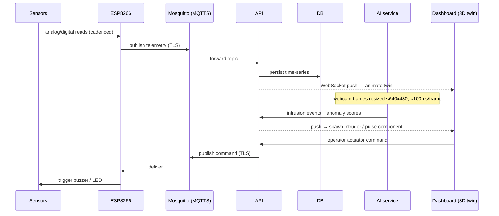

# Architecture

## Hardware option: B — Distributed "Edge-to-Server"

No Raspberry Pi. A **student laptop** is the **Local Server** and the **Wi-Fi access point**:

- The **USB webcam** plugs directly into the laptop → the AI service reads it locally (uses the laptop's CPU/GPU).
- The **ESP8266** connects over Wi-Fi to the laptop's IP and streams sensor data.
- The physical Sentinel-X box only contains the ESP8266 + electronics (sensors, OLED, buzzer, LEDs).

## Data flow (end to end)



## Network topology

- Dedicated isolated subnet **`192.168.X.0/24`** (X = our table number), own Wi-Fi AP.
- Strict routing so our traffic never interferes with neighboring teams' tables.
- ESP8266 packets isolated toward the Local Server only.
- Full IP plan, masks and VLAN/firewall rules documented in [`../infra/`](../infra/).

## Container stack (Docker-Compose, on the laptop)

| Service | Role |
|---|---|
| `mosquitto` | MQTT broker (MQTTS / TLS) |
| `db` | Time-series storage (telemetry + event history) |
| `api` | REST + WebSocket — `POST /api/v1/alerts`, live feed |
| `ai` | Python vision + predictive maintenance (or run on host for webcam/GPU access) |
| `dashboard` | Web UI + 3D Digital Twin |
| `reverse-proxy` | TLS termination (HTTPS) |
| `monitoring` | MCO: CPU/RAM, MQTT log volume |

## API contract (mandatory entry point)

`POST /api/v1/alerts` — receives state changes from table sensors.

```jsonc
// example payload (to be finalized Monday with the whole team)
{
  "source": "esp8266-01",
  "type": "gas|thermal|presence|cyber|predictive",
  "severity": "info|warning|critical",
  "value": 42.7,
  "ts": "2026-10-05T14:23:00Z"
}
```

> This contract is the spine of the whole system. Lock it early — every pillar depends on it.
