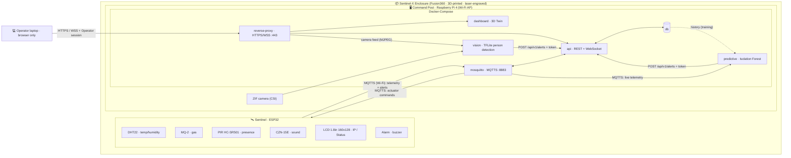

# Architecture

## Topology — Option A "Embedded centralization"

We implement the brief's **Option A**: the Local Server ("PC Serveur Local") is a **Raspberry Pi 4 fixed inside the Sentinel-X Enclosure**. It runs the whole containerized stack — web front-end and API — *and* the vision AI, on the **ZIF camera** (Joy-IT RB-Camera-JT, OV5647 5 MP) on its CSI port. The ESP32 joins the Pi's Wi-Fi. A laptop is only the Operator's browser. See [`../GLOSSARY.md`](../GLOSSARY.md) for the canonical terms.

| Node | Hardware | Role |
|---|---|---|
| **Sentinel** | ESP32 + probes + LCD + Alarm | Senses, decides its own local Alerts, fires the Alarm autonomously |
| **Command Post** | Raspberry Pi 4 + ZIF camera | The single server: Wi-Fi AP, MQTT broker, DB, API, dashboard host, vision + predictive AI |
| *Operator laptop* | any laptop | Browser only — nothing of the system runs on it |

The Sentinel and the Command Post live in the same 3D-printed **Enclosure** (see [Physical layout](#physical-layout-option-a)).

> **Main technical risk — vision latency on the Pi 4.** Option A puts inference on the Pi. We start from a lightweight open-source base, [`automaticdai/rpi-object-detection`](https://github.com/automaticdai/rpi-object-detection) (TFLite EfficientDet-Lite0, `person` class only; fallback OpenCV motion detection). Benchmark it Monday. Details in [`../ai/`](../ai/).

### Deviations to validate with the coach (Monday)

- **ESP32 instead of ESP8266.** Same family and toolchain (Arduino/PlatformIO), strictly more capable: RAM headroom for the mandatory TLS handshake (tight on an ESP8266) and several ADC inputs (the ESP8266 has a single 0–1 V analog input, awkward for the MQ-2). An ESP-01S is on hand if the ESP8266 label is required.
- **Raspberry Pi 4 instead of a Pi 5.** The brief specifies a Pi 5 (4 GB) for Option A; we have a Pi 4. Inference is slower, hence the lightweight vision model and the Monday benchmark.
- **ZIF camera instead of a USB webcam.** The brief says USB webcam; we use a Joy-IT RB-Camera-JT (OV5647, 5 MP, Pi camera v1 compatible) on the Pi's CSI port (ZIF ribbon). Same role, captured with Picamera2.
- **LCD instead of the OLED.** The brief lists a 0.96" OLED I2C; our status display is a 1.8" 160×128 px color LCD (ST7735S, SPI), sold for the micro:bit.



## Physical layout (Option A)

The Enclosure (Fusion360, 3D-printed, laser-engraved) houses the Sentinel **and** the Command Post:

- **Pi 4 + ZIF camera** — active cooling and vents (the Pi runs hot under inference); camera module on a short ribbon, lens exposed at the front.
- **DHT22 and MQ-2 in a separate ventilated compartment**, away from the Pi and from each other (the MQ-2 has a heater). Otherwise the probes measure the Pi's own heat and the predictive model learns inference load as "thermal drift".
- **LCD visible** through the shell, clean cable passthroughs, no visible wires (brief requirement).
- **Power:** official 15 W USB-C supply (5.1 V / 3 A) for the Pi 4.

## Alert ownership — who decides what

Each node owns the Alerts it can decide **alone**, so the Sentinel stays autonomous even if the Command Post is down.

| Alert `kind` | Decided by | Notes |
|---|---|---|
| `gas`, `thermal` | **Sentinel (ESP32)** | Threshold with hysteresis; fires the **Alarm locally and immediately** |
| `presence` | **Sentinel** | PIR digital |
| `noise` | **Sentinel** | Share of the cycle with sound above the sensor's threshold, with hysteresis |
| `intrusion` | **Command Post · `vision`** | TFLite person detection on the ZIF camera |
| `predictive` | **Command Post · `predictive`** | Isolation Forest on temp+air drift |
| *(Status)* | **Command Post · `api`** | Not an Alert — aggregates all active Alerts into the Outpost `Status` |

The Sentinel owns **hysteresis / debounce**: one Alert = one transition (a high/low threshold band, no flapping). It publishes telemetry continuously **and** Alerts on transition.

## Ingress & transport contract

Two ingress paths funnel into one Alert pipeline in the `api`:

- **Sentinel → MQTTS** (`mosquitto`, port 8883): telemetry + its own Alerts. Lightweight for the micro, and satisfies the mandatory IoT ↔ stack encryption.
- **`vision` / `predictive` → `POST /api/v1/alerts`** (the brief's mandatory JSON entry point), over the **internal Docker network**, with a per-service token.
- **Broker → `predictive`**: the predictive service subscribes to live telemetry (`sentinel/+/telemetry`) with its own MQTT user, on the same broker reached as `mosquitto:8883` from the internal Docker network.
- **`api`**: subscribes to MQTT, exposes the endpoints, normalizes both paths into DB + WebSocket → Twin. Recomputes `Status` after every Alert.
- **Commands**: dashboard → `POST /api/v1/commands` → MQTTS `command/<id>/actuator` → ESP32.

### MQTT topics

```
sentinel/<id>/telemetry        # ESP32 → broker → api + predictive, continuous snapshot
sentinel/<id>/alert            # ESP32 → broker, on transition
command/<id>/actuator          # api → broker → ESP32
```

---

## JSON schemas (the contract — lock Monday, change only by team agreement)

### Telemetry (Reading snapshot) — `sentinel/<id>/telemetry`

One publish per cycle (~1–2 s), all current Readings share one timestamp.

```jsonc
{
  "sentinel": "sentinel-01",
  "ts": "2026-10-05T14:23:00Z",
  "readings": {
    "temp": 31.2,          // °C
    "humidity": 44.0,      // %
    "air": 180,            // gas sensor raw/ppm
    "pir": false,          // presence
    "sound": 0.02          // share of the cycle the sound sensor heard sound (0–1)
  }
}
```

### Alert — `sentinel/<id>/alert` **and** body of `POST /api/v1/alerts`

The **single unified Alert schema**, emitted by the Sentinel and by the AI services.

```jsonc
{
  "alert_id": "a1b2c3d4",     // stable id; pairs a raised with its later cleared
  "sentinel": "sentinel-01",  // the api takes it from the MQTT topic, not from the body
  "source": "esp32",          // esp32 | vision | predictive — set by the api from the authenticated channel
  "kind": "gas",              // gas | thermal | presence | noise | intrusion | predictive
  "severity": "warning",      // info | warning | critical
  "state": "raised",          // raised | cleared  — the transition (an Alert is a change of state)
  "value": 420,               // triggering measurement (kind-dependent, optional)
  "detail": {},               // kind-specific, see below
  "ts": "2026-10-05T14:23:05Z"
}
```

**`detail` by kind:**

```jsonc
// intrusion — x_norm (0=left, 1=right) drives the intruder's position in the 3D twin
"detail": { "x_norm": 0.42, "confidence": 0.88, "bbox": [120, 80, 60, 180] }

// predictive — the learned-model output, not a static threshold
"detail": { "anomaly_score": 0.91, "drivers": ["temp_slope", "air_slope"] }
```

> An **Incident** spans from the first `raised` Alert until every open Alert has `cleared`. `alert_id` is how the time-scrubber groups and replays it.

### `POST /api/v1/alerts`

- **Callers:** the `vision` and `predictive` services only, over the internal Docker network. The reverse proxy does **not** route this path to the table network.
- **Auth:** `Authorization: Bearer <token>`, one token per service. Each token may post only its own `kind` (`vision` → `intrusion`, `predictive` → `predictive`); the `api` sets `source` from the token.
- **Body:** one Alert object (schema above), validated strictly: unknown fields rejected, enums enforced, max 16 KB.
- **Response:** `202 Accepted` (persisted, broadcast over WebSocket, `Status` recomputed) · `400` invalid · `401` missing/bad token · `403` `kind` not allowed for this token · `413` too large · `429` rate-limited.

### `GET /health`

- **Callers:** Docker's healthcheck, inside the `api` container. The reverse proxy does **not** route it: it routes `/api` and `/ws` only.
- `200` `{ "status": "ok", "broker": "connected" | "off" }`, `503` `{ "status": "degraded", "broker": "disconnected" }` while the broker is out of reach — see [`../backend/`](../backend/README.md#health--get-health).

### Operator endpoints (through the reverse proxy, HTTPS/WSS)

| Endpoint | Purpose |
|---|---|
| `POST /api/v1/auth/login` | Operator login → session cookie (`HttpOnly; Secure; SameSite=Strict`). The **only** unauthenticated endpoint. |
| `GET /api/v1/auth/check` | Forward-auth for the reverse proxy (camera feed) → `204` / `401` |
| `POST /api/v1/commands` | Actuator command (schema below, without `cmd_id`/`ts` — the `api` adds them) → `202` |
| `wss://<pi>/ws` | Live feed (frames below). Session checked on upgrade, `Origin` checked. |
| `GET /api/v1/history?from=…&to=…` | Telemetry + Alert history of a time range, oldest first (time-scrubber) — see [`../backend/`](../backend/README.md#history--get-apiv1history). Session required |
| `GET /api/v1/incidents` | The Incidents, oldest first, with their start and end (`null` while one goes on) — see [`../backend/`](../backend/README.md#incidents--get-apiv1incidents). Session required |
| `GET /api/v1/incidents/:incident_id` | One Incident and its telemetry + Alerts, oldest first, for the Twin to replay — see [`../backend/`](../backend/README.md#replay--get-apiv1incidentsincident_id). Session required |
| camera feed | Session required |

### Actuator command — `command/<id>/actuator`

```jsonc
{
  "cmd_id": "c9f8e7",
  "sentinel": "sentinel-01",
  "actuator": "buzzer",       // buzzer (the only actuator)
  "action": "on",             // on | off | pattern
  "params": { "pattern": "siren" },
  "ts": "2026-10-05T14:23:10Z"
}
```

### WebSocket frames (api → dashboard/Twin)

```jsonc
{ "type": "telemetry", "payload": { /* telemetry snapshot */ } }
{ "type": "alert",     "payload": { /* alert object */ } }
{ "type": "status",    "payload": { "status": "elevated", "ts": "..." } }
```

### Status derivation (on the Command Post)

```
critical  if any active Alert is critical
elevated  else if any active Alert is warning
nominal   otherwise
```

---

## Security model (binding for every workstream)

### Exposed surface

Only what the table network needs reaches it; everything else stays on the internal Docker network.

| Port | Service | Reachable by |
|---|---|---|
| 443/tcp | `reverse-proxy` (HTTPS/WSS) | Operator laptop |
| 8883/tcp | `mosquitto` (MQTTS) | Sentinel from the table Wi-Fi; `api` and `predictive` from the internal Docker network |
| 22/tcp | SSH, keys only | Operator laptop only |
| 67/udp | DHCP of the Wi-Fi AP | table Wi-Fi |
| 123/udp | NTP (chrony): the table network has no Internet, and the Sentinel time-stamps its readings | table Wi-Fi |

No plaintext port: no MQTT 1883, no HTTP 80. `db`, `api`, `dashboard`, `vision`, `predictive` publish no ports.

> **One broker, two sides.** Mosquitto 2.x listens on localhost only unless a `listener` is declared. Our explicit `listener 8883` binds every interface of the container, so the same TLS listener serves the ESP32 (through the published port) and the internal clients (`mosquitto:8883`). Adding an MQTT client later = one MQTT user + its ACL lines, nothing else.

### Transport

- A **team CA** (OpenSSL) signs the broker and reverse-proxy certificates. Private keys never enter git.
- The broker certificate carries **`IP:192.168.X.1`** (the ESP32 connects by IP) **and `DNS:mosquitto`** (internal clients connect by service name), so every client can verify the hostname.
- MQTTS, TLS ≥ 1.2, on 8883. **Every MQTT client** (ESP32, `api`, `predictive`) verifies the broker certificate against the team CA — never `setInsecure()` / `tls_insecure_set(True)`.
- HTTPS/WSS terminated by the reverse proxy.

### Authentication & authorization

| Channel | Principal | Mechanism | Allowed |
|---|---|---|---|
| MQTT | `sentinel-01` | username/password over TLS | publish its own telemetry/alert, read its own commands |
| MQTT | `api` | username/password over TLS | read all Sentinel topics, publish commands |
| MQTT | `predictive` | username/password over TLS | read all Sentinel telemetry |
| HTTP (internal) | `vision`, `predictive` | bearer token | `POST /api/v1/alerts` for its own `kind` |
| HTTPS/WSS | Operator | login → session cookie | dashboard, history, camera feed, commands |

Mosquitto runs with `allow_anonymous false`, a hashed `password_file` and this ACL:

```
user sentinel-01
topic write sentinel/sentinel-01/telemetry
topic write sentinel/sentinel-01/alert
topic read command/sentinel-01/actuator

user api
topic read sentinel/+/telemetry
topic read sentinel/+/alert
topic write command/+/actuator

user predictive
topic read sentinel/+/telemetry
```

**Never trust the payload:** the `api` derives `sentinel` from the MQTT topic and `source` from the channel (MQTT → `esp32`, token → `vision` / `predictive`), and validates every body against the schemas above.

### Denial of service

- Rate limits in the `api`: login 5/min per IP, commands 2/s, alerts 20/s per token.
- Mosquitto `max_packet_size 4096`.
- Log rotation on every container and on Mosquitto, so a message flood can't fill the SD card.

Host, Docker and Wi-Fi hardening checklist: [`../cyber/`](../cyber/).

---

## Network topology

- The **Command Post (Pi)** is the Wi-Fi access point of an isolated subnet **`192.168.X.0/24`** (X = table number): WPA2-PSK, CCMP/AES only, WPS off, long passphrase kept out of git.
- The **Sentinel (ESP32)** joins it (2.4 GHz only); the **Operator laptop** joins it as a client.
- No NAT or bridge to any other network. The Pi's Ethernet is for setup only — pull Docker images and Python packages before going isolated.

| Host | IP | Notes |
|---|---|---|
| Command Post (Pi) | `192.168.X.1` | AP + DHCP |
| Sentinel (ESP32) | `192.168.X.10` | DHCP reservation |
| Operator laptop | `192.168.X.20` | DHCP reservation |

This plan is the basis of the network schema deliverable (engineering report) — see [`../infra/`](../infra/).

## Container stack (Docker-Compose, on the Pi)

| Service | Role | Published port |
|---|---|---|
| `reverse-proxy` | TLS termination (HTTPS/WSS); routes dashboard, API and camera feed; forward-auth on the Operator session | 443 |
| `mosquitto` | MQTT broker (MQTTS, ACL) | 8883 |
| `api` | REST + WebSocket, Alert pipeline, `Status`, auth | — |
| `db` | Telemetry + Alert history (time-scrubber, predictive training) | — |
| `dashboard` | Web app + 3D Digital Twin (rendered in the Operator's browser) | — |
| `vision` | Person detection on the ZIF camera (Picamera2, camera device nodes via `devices:`); serves the annotated camera feed | — |
| `predictive` | Isolation Forest on live telemetry (MQTTS subscriber); trains on DB history (read-only DB user) | — |

`docker compose up` brings the whole Command Post online. Hardening rules for every service (non-root, no `privileged`, `cap_drop: ALL`…) are in [`../cyber/`](../cyber/).
