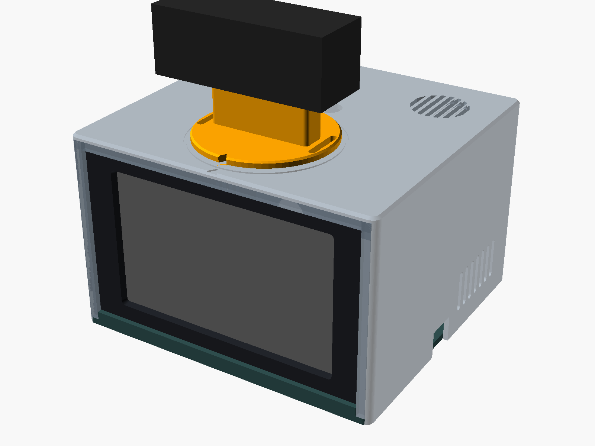
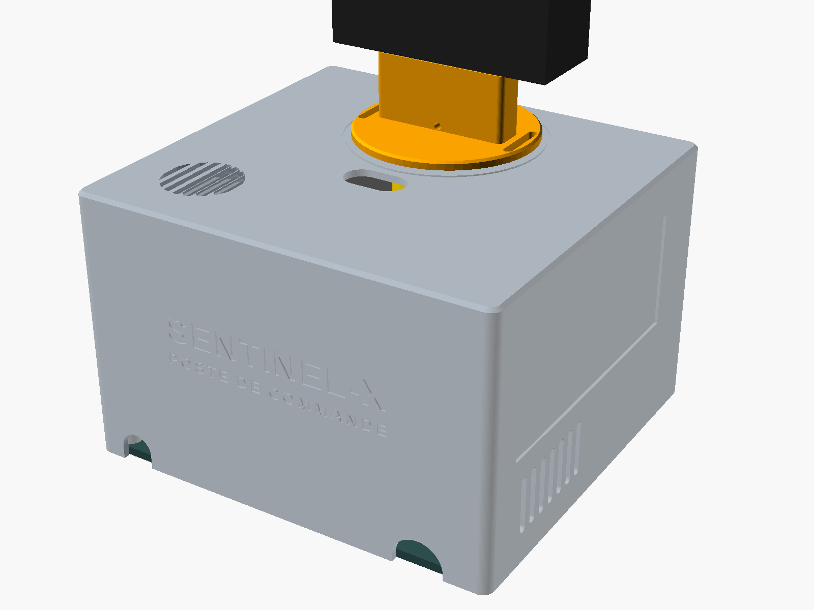
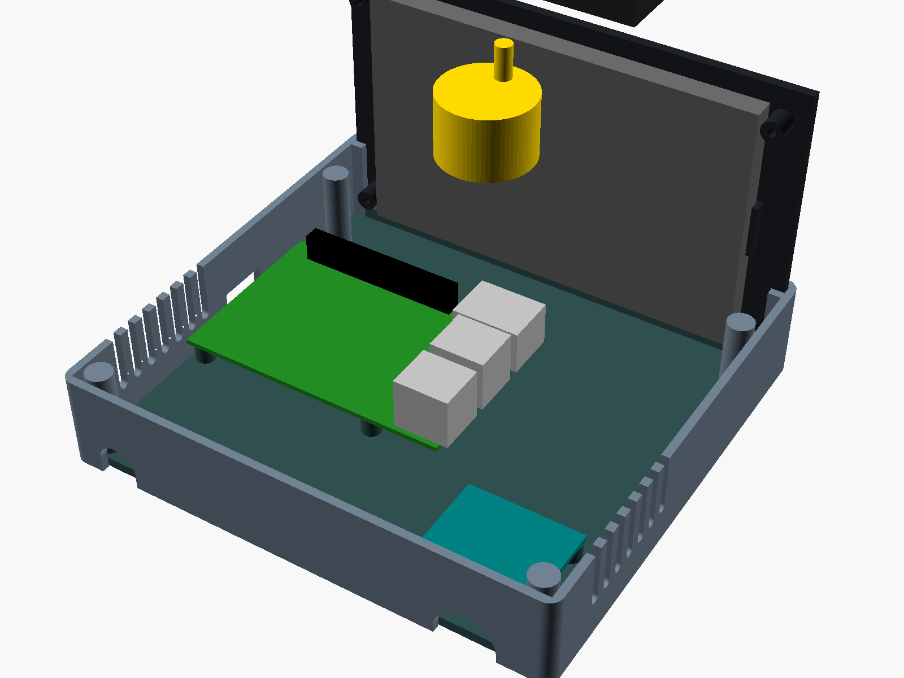
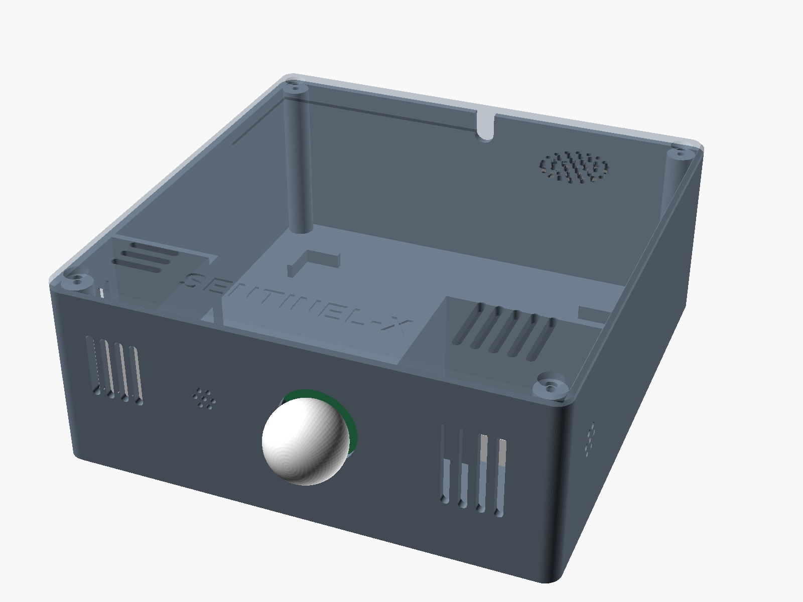
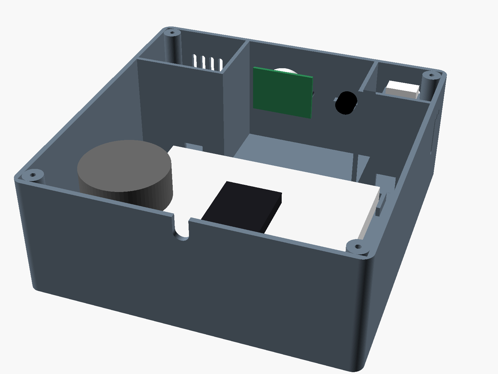
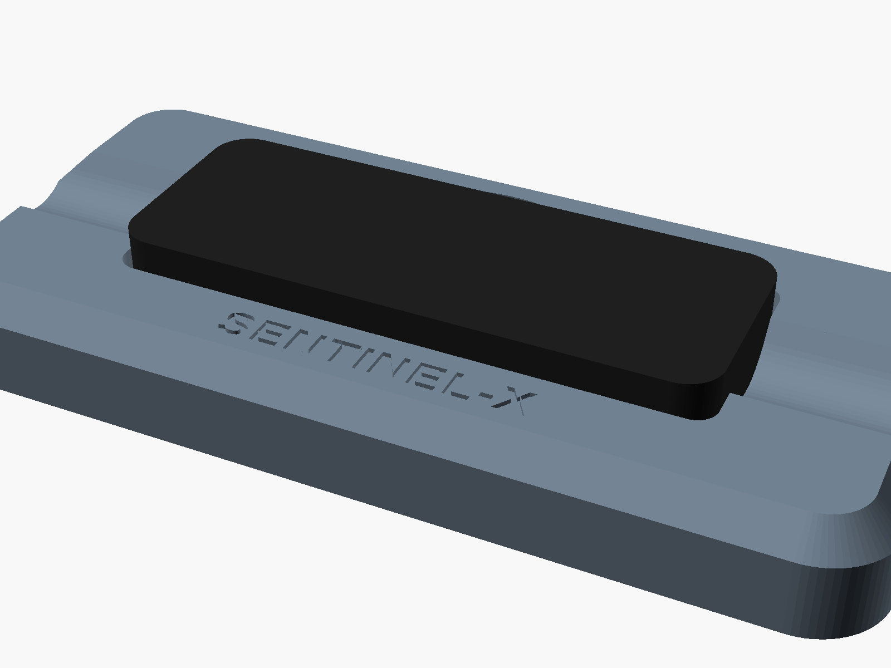

# enclosure/ : les boîtiers à imprimer

Trois objets, huit fichiers STL dans [`stl/`](stl/), chacun déjà posé dans le bon sens pour l'impression. Aucun ne demande de support.

| Objet | Ce qu'il contient | Taille hors tout |
|---|---|---|
| **Poste de commande** | Raspberry Pi 4, écran HDMI 800×480 en façade, webcam USB sur un plateau tournant, moteur 28BYJ-48 et sa carte ULN2003 | 150 × 140 × 95 mm, plus la webcam |
| **Sentinel** | ESP32 sur ses deux demi-breadboards, DHT22, MQ-2, PIR HC-SR501, micro CZN-15E, enceinte | 151 × 155 × 61 mm |
| **Support Leap Motion** | Le Leap Motion Controller d'origine, à plat sur le bureau de l'Opérateur | 128 × 58 × 15 mm |

| Poste de commande | Arrière | Intérieur |
|---|---|---|
|  |  |  |

| Sentinel | Intérieur, vu de l'arrière | Support Leap Motion |
|---|---|---|
|  |  |  |

## Les fichiers

| Fichier | Pièce | Posée sur le plateau par |
|---|---|---|
| `command-post-shell.stl` | Coque : toit et trois murs | le toit |
| `command-post-base.stl` | Socle : le Pi, la carte ULN2003 | le dessous |
| `command-post-bezel.stl` | Façade : la fenêtre de l'écran | la face avant |
| `command-post-clamps.stl` | Les deux brides qui tiennent l'écran | à plat |
| `command-post-turntable.stl` | Plateau de la webcam, sur l'axe du moteur | le dessous |
| `sentinel-base.stl` | Boîte du Sentinel : fond, murs, compartiments | le fond |
| `sentinel-lid.stl` | Couvercle du Sentinel, avec le support de l'enceinte | le dessus |
| `leap-stand-stand.stl` | Support du Leap Motion | le dessous |

## Impression

Sur la Creality K2 Plus du myDiL (350 mm de plateau : chaque pièce passe en une fois).

- **Matière** : PLA pour le Poste de commande et le Leap. **PETG** de préférence pour le Sentinel : la chauffe du MQ-2 dégage près d'un watt dans son compartiment.
- Couches de 0,2 mm, 3 périmètres, remplissage 15 à 20 % (gyroïde), sans support, sans bordure.
- Au plus 750 g de filament pour le tout (le volume plein des pièces), moins avec le remplissage.

## Visserie et petit matériel

| Pour | Quoi |
|---|---|
| Le Pi sur le socle | 4 vis M2,5 × 6 |
| Le socle sous la coque | 4 vis M3 × 12 tête fraisée, par en dessous |
| Le moteur sous le toit | 2 vis M3 × 8 tête fraisée et 2 écrous M3 |
| L'écran sur la façade | 4 vis M3 × 10 |
| La carte ULN2003 | 4 vis M3 × 6, ou un carré d'adhésif double face mousse si ses trous ne tombent pas (prévus à 29,5 × 27 mm) |
| Le plateau sur l'axe, s'il a du jeu | 1 vis M3 × 8, par le trou au dos de la barre |
| Le couvercle du Sentinel | 4 vis M3 × 12 tête fraisée |
| Le PIR | 2 vis M2 × 6, ou un point de colle chaude |
| Le micro, le MQ-2, l'enceinte | Colle chaude |
| Sous chaque boîtier et sous le Leap | 4 patins caoutchouc de 10 mm |
| Option : ventilateur 30 × 30 mm 5 V sous la grille du toit | 4 vis M3 × 16, ses fils sur les broches 2 (5 V) et 6 (GND) du Pi |

## Montage du Poste de commande

1. **Écran sur la façade.** Face contre la façade, la zone affichée dans la fenêtre. Les deux brides se vissent sur les quatre plots, le long de ses bords haut et bas.
2. **Pi sur le socle.** Carte SD vers la droite (l'encoche du mur droit la laisse accessible), connecteur GPIO vers l'avant, ports USB et Ethernet vers la gauche. Quatre vis M2,5.
3. **Carte ULN2003** sur les quatre plots du coin arrière gauche.
4. **Moteur sous le toit.** Son axe sort par le trou du toit, son fil bleu vers l'arrière. Deux vis fraisées par le dessus, les écrous dessous, sur ses pattes.
5. **Plateau.** Enfoncé sur l'axe, sa pointe en face du triangle gravé sur le toit : la caméra regarde droit devant. C'est le zéro du moteur, à refaire avant chaque démarrage (il compte ses pas depuis là).
6. **Webcam.** Son clip se pose sur la barre du plateau comme sur le haut d'un écran. Sans clip, une sangle velcro passe par les deux fentes. Son câble descend par la fente derrière le plateau, jusqu'à un port USB du Pi.
7. **Câblage**, comme sur [`docs/cablage/raspberry-pi.html`](../docs/cablage/raspberry-pi.html) : broches 31, 33, 35, 37 vers IN1 à IN4, 39 vers −, 4 vers + ; le moteur dans la prise blanche de l'ULN2003 ; l'écran sur le micro-HDMI 1, son alimentation USB sur un port USB du Pi. Le câble USB de l'ESP32 et, si besoin, l'Ethernet passent dans l'encoche arrière gauche, l'alimentation USB-C dans l'encoche arrière droite. Toutes les fiches restent dedans : à l'arrière ne sortent que l'alimentation et le câble de l'ESP32, plus l'Ethernet s'il est branché.
8. **Fermeture.** La façade debout dans la rainure à l'avant du socle, on descend la coque par-dessus : la façade glisse dans les rainures des murs jusqu'à celle du toit. Quatre vis M3 × 12 par-dessous.

## Montage du Sentinel

1. **Breadboards** collées entre les quatre équerres du fond (leur adhésif suffit). L'ESP32 à cheval sur la jonction, **son USB contre le mur du fond**, à l'aplomb de l'encoche.
2. **DHT22** glissé par le haut dans son support, grille contre les fentes, posé sur ses deux piliers : ses quatre fiches Dupont passent dessous. Ses fils sortent du compartiment par le passage au ras du fond.
3. **MQ-2** : sa capsule dans le berceau du mur droit, face aux trous, un point de colle chaude sur la carte (pas sur la capsule, qui chauffe). Fils par le passage de son compartiment.
4. **PIR** : le dôme sort par le trou de la façade, la carte se visse sur les deux plots (M2) ou se colle. Ses deux potentiomètres et son cavalier restent accessibles couvercle ouvert.
5. **CZN-15E** : sa capsule dans le petit berceau, face aux trous, un point de colle.
6. **Enceinte** dans la marche du couvercle à sa taille (28, 36, 40 ou 50 mm), un cordon de colle chaude autour. Fils assez longs pour ouvrir le couvercle.
7. Une fois câblé comme sur [`docs/cablage/esp32.html`](../docs/cablage/esp32.html), un bout de mousse ou de ruban bouche les deux passages de fils : la chaleur du MQ-2 reste dans son compartiment, loin du DHT22.
8. Le câble USB couché dans l'encoche du fond, le couvercle se visse aux quatre coins (M3 × 12 fraisées).

## Support Leap Motion

Le capteur se pose dans le creux, sa LED verte vers l'Opérateur ; son câble sort par l'un ou l'autre bout. L'encoche à l'arrière sert à le soulever. Le dessus du capteur dépasse le bord : rien ne gêne son champ de vision.

## Gravure laser

Le sujet demande des plaques gravées (logo, consignes, numéro de série) sur le boîtier. Deux logements de 1 mm de profondeur les attendent :

- Poste de commande, mur gauche : **100 × 40 mm**, plaque à découper à 99,4 × 39,4 mm ;
- Sentinel, couvercle : **70 × 40 mm**, plaque à 69,4 × 39,4 mm.

En plexiglas ou contreplaqué de 3 mm sur la Creality Falcon A1, collées.

## Ce qui a été supposé, à vérifier avant d'imprimer

Toutes ces cotes sont en tête des fichiers `.scad`. Après un changement, `./build.sh` refait les STL et les aperçus (OpenSCAD 2024 ou plus récent : `brew install --cask openscad@snapshot`).

| Cote | Valeur prise | Fichier, variable | Si c'est faux |
|---|---|---|---|
| **Écran** : carte, zone affichée, épaisseur au bord | 121,2 × 78 mm, 108,5 × 65,5 mm, 7 mm (un 5 pouces HDMI 800×480 type Waveshare) | `command-post.scad`, `scr`, `scr_view`, `scr_view_off`, `scr_edge` | Seules la façade et les brides changent, sauf si l'écran est plus grand : la coque et le socle s'élargissent alors d'eux-mêmes |
| Trous de la carte ULN2003 | 29,5 × 27 mm | `uln_holes` | Adhésif mousse sur les plots |
| Pied carré de la lentille du PIR | 4 mm entre le mur et sa carte | `sentinel.scad`, `pir_skirt` | Un point de colle |
| Capsule du MQ-2, du micro | Ø 19,8 mm, Ø 9,7 mm | `cradle(...)` dans `sentinel.scad` | Colle chaude |
| Leap Motion d'origine | 80 × 30 mm | `leap-stand.scad`, `leap` | — |
| Axe du 28BYJ-48 | Ø 5 mm, méplats à 3 mm | `turntable()` | Vis M3 au dos de la barre |
| Webcam | Un clip d'écran | `tt_bar` (barre de 12 mm d'épaisseur) | Sangle velcro par les fentes |

Les sources sont les fichiers `.scad` : `common.scad` (outils partagés), `command-post.scad`, `sentinel.scad`, `leap-stand.scad`. Chacun prend `part="..."` : une pièce posée pour l'impression, `assembly` le boîtier monté avec ses composants en couleur, `inside` son intérieur.
